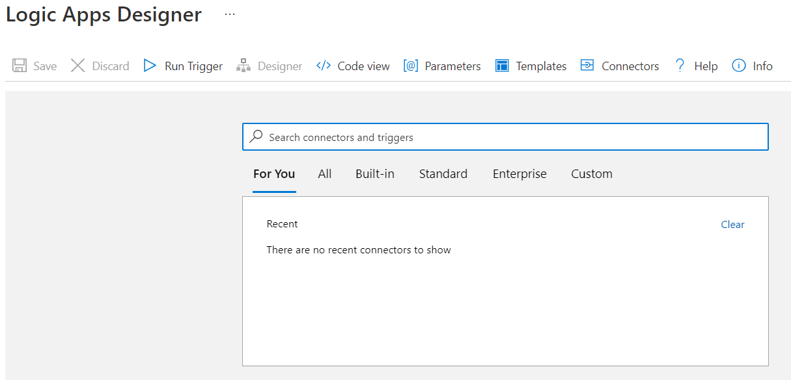

One easy way to use Event Grid is to include it in a logic app.

Suppose you've chosen to use Azure Event Grid to alert your administrators when a virtual machine is reconfigured. 

Here, you'll set up a virtual machine and create a logic app with an Event Grid trigger that responds to the events produced by the virtual machine.

## Create a virtual machine

Let's start by creating a new virtual machine in the Azure portal.

1. Sign into the [Azure portal](https://portal.azure.com/learn.docs.microsoft.com?azure-portal=true) with the account you used to activate the sandbox.
1. Select **+ Create a resource**.
1. Select **Compute** > **Virtual Machine**.
1. Fill out the wizard like this:

    | Field | Value |
    | --- | --- |
    | **Subscription** | Concierge subscription |
    | **Resource group**   | <rgn>[sandbox resource group]</rgn> |
    | **Name** | vm1 |
    | **Region** | Select a region near you |
    | **Availability options** | Leave at the default value |
    | **Image** | Windows Server 2019 Datacenter |
    | **Size** | Standard DS1 v2 |
    | **Username** | vmadmin |
    | **Password** | Enter a complex password |
    | **Public inbound ports** | Leave at the default value |
    | **Select inbound ports**  | HTTP (80) and RDP (3389) |

1. Select **Review and create**, then select **Create** on the resulting page.

## Create a logic app

The next step is to create the Logic App that will run when a virtual machine change is detected. Let's create a blank Logic App.

1. Select **+ Create a resource**.
1. Select **Integration** > **Logic App**.
1. Complete the **Create** page like this:

    | Field | Value |
    | --- | --- |
    | **Name** | Enter a name |
    | **Subscription** | Concierge subscription |
    | **Resource group** | Select **Use existing**, then <rgn>[sandbox resource group]</rgn> |
    | **Location** | Select a region near you |
    | **Log Analytics** | Off |

    

1. Select **Create**.

## Add an Event Grid trigger to the Logic App

Once your logic app is created, you'll add so that triggers for Event Grid events.

1. Select **All Resources**.
1. Select the logic app that you created in the previous step.
1. Under **Templates**, select **Blank Logic App**.

    

1. Within the designer, use the search box, and enter **Event Grid** as your filter. From the triggers list, select **When a resource event occurs**.

    

1. When prompted, sign into the **Microsoft Learn Sandbox** tenant using your Azure account credentials.
1. Now subscribe your logic app to publisher events.

    | Field | Value |
    | --- | --- |
    | **Subscription** | Concierge subscription |
    | **Resource group** | `Microsoft.Resources.ResourceGroups` |
    | **Resource name** | Leave at the default value |
    | **Event type item - 1** | `Microsoft.Resources.ResourceActionSuccess` |
    | **Event type item - 2** | `Microsoft.Resources.ResourceDeleteSuccess` |
    | **Event type item - 3** | `Microsoft.Resources.ResourceWriteSuccess` |
    | | |

    

1. Click **Save**.

    

Your logic app is now ready and set up to be a subscriber to the events from Azure Event Grid.
