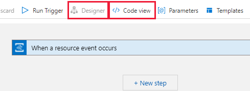

When you create events in Azure Event Grid, you choose how to respond to those events and which actions should occur.

Suppose, in your healthcare organization, you've set up a logic app to listen for events. You now need the facility to filter the events and create actions based on conditions within these events.

Here, you'll learn how to create actions and conditions to respond to events.

## Conditions

To run actions in your logic app after events pass a specified condition, you add a conditional statement. This control structure compares the data in your workflow against specific values or fields. You then specify different actions that run based on whether the data meets the condition. 

The screenshot shows an example of a filter that checks whether a filename in a directory has the PDF extension.


For example, suppose you have a logic app that needs to send an email based on certain fields being found in an Event Grid trigger. You'd create a condition in your logic app that could check the event data and conditionally call an action.

> [!NOTE]
> You can nest conditions inside each other conditions.

## Logic apps actions

Logic apps provide built-in triggers and actions so you can orchestrate workflows, communicate with other apps and services, and manage or manipulate data.

There are many built-in actions that you can use. Here are some examples:

- Azure Service Bus
- SQL Server
- Office 365 Outlook
- Salesforce

Suppose you have a logic app that needs to send an email in response to an event. You could use the built-in Office 365 Outlook action.

## Logic app JSON configuration

A logic app has two different views that can both be accessed from the submenu.

- **Designer view** - user interface that visually maps all triggers, actions, and connectors
- **Code view** - a JSON configuration that allows any field to be edited in a code editor

    


The example below demonstrates the JSON configuration for an Event Grid trigger. By using your logic app's JSON view, you'll become familiar with the concepts and structure, and confident to edit the JSON directly.

``` JSON
"triggers": {
    "When_a_resource_event_occurs": {
        "inputs": {
            "body": {
                "properties": {
                    "destination": {
                        "endpointType": "webhook",
                        "properties": {
                            "endpointUrl": "@{listCallbackUrl()}"
                        }
                    },
                    "filter": {
                        "includedEventTypes": [
                            "Microsoft.Resources.ResourceActionSuccess"
                        ]
                    },
                    "topic": "/subscriptions/487b8420-0350-42e4-855f-8139135f3a1f/resourceGroups/LogicApp-EventGrid"
                }
            },
            "host": {
                "connection": {
                    "name": "@parameters('$connections')['azureeventgrid']['connectionId']"
                }
            },
            "path": "/subscriptions/@{encodeURIComponent('487b8420-0350-42e4-855f-8139135f3a1f')}/providers/@{encodeURIComponent('Microsoft.Resources.ResourceGroups')}/resource/eventSubscriptions",
            "queries": {
                "x-ms-api-version": "2017-09-15-preview"
            }
        },
        "splitOn": "@triggerBody()",
        "type": "ApiConnectionWebhook"
    }
},
"parameters": {
    "$connections": {
        "value": {
            "azureeventgrid": {
                "connectionId": "/subscriptions/487b8420-0350-42e4-855f-8139135f3a1f/resourceGroups/LogicApp-EventGrid/providers/Microsoft.Web/connections/azureeventgrid",
                "connectionName": "azureeventgrid",
                "id": "/subscriptions/487b8420-0350-42e4-855f-8139135f3a1f/providers/Microsoft.Web/locations/northeurope/managedApis/azureeventgrid"
            }
        }
    }
}
```

## Visual Studio Code

With Azure Logic Apps and Visual Studio Code, you can manage logic apps within a familiar IDE and have quick access to your logic app's structure through a code-based experience. 

You can do these same tasks in the Azure portal and in VS Code. However, you'll get started quickly in VS Code if you become familiar with the definitions. You can also work on logic apps and integration accounts from any development platform where VS Code runs, such as Linux, Windows, and Mac.

You can download and install this extension from the Visual Studio Marketplace or directly from inside VS Code.


To edit an existing logic app within VS Code, follow these steps:

1. Open VS Code and select the Azure icon.

    

1. In the Azure pane, under **Logic Apps**, select **Sign in to Azure**. At the Microsoft sign-in page prompt, sign in with your Azure account.

    

1. Under **Logic Apps**, select the subscription that you want. The subscription node expands and shows any logic apps in that subscription.

    

1. Right-click your logic app and select **Open in Editor**.

    

1. You should now see the JSON file that makes up your logic app.

    

1. When you're ready, save your changes (File menu > Save, or select <kbd>Ctrl+S</kbd>).
1. When prompted to upload your changes and overwrite the existing logic app in the Azure portal, select **Upload**.

     