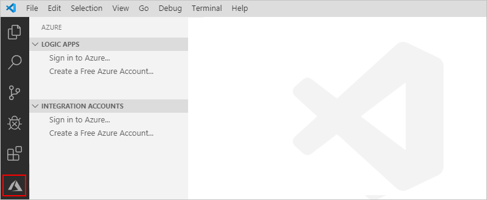

When you create events within Azure, you can choose how to respond to these events and which actions should occur

Suppose you've set up your Logic App to listen for events. You now need to be able to filter the events and create actions based on conditions within these events

Here you'll learn the how to create actions and conditions to respond to these events.

## Conditions

Logic apps include capabilities for orchestration, conditions/filters, switches, loops and scopes. 

To run actions in your logic app after events pass a specified condition, you will need to add a conditional statement. This control structure compares the data in your workflow against specific values or fields. You can then specify different actions that run based on whether or not the data meets that condition. 

The screenshot shows an example of a filter that checks whether a filename in a directory has the PDF extension


For example, suppose you have a logic app that needs to send an email based on certain fields being found in an EventGrid trigger. This would be handled by creating a condition in your Logic App that could check the event data and conditionally call an action

> [!NOTE]
> You can nest conditions inside each other.

## Logic App Actions

Logic Apps provide built-in triggers and actions so you can orchestrate workflows, communicate with other apps and services and manage or manipulate data.

There are many built-in actions that can be used. Some common managed actions are

- Azure Service Bus
- SQL Server
- Office 365 Outlook
- Salesforce

For example, suppose you have a Logic App that needs to send an email in response to an event. You can use the built-in Office 365 Outlook action for this

## Logic App JSON Configuration

A Logic App has two different views that can both be accessed from the Logic App sub menu


- **Designer view** - User interface that visually maps all triggers, actions and connectors
- **Code view** - A JSON configuration, allowing any field to be edited in a code editor

The example below demonstrates the JSON configuration for an Event Grid trigger, by looking through your Logic App JSON view you can become familiar with the concepts and structure and become confident in editing the JSON directly.

``` JSON
 "triggers": {
            "When_a_resource_event_occurs": {
                "inputs": {
                    "body": {
                        "properties": {
                            "destination": {
                                "endpointType": "webhook",
                                "properties": {
                                    "endpointUrl": "@{listCallbackUrl()}"
                                }
                            },
                            "filter": {
                                "includedEventTypes": [
                                    "Microsoft.Resources.ResourceActionSuccess"
                                ]
                            },
                            "topic": "/subscriptions/487b8420-0350-42e4-855f-8139135f3a1f/resourceGroups/LogicApp-EventGrid"
                        }
                    },
                    "host": {
                        "connection": {
                            "name": "@parameters('$connections')['azureeventgrid']['connectionId']"
                        }
                    },
                    "path": "/subscriptions/@{encodeURIComponent('487b8420-0350-42e4-855f-8139135f3a1f')}/providers/@{encodeURIComponent('Microsoft.Resources.ResourceGroups')}/resource/eventSubscriptions",
                    "queries": {
                        "x-ms-api-version": "2017-09-15-preview"
                    }
                },
                "splitOn": "@triggerBody()",
                "type": "ApiConnectionWebhook"
            }
        }
    },
    "parameters": {
        "$connections": {
            "value": {
                "azureeventgrid": {
                    "connectionId": "/subscriptions/487b8420-0350-42e4-855f-8139135f3a1f/resourceGroups/LogicApp-EventGrid/providers/Microsoft.Web/connections/azureeventgrid",
                    "connectionName": "azureeventgrid",
                    "id": "/subscriptions/487b8420-0350-42e4-855f-8139135f3a1f/providers/Microsoft.Web/locations/northeurope/managedApis/azureeventgrid"
                }
            }
        }
    }
```

## Visual Studio Code

<!-- Images taken from https://docs.microsoft.com/en-us/azure/logic-apps/quickstart-create-logic-apps-visual-studio-code -->

With Azure Logic Apps and Visual Studio Code, you can manage logic apps within a familiar IDE and have quick access to your Logic App structure through a code-based experience. 

Even though you can perform these same tasks in the Azure portal and in Visual Studio, you can get started quickly in Visual Studio Code if you become familiar with the definitions. Also, you can work on logic apps and integration accounts from any development platform where Visual Studio Code runs, such as Linux, Windows, and Mac

You can download and install this extension from the Visual Studio Marketplace or directly from inside Visual Studio Code


To edit an existing Logic App within Visual Code, you can follow these steps

1. Open Visual Code and select the Azure icon

    

1. In the Azure pane, under Logic Apps, select **Sign in to Azure**. When the Microsoft sign-in page prompts you, sign in with your Azure account.

    

1. Under Logic Apps, select the subscription that you want. The subscription node expands and shows any logic apps that exist in that subscription

    

1. Right click your Logic App and select **Open in Editor**

    

1. You should now see the JSON file that makes up your Logic App

    

1. Make any required changes, when you're done, save your changes (File menu > Save, or press Ctrl+S)
1. When prompted to upload your changes and overwrite your existing logic app in the Azure portal, select **Upload**

     