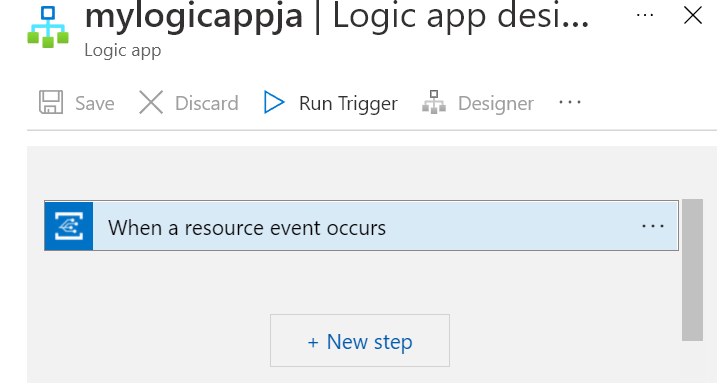
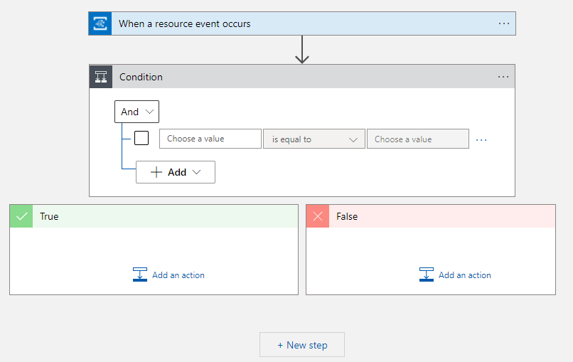
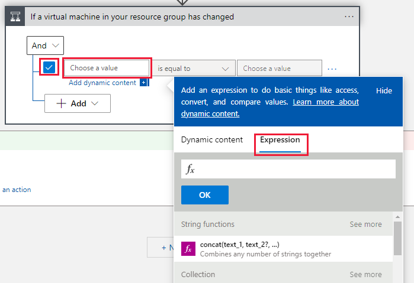
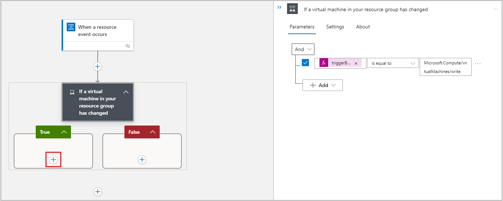
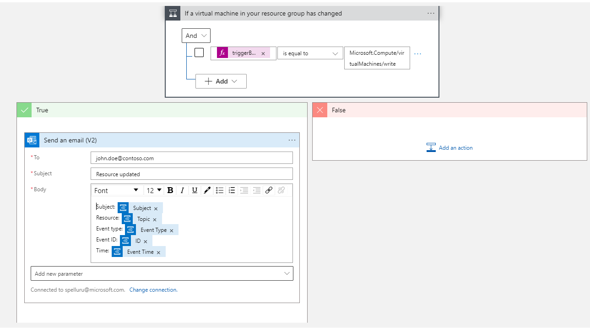

You are now ready to perform an action based on receiving a published event within your Logic App

Suppose you've finished the setup of the Logic App, as in the scenario, you now are required to send an email notification that details any change to the Virtual Machines within your Resource Group

Here you'll learn how to setup a condition which allows you to inspect an event and respond with a Logic App action to send an email .

## Add a condition
<!--Images taken from https://docs.microsoft.com/en-us/azure/event-grid/monitor-virtual-machine-changes-event-grid-logic-app-->

The first step is to create a condition that only runs the Logic App when a certain event is published

1. In Logic App Designer, under the event grid trigger, select **New step**

     

1. Under **Choose an action**, in the search box, enter condition as your filter. From the actions list, select the Condition action.

    

    > [!NOTE]
    > The Logic App Designer adds an empty condition to your workflow, which includes action paths to follow based whether the condition is true or false.

     

1. Rename to **If a virtual machine in your resource group has changed**. On the condition's title bar, select the ellipses (...) button, and select Rename.

    

1. On the first row under **And**, click inside the left box. In the content list that appears, select **Expression**

    

1. In the expression editor, enter `triggerBody()?['data']['operationName']` and select **OK**

    
    
1. Leave the middle box as **is equal to**, in the right box, enter `Microsoft.Compute/virtualMachines/write`

    

1. Save your Logic App

## Send Email Notification

The next step is to create an action based on the Logic App being triggered, this will be done by adding an email action

1. In the condition's **If true** box, select **Add an action**.

    

1. Under **Choose an action**, in the search box, enter **send an email** as your filter and select the **Office 365 Outlook** provider

    

1. If you don't already have a connection for your email provider, sign in to your email account when you're asked for authentication
1. Rename the action to `Send email when virtual machine updated`
1. Setup the dynamic content of the email

    

1. Your email action should look like

    
    
1. Your finished Logic App should now look like

    

## Test your workflow

You have now created and configured a Logic App to listen for Virtual Machine events and send an email notification with event details dynamically written into the body of the email. The final step is to test the complete workflow

1. First, we need to cause an event to fire, you can do this by resizing your Virtual Machine
1. After a couple of minutes, you should get an email similar to

    
