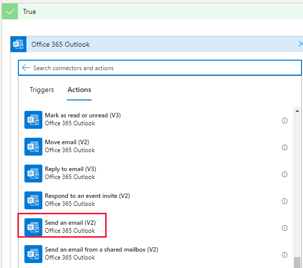

You're ready to do an action based on receiving a published event within your logic app.

You've finished the initial setup of the logic app. You now need to send an email notification that details any change to the virtual machines in your resource group.

You're going to learn how to set up a condition that allows you to inspect an event, respond with a logic app action, and send an email.

## Add a condition

First, let's create a condition that runs the logic app only when a certain event is published. Select the Logic app you just created > Logic app designer from the left-hand menu. 

1. In Logic App Designer, under the **Event Grid** trigger, select **New step**.

    

1. Under **Choose an action**, in the search box, enter **condition** as your filter. From the **Actions** list, select **Condition**.

    

    The Logic App Designer adds an empty condition to your workflow, including action paths to follow, based on a true or false condition.

     

1. On the condition's title bar, select the ellipsis (...) button, and select **Rename**. Rename the condition to **If a virtual machine in your resource group has changed**.

    

1. On the first row under **And**, click inside the left box. In the content list that appears, select **Expression**.

    

1. In the expression editor, enter `triggerBody()?['data']['operationName']` and select **OK**.

    

1. Leave the middle box as **is equal to**. In the right box, enter `Microsoft.Compute/virtualMachines/write`.

    

1. Save your logic app.

## Send an email notification

Next, we'll add an email action based on the logic app being triggered. The following steps use the Office 365 Outlook action. If you don't have an Office 365 account, you can also use Outlook.com or Gmail. The configuration for these may be slightly different, so you may need to adjust accordingly.

1. In the condition's **If true** box, select **Add an action**.

    

1. Under **Choose an action**, in the search box, enter **send an email** as your filter and select the **Office 365 Outlook** provider.

    

1. If you don't already have a connection for your email provider, sign in to your email account when you're asked for authentication.

1. Rename the action to **Send email when virtual machine updated**.

1. Set up the dynamic content of the email.

    

1. Your email action should look similar to the following. If you selected a different email account type (Outlook.com or Gmail), your options might be different.

    

1. Your finished logic app should now look similar to the following.

    

1. Select **Save** to save your logic app.

## Test your workflow

You've created and configured a logic app to listen for virtual machine events and send an email notification. Event details are dynamically written into the body of the email.

The final step is to test the complete workflow.

1. In the search bar at the top of the Azure portal, search for **vm1** and select the virtual machine in the results.

1. In the **Settings** section of the left menu, select **Size**.

1. Select a new size of **DS2_v2** for the virtual machine, and then select **Resize**.

1. After the virtual machine has been resized, you should receive an email that looks similar to the following:

    
