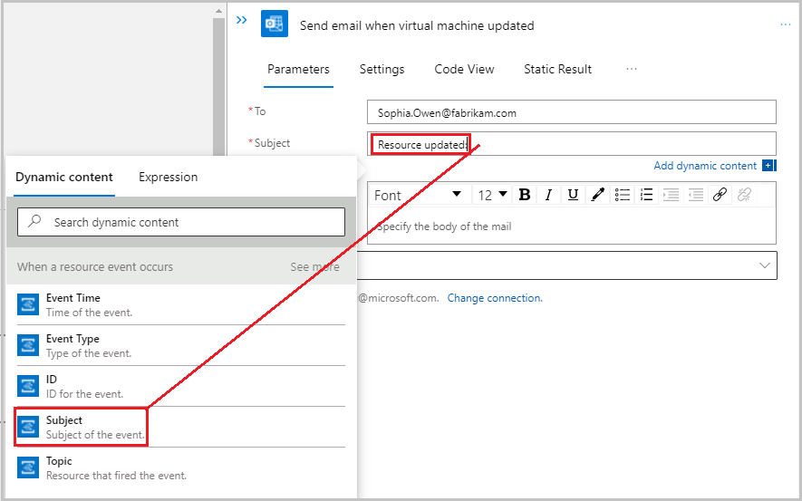
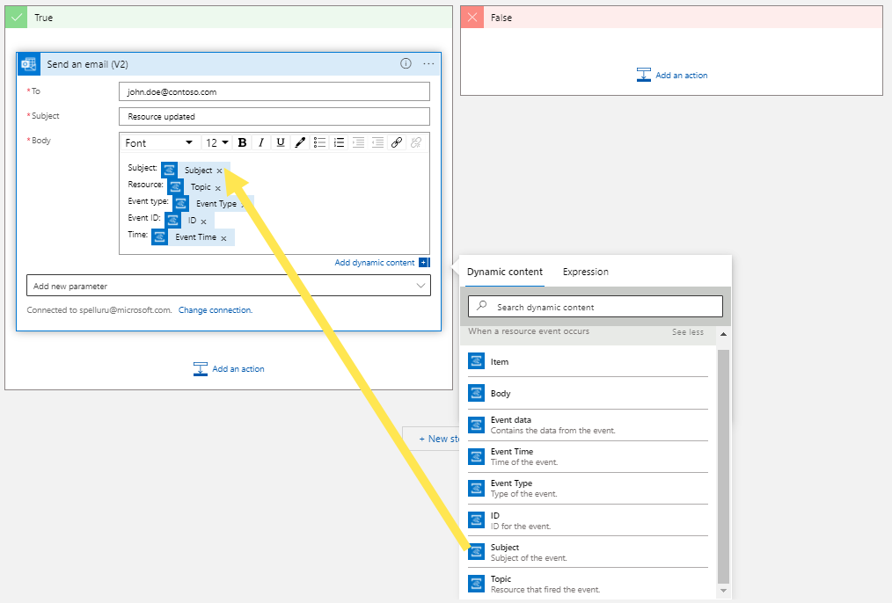

You're ready to do an action based on receiving a published event within your logic app.

You've finished the initial setup of the logic app, and now need to send an email notification that details any change to the virtual machines in your resource group.

You're going to learn how to set up a condition that allows you to inspect an event, respond with a logic app action, and send an email.

## Add a condition

First, let's create a condition that only runs the logic app when a certain event is published.

1. In Logic App Designer, under the **Event Grid** trigger, select **New step**.

     

1. Under **Choose an action**, in the search box, enter **condition** as your filter. From the actions list, select **Condition**.

    

    The Logic App Designer adds an empty condition to your workflow, including action paths to follow, based on a true or false condition.

     

1. Rename to **If a virtual machine in your resource group has changed**. On the condition's title bar, select the ellipses (...) button, and select **Rename**.

    

1. On the first row under **And**, click inside the left box. In the content list that appears, select **Expression**.

    

1. In the Expression editor, enter `triggerBody()?['data']['operationName']` and select **OK**.

    

1. Leave the middle box as **is equal to**. In the right box, enter `Microsoft.Compute/virtualMachines/write`.

    

1. Save your logic app.

## Send email notification

Next, we'll add an email action based on the logic app being triggered. The following steps are shown using the Office 365 Outlook action. If you don't have an Office 365 account to use, you can also use Outlook.com or Gmail. The configuration for these may be slightly different, so you may need to adjust accordingly.

1. In the condition's **If true** box, select **Add an action**.

    

1. Under **Choose an action**, in the search box, enter **send an email** as your filter and select the **Office 365 Outlook** provider.

    

1. If you don't already have a connection for your email provider, sign in to your email account when you're asked for authentication.

1. Rename the action to `Send email when virtual machine updated`.

1. Set up the dynamic content of the email.

    

1. Your email action should look like:

    

1. Your finished logic app should now look like:

    

## Test your workflow

You've created and configured a logic app to listen for virtual machine events and send an email notification. Event details are dynamically written into the body of the email.

The final step is to test the complete workflow.

1. In the search bar at the top of the Azure portal, search for **vm1** and select the virtual machine in the results.

1. In the **Settings** section of the left menu, select **Size**.

1. Select a new VM size of **DS2_v2**, then select **Resize**.

1. Once the VM has been resized, you should receive an email that looks similar to the following:

    
