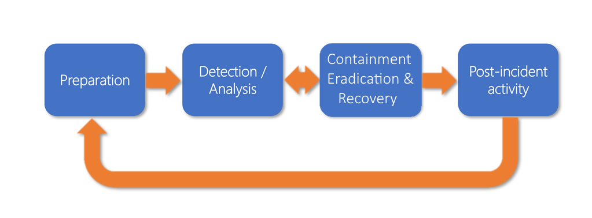

Cyberattacks and security breaches are severe threats to your business. Every organization should have a prepared _incident response plan_ to deal with security threats that impact their ability to provide service to customers, or jeopardize their ability to protect private/customer data.

## What is an incident response plan?

An incident response plan (IRP) allows you to identify and minimize the damage, reduce the cost, and fix the cause of a security attack. A well-designed IRP provides step-by-step instructions for handling an incident and ensures that the security team responds using an established set of procedures, that the right people are involved, and that proper communication channels are informed.

## Create an incident response plan

The National Institute of Standards and Technology (NIST) publishes a standard guide on how to handle security incidents. This document is a great tool to help the organization establish its response plan _before_ a significant attack occurs. Keep in mind that every organization is different and that the types of data and services they are protecting will heavily influence the plan.

There are several steps involved:

1. Establish an incident response team
1. Practice the plan
1. Revise the plan

### Establish an incident response team

One of the essential steps of creating an IRP is to define a computer security incident response team (CSIRT). This team will consist of members from several areas of the company, including:

- **Executive**: There should be a representative of the executive leadership team that can communicate with and updates the board during and after the security incident.

- **IT**: The IT department should be involved in the creation and execution of any IRP.

- **Communications**: Different people in the company will need to be informed about the security incident, and it may become necessary to let customers or even the press know about significant data breaches. Members of the communications staff and PR team should be part of the response team to craft the communications.

- **Legal**: The legal department should be involved in the planning to ensure legal compliance and regulatory requirements for your data handling are met. They can also provide advice both during and after the incident has been addressed.

### Practice the plan

Once an incident response plan has been defined, the CSIRT should run fire drills to test the plan thoroughly. This will help to identify gaps and trouble areas so they can be addressed before a real security threat emerges. The team has to respond quickly under pressure, so a clear, well-understood plan is a requirement.

### Revise the plan

The incident response plan should be evaluated on a periodic basis to ensure it's still valid, identifies the correct parties to involve, and covers the primary threat areas defined for the company servers and data. In addition, each member of the CSIRT should periodically review the plan to ensure they understand their responsibilities during an incident and that when under pressure, they can respond efficiently.

## Phases of an incident response

As mentioned earlier, the NIST defines a computer security incident guide that companies can use to craft a response plan. As part of that guide, they describe four primary phases of a security response that need to be planned out.

The following figure shows these four phases defined by the NIST. Note that the descriptions provided here are simple summaries - the overall document linked in the summary has more thorough descriptions of each phase and how you can plan a strategy.

- **Preparation.** This phase includes defining the incident response team, documenting the response plan, and also scoping out tools and processes to help prevent incidents from occurring.

- **Detection and Analysis.** Security incidents come in many forms, and you can't plan for every possible contingency. However, there are common attack vectors that _are_ well known, such as web-based and email-based attacks. These can easily be planned for, and in many cases, the response plan will incorporate standard communications and analysis. Tools such as Azure Security Center can help immensely in this area by providing a standard dashboard to detect and analyze inbound threats.

- **Containment, Eradication & Recovery.** Containment involves keeping the threat from growing or impacting other systems. Once it's contained, the response team can begin the steps to remove the threat altogether and then recover the affected systems. This step often involves a back-and-forth movement to the prior detection phase to ensure that the attack vector is truly mitigated and not simply moved to another system.

- **Post-Incident activity.** The final phase involves a post evaluation of the attack performed, the steps taken in response, and the effectiveness of the team's response. This will often lead to changes in the IRP and possible strengthening of the infrastructure to prevent future attacks of the same nature.
