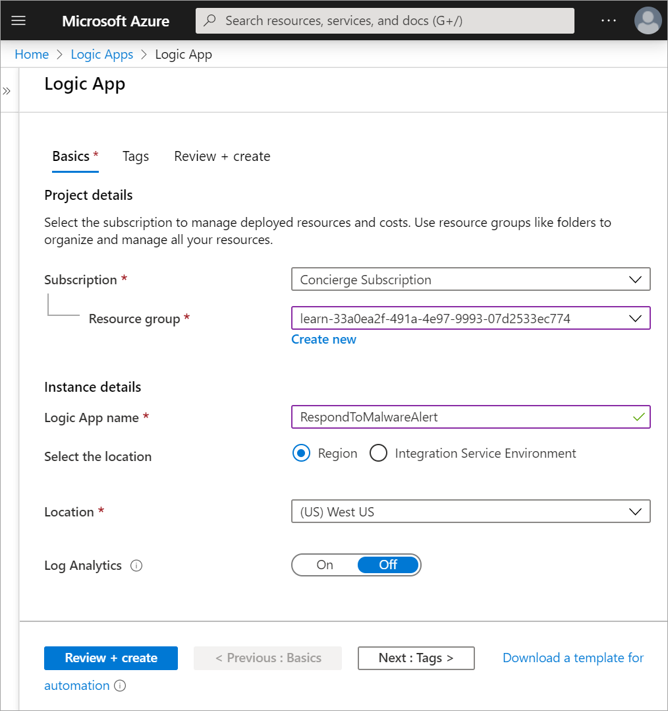
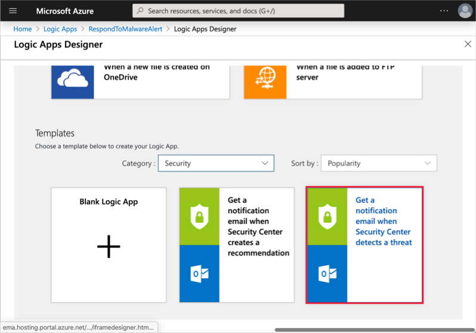
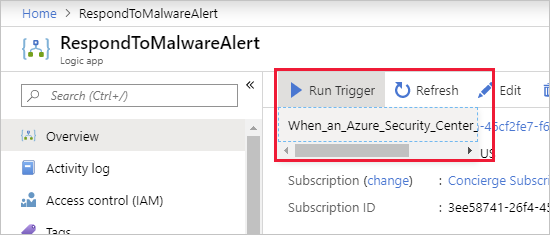

Workflow Automations are created directly in the Security Center portal.

> [!IMPORTANT]
> You will need an Office 365 email account to use this specific set of instructions - if you don't have one, try changing the instructions below to use a different template, or create a Blank Logic App.

1. Sign into the [Azure portal](https://portal.azure.com?azure-portal=true) with the same account you used to activate the Azure Sandbox.

1. Navigate to **Security Center** using the search box, through the tile on the main dashboard, or through the left-hand sidebar.

1. In the first section in the Azure Security Center left panel, select **Workflow automation.**

    

1. Select the **Add workflow automation** button to create a new automation.

1. In the **Logic App** panel, enter the following information:

   |   Field  |Value  |
   |---------|---------|
   |Name     | _RespondToMalwareAlert_      |
   |Subscription     |_Concierge Subscription_     |
   |Resource group     | <rgn>[Learn resource group]</rgn>        |
   |Select Security Center data types     |  _Threat detection alerts_   |
   |Alert name contains    | _Malware_      |
   |Alert severity    |  _All severities selected_      |

1. Under **Actions** you can select an existing Azure Logic App, or create a new one. Since we don't have any yet, select the **Create a new one** link to build a new Logic App.

    A new window will open in the Azure portal with the Logic Apps view. Make sure you're still in the Microsoft Learn Sandbox directory before continuing.

1. Select **Add**.

1. In the new window, use the following settings.


   |   Field  |Value  |
   |---------|---------|
   |Subscription     |_Concierge Subscription_     |
   |Resource group     | <rgn>[Learn resource group]</rgn>        |
   |Logic App name     | _RespondToMalwareAlert_      |

    Accept the default values for the rest of the fields.

    

1. Select **Review + create** and **Create**. It takes a minute or two to create the app. You can monitor the creation through the alerts icon, or use the **Refresh** button to refresh the screen.

1. Once the Logic App has been created, select it in your Logic Apps list to open the designer.

1. Scroll down to the **Templates** section and select **Security** from the Category drop-down list.

1. Select **Get a notification email when Security Center detects a threat** as shown below. You could also select **Blank Logic App** if you wanted to create some custom logic to run in response to an alert, or if you don't have an M365-based email account.

    

1. Select **Use this template** to create the app.

1. Provide credentials for Office 365 to connect your email account. Once validated, the owning email will be shown on the Office 365 Outlook connector.

1. Select **+** on the **Security Center Alert** connector to add support for Security Center.

1. Select **Continue** to move to the details page.

1. Specify a target email address to send the notification to.

1. On this screen you can change the subject of the email as well as all the details that will be included.

1. You can use the **+ New step** to create additional logic steps in the flow. In this case, we don't need anymore so select **Save** from the menu at the top.

1. Switch back to the Security Center window or tab and select **Refresh** to select your newly created Logic App.

1. Select **RespondToMalwareAlert** from the list of Logic Apps.

1. Select **Create** to create the workflow automation.

## Run a Workflow automation from Azure Security Center

You normally run playbooks from the Security Center dashboard using an existing alert.

1. Navigate back to the Security Center dashboard. You can use the breadcrumb bar at the top to back up.

1. Under **Threat Detection**, select **Security incidents & alerts**.

1. Here, you would select an alert, and at the top of the details page, select the **Run playbooks** button.

    

In this case, in the Azure Sandbox, you likely don't have any alerts - so you can't execute the playbook this way. However, we can test it through the Logic Apps panel.

## Test a workflow automation from Logic Apps

1. Select **Home** from the left-hand sidebar. You should see your Logic App as a recently created resource. If not, try searching for it from the top search bar - recall the name is **RespondToMalwareAlert**.

1. On the **Overview** panel, use the **Run Trigger** button to show the trigger and select it.

    

1. A new entry will show up under _Runs history_ in the Overview panel. You can select that entry to drill into details. For example, you can drill into the inputs and outputs of the run:

### Inputs

```json
{
    "method": "post",
    "path": "/Mail",
    "host": {
        "connection": {
            "name": "/subscriptions/abcd/resourceGroups/abcd/providers/Microsoft.Web/connections/office365"
        }
    },
    "body": {
        "Body": "Azure Security Center has discovered a potential security threat in your environment - Alert details below:\n\nAlert name: \n\nDescription: \n\nDetection time: \n\nAttacked resource: \n\nDetected by: \n\nAlert ID: ",
        "Importance": "High",
        "Subject": "Azure Security Center has discovered a potential security threat in your environment",
        "To": "john@doe.com"
    }
}
```

### Outputs

```json
{
    "statusCode": 200,
    "headers": {
        "Pragma": "no-cache",
        "x-ms-request-id": "615f4430-7433-4fd3-aa2d-000e8a1a0db9",
        "Strict-Transport-Security": "max-age=31536000; includeSubDomains",
        "X-Content-Type-Options": "nosniff",
        "X-Frame-Options": "DENY",
        "Timing-Allow-Origin": "*",
        "x-ms-apihub-cached-response": "true",
        "Cache-Control": "no-store, no-cache",
        "Date": "Fri, 10 Oct 2019 09:17:32 GMT",
        "Set-Cookie": "ARRAffinity=9c9c847b5bd6c73a56d4f1afae4aecaa7f5b746d703be6c728afc87b6c50d7e3;Path=/;HttpOnly;Domain=office365-wus.azconn-wus.p.azurewebsites.net",
        "Content-Length": "0",
        "Expires": "-1"
    }
}
```
