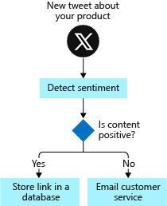
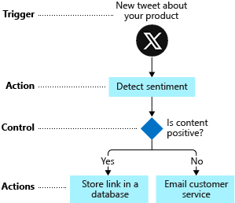

Implementing business processes is difficult because you need to make diverse services work together. Think about everything your company uses to store and process data: Salesforce, Office 365, Oracle, Twitter, YouTube, Dropbox, Google services, Azure Cognitive Services, and so on. How do you integrate all these products?

Azure Logic Apps gives you pre-built components to connect to hundreds of services. You put the pieces together in any combination you need. For example, in the shoe-company scenario, we want to monitor social media reaction to our new product. We'll build a logic app to integrate Twitter, Azure Cognitive Services, SQL Server, and Outlook email.

In this unit, we'll plan the sequence of steps needed to implement a business process. Then we'll map those steps to the pre-built components in Azure Logic Apps. Finally, we'll assemble the parts into an app using the Logic Apps Designer. The following illustration shows an overview of the app-development process.

## Plan your business process

The first step to creating a logic app is planning the steps of your business process. In the social-media monitoring scenario, the steps would be:

- Detect tweets about the product
- Analyze the sentiment
- Store a link to positive tweets, and
- Email customer service for negative tweets

It's common to use a flowchart to capture the steps of the process. The following illustration shows the flowchart for the social-media monitor app.

## Identify the type of each step in your process

The steps of a business process do different types of operations. Some respond to external events, some process or store data, and others make decisions based on the data. Logic Apps uses the terms *trigger*, *action*, and *control action* for these three categories.

For example, in our social-media monitor scenario, we *trigger* the process when a new tweet is posted, perform *actions* like detect the sentiment, and make a *control* decision based on the sentiment score. The following illustration shows the type of each step in the social-media monitor app.

## Map your steps to Logic Apps components

Let's be more formal about the definitions of the component types:

- A *trigger* is an event that occurs when a specific set of conditions is satisfied. Triggers activate automatically when the conditions are right (for example, when a timer expires or data becomes available). Every logic app must start with a trigger. In our example, we'll trigger the app when a new tweet mentions our product.

- An *action* is an operation that executes one of the tasks in your business process. Actions run when a trigger activates or another action completes. Our social-media monitor app has three actions: detect sentiment, insert database row, and send email.

- *Control actions* are special built-in actions that let you add decisions and loops to your app. Our example will use a control action to branch based on the sentiment score.

A group of related triggers and actions are packaged inside a *connector*. Conceptually, you can think of a connector as a component that lets you access an external service. For example, the Twitter connector lets you send and receive tweets while the Microsoft 365 Outlook connector allows you to manage your email, calendar, and contacts. The following illustration shows the Twitter connector with its operations divided into the two categories.

Your job is to map each task in your flowchart to Logic Apps triggers and actions. The following illustration shows the connectors we'd use in the social-media app with the relevant triggers and actions highlighted.

## Define your app using the Logic Apps Designer

The Logic Apps Designer is a graphical tool for creating your workflows. It lets you pick from a gallery of connectors that contain the triggers and actions you can use in your app. You'll use the graphical Logic Apps Designer to arrange the trigger, actions, and control actions. The following screenshot shows the designer with the completed application.

When you save your app, it will be live and will run automatically whenever the trigger activates.

## Knowledge check

The questions in this knowledge check relate to the workflows shown in the following illustrations. Each question will ask you to evaluate one of the workflows to find the correct answer.

| Social media workflow | Email attachment processing workflow |
| --- | --- |
|  |  |
| | |
