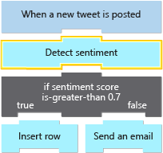

In this exercise, we're going to continue work on our social-media monitor app. We'll analyze whether the tweets about our product are positive or negative. We'll create a Detect-sentiment action, which will provide us a numeric *Score* that represents the sentiment of the tweet. The following illustration shows a conceptual view of the app with the part that we'll work on highlighted.



## Get Text Analytics Key and endpoint

The Azure Text Analytics API provides natural language processing of text. It lets you do sentiment analysis, key phrase extraction, language detection, and entity linking. We'll be using it for sentiment analysis. We'll run a script in this section to programmatically set up a Cognitive Services account in the sandbox, register the Text Analytics service, and return a key and the endpoint ULR to us. We'll need those values in this exercise to make calls and get back sentiment scores. 

The Cognitive Services account is created in the sandbox environment and is, therefore, free for use in this module. 

1. In the Cloud Shell to the right, run the following curl command to copy the **setup-textanalytics.sh** script from GitHub

    ```azurecli
    curl https://raw.githubusercontent.com/MicrosoftDocs/mslearn-route-and-process-data-logic-apps/master/setup-textanalytics.sh > setup-textanalytics.sh
    ```

1. Run the following command to execute the script. This command will take a couple of minutes. 

    ```azurecli
    bash setup-textanalytics.sh
    ```

1. Wait for the script to complete. When it finishes, the Cloud  Shell displays values for the following properties.
     - **Cognitive Services account key**
     - **Cognitive Services account endpoint**

    Save the values that are displayed in the Cloud Shell somewhere safe. We need them in this exercise when we update our app in the portal. 

## Locate the Detect-sentiment action

Here, we'll locate the Detect-sentiment action using the [Azure portal](https://portal.azure.com/learn.docs.microsoft.com?azure-portal=true). 

1. Return to the Logic App designer by selecting **Logic app designer**. This button is located under the Development Tools section of the left navigation bar.

1. Under the Twitter trigger, click **New step**.

1. In the **Search connectors and actions** search box, type "Text analytics".

1. Select the **Text Analytics** connector.

1. In the Actions section, select **Detect Sentiment**.

## Create a Detect-sentiment action

Now that we located the Detect-sentiment action, let's create an instance of it. In this process, we'll also configure it to connect to our Text Analytics subscription.

1. In the Connection Name field, type **CognitiveServicesConnection**.

1. Paste your saved API key in the **Account Key** field and your saved endpoint address in the **Site URL** field.

1. Click **Create**.

## Configure your Detect-sentiment action

Next, we'll configure our Logic App to pass the tweet text to the Detect-sentiment action.

1. In the **Detect Sentiment** step, select *Text* from the **Add new parameter** dropdown list.

1. Select the **Text** field in the Detect-sentiment action.

1. In the Dynamic content popup, select **Original tweet text**.

    > [!NOTE]
    > If you are using the RSS **When a feed item is published** trigger, please send the **FeedSummary** to the Text Analytics service.

1. Click **Save** in the Logic App designer.

## Examine the results of your Detect-sentiment action

Your app is now live. Tweets containing your product name will be processed by the Text Analytics service and you'll be given a numeric score. Recall that a score close to 1 is positive sentiment while a score near 0 is negative. In this section, you'll see how to monitor the execution of your app and view the data flowing through each step. This tool is great to know about since it helps you verify your app is working correctly.

1. In the left navigation bar, select **Overview**.

1. Click **Refresh** once a minute until you see a new row item in the **Runs history** table.
    > [!NOTE]
    > Each item in the **Runs history** table represents a separate tweet that contained the name of the product you entered in the **Search text** of your trigger.

1. Once you see a row item appear, select the item.

1. Select the Detect-sentiment action.

1. Locate the text of the tweet and the score that was given to it by the Cognitive Services engine.