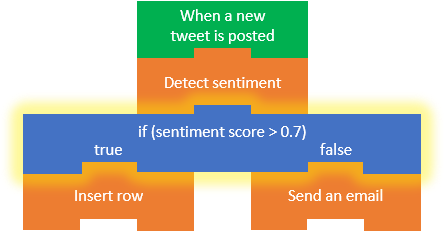
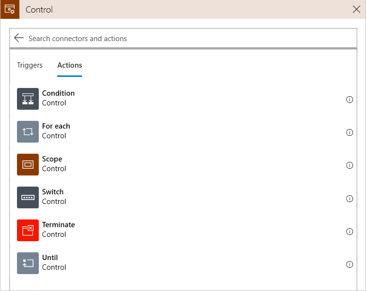

Control actions let your Logic App make decisions. The social-media monitor will use a control action to test the sentiment score of a tweet and branch based on whether it is positive or negative. In this unit, we'll look at the four control actions that help you manage the execution path through your app. Then, we'll see how to use the Logic Apps Designer to add a control action and configure its settings.

## *Condition* action

A *condition* action is an *if* statement that lets your app do different things based on the data you're processing. It consists of a Boolean expression and two actions. At runtime, the execution engine evaluates the expression and chooses an action based on whether the expression is true or false.

For example, you might want to route an expense report to a different manager based on the amount. If you're processing an email, you might need to test whether it is flagged as high-priority. In our social-media app, we'll use a *condition* statement to branch based on the sentiment score of the tweet. The following illustration shows the use of the *condition* control action in our app.



### Types and operators

You can test numeric, string, Boolean, and JSON objects in your conditions. The following pseudo-code shows one example of each of the simple types:

```
if (score is-greater-than 0.7)              ... // Numeric
if (TweetedBy does-not-contain "MyCompany") ... // String
if (Favorited is-equal-to true)             ... // Boolean
```

Each type has a set of operators you can use in your comparisons. The following table lists the operators for each type.

| Numeric                     | String              | Boolean         | JSON objects    |
| --------------------------- | ------------------- | --------------- | --------------- |
| is-equal-to                 | is-equal-to         | is-equal-to     | is-equal-to     |
| is-not-equal-to             | is-not-equal-to     | is-not-equal-to | is-not-equal-to |
| is-greater-than             | contains            |                 |                 |
| is-greater-than-or-equal-to | does-not-contain    |                 |                 |
| is-less-than                | starts-with         |                 |                 |
| is-less-than-or-equal-to    | does-not-start-with |                 |                 |
|                             | ends-with           |                 |                 |
|                             | does-not-end-with   |                 |                 |
|||||

Most of the operations are intuitive, but there are two cases worth mentioning:

* String comparisons are all case sensitive.
* JSON comparisons use what's called *deep* equals. This means operator will compare the entire objects, including any descendant tokens for complex objects.

<!-- TODO in process of verifying with product team whether this is true or a bug
> [!IMPORTANT]
> Boolean comparison is case sensitive. For example, if the incoming data uses an uppercase first letter like "True" for a Boolean value, you need to use that same string in your comparison. Please examine the format used by your incoming data to decide what to use in your comparison.
-->

### Combine expressions using **AND** and **OR**

Logic Apps lets you create complex expressions by combining conditions using **AND** or **OR**. Suppose you wanted to identify tweets that were neutral in their sentiment (recall that a score close to 0.5 is neutral). You could write an expression similar to the following pseudo-code:

```
if (score is-greater-than 0.4 AND score is-less-than 0.6)
```

### Data availability

Logic Apps makes the data from all previous steps available in subsequent steps. This means your expressions can use values generated by any of the previous steps. You can even combine values from different steps in one expression. For example, the following pseudo-code looks for tweets with positive sentiment that were *not* sent by your company. Notice that the **score** comes from the Detect-sentiment action while the **TweetedBy** value is from the When-a-new-tweet-is-posted trigger.

```
if (score is-greater-than 0.7 AND TweetedBy does-not-contain "MyCompany")
```

### Create complex expressions with groups

Suppose you want to build an expression to identify influential tweets. You decide that there are two criteria that would qualify:

* The sentiment score is above 0.9 and the tweet has been marked as a favorite
* The retweet count is greater than 1000.

You want to build an expression like the following pseudo-code to capture this idea:

```
if (score is-greater-than 0.9 AND Favorited is-equal-to true OR RetweetCount is-greater-than 1000) // Error, cannot mix AND and OR
```

Logic Apps does support this, but not directly. You need to use a feature called "groups" to do it. A *group* is a sequence of expressions combined with either **AND** or **OR**. You can't mix **AND** and **OR** within a group.

Let's look at a few examples expressed as pseudo-code. To help make it easier to read, we'll use lowercase letters to represent the expressions that we need to combine. The first example below is a legal group but the second one is not:

```
if (a AND b AND c) // OK
if (a AND b OR  c) // Error, cannot mix AND and OR
```

Instead, you would create a group for the expressions connected by **AND** in the preceding example. Then use **OR** to connect the group to the other expression. We use brackets in the following pseudo-code to represent a group:

```
if ([a AND b] OR c) // OK
```

## *Switch* action

A *switch* action compares a value against several cases and executes only the one that matches. A *switch* can include a *default* action that runs if there's no match.

For example, suppose you are processing an email message and want to respond differently based on the message **Importance**. The **Importance** in an Outlook email is an integer between 0 and 2. The following pseudo-code shows how you might build a *switch* action for email importance. 

```
switch (Importance)
  case 0: ... // action(s) for low importance
  case 1: ... // action(s) for medium importance
  case 2: ... // action(s) for high importance
  default: ...
```

## *Foreach* loop

A *foreach* loop action processes an array. It performs the same actions on each array item. By default, the actions for each array element run in parallel, although you can control this in the loop's configuration.

For example, part of the tweet data returned by the When-a-new-tweet-is-posted trigger is an array of URLs for the media included in the tweet. Suppose you wanted to insert each URL into its own row in a database. You could use a *foreach* action like the following pseudo-code to do the processing:

```
foreach url in MediaUrls
    insert-row
```

## *Until* loop

The *until* loop action runs a group of actions multiple times. You can set three different stop criteria and the loop runs until one of them is true:

* Condition: an expression evaluated after every iteration
* Count: the maximum number of iterations (the default is 60)
* Timeout: the maximum clock time allowed specified using ISO 8601 format (the default is one hour).

This loop can be used to process data, but it's also a good option when you need to retry a networking operation until it succeeds to times out. For example, suppose your app needed to run an action that made an HTTP request. You could use an *until* loop similar to that shown in the following pseudo-code (the time value "PT5M" is equal to five minutes):

```
repeat
    HTTP Get
until (StatusCode is-equal-to 200 OR Count is-greater-than 3 OR Timeout is-greater-than PT5M)
```

## Add a control action using the Designer

The Logic Apps Designer gives you a GUI to add and configure a control action. They are all packaged inside the *Control* connector, so the first step is finding that connector. Once you've located the connector, you'll see the four control actions we discussed and a few others that are useful, but not directly related to our goal of managing control flow. The following screenshot shows the available control actions displayed in the Designer.



In our social-media monitor app, we'll be using the *Condition* action to add an if-statement to test the sentiment score. The Designer gives you a GUI that lets you build complex expressions, included groups. The following screenshot shows the condition action for the social-media monitor app displayed in the Designer.

