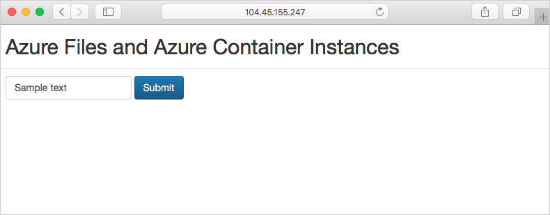

By default, Azure Container Instances is stateless. If the container crashes or stops, all of its state is lost. To persist state beyond the lifetime of the container, you must mount a volume from an external store.

Here, you will mount an Azure file share to an Azure container instance for data storage and retrieval.

## Create an Azure file share

Run the following script to create a storage account. The storage account name must be globally unique, so the script adds a random value to the base string:

```azurecli
ACI_PERS_STORAGE_ACCOUNT_NAME=mystorageaccount$RANDOM

az storage account create \
    --resource-group <rgn>[sandbox resource group name]</rgn> \
    --name $ACI_PERS_STORAGE_ACCOUNT_NAME \
    --sku Standard_LRS \
    --location eastus
```

Run the following command to place the storage account connection string into an environment variable named *AZURE_STORAGE_CONNECTION_STRING*. This environment variable is understood by the Azure CLI and can be used in storage-related operations:

```azurecli
export AZURE_STORAGE_CONNECTION_STRING=$(az storage account show-connection-string --resource-group <rgn>[sandbox resource group name]</rgn> --name $ACI_PERS_STORAGE_ACCOUNT_NAME --output tsv)
```

Create a file share in the storage account by running the `az storage share create` command. The following example creates a share with the name *aci-share-demo*:

```azurecli
az storage share create --name aci-share-demo
```

## Get storage credentials

To mount an Azure file share as a volume in Azure Container Instances, you need three values: the storage account name, the share name, and the storage account access key.

If you used the script above, the storage account name was created with a random value at the end. To query the final string (including the random portion), use the following commands:

```azurecli
STORAGE_ACCOUNT=$(az storage account list --resource-group <rgn>[sandbox resource group name]</rgn> --query "[?contains(name,'$ACI_PERS_STORAGE_ACCOUNT_NAME')].[name]" --output tsv)
echo $STORAGE_ACCOUNT
```

The share name is already known (aci-share-demo), so all that remains is the storage account key, which can be found using the following command:

```azurecli
STORAGE_KEY=$(az storage account keys list --resource-group <rgn>[sandbox resource group name]</rgn> --account-name $STORAGE_ACCOUNT --query "[0].value" --output tsv)
echo $STORAGE_KEY
```

## Deploy container and mount volume

To mount an Azure file share as a volume in a container, specify the share and volume mount point when you create the container:

```azurecli
az container create \
    --resource-group <rgn>[sandbox resource group name]</rgn> \
    --name aci-demo-files \
    --image microsoft/aci-hellofiles \
    --location eastus \
    --ports 80 \
    --ip-address Public \
    --azure-file-volume-account-name $ACI_PERS_STORAGE_ACCOUNT_NAME \
    --azure-file-volume-account-key $STORAGE_KEY \
    --azure-file-volume-share-name aci-share-demo \
    --azure-file-volume-mount-path /aci/logs/
```

Once the container has been created, get the public IP address:

```azurecli
az container show \
    --resource-group <rgn>[sandbox resource group name]</rgn> \
    --name aci-demo-files \
    --query ipAddress.ip \
    --output tsv
```

Open a browser and navigate to the container's IP address. You will be presented with a simple form. Enter some text and click **Submit**. This action will create a file in the Azure Files share containing the entered text.



To validate, you can navigate to the file share in the Azure portal and download the file.

1. Get the filename

    ```azurecli
    az storage file list -s aci-share-demo -o table
    ```

1. Download it, make sure to replace the `<filename>` below.

    ```azurecli
    az storage file download -s aci-share-demo -n <filename>
    ```
    


If the files and data stored in the Azure Files share were of any value, this share could be remounted on a new container instance to provide stateful data.