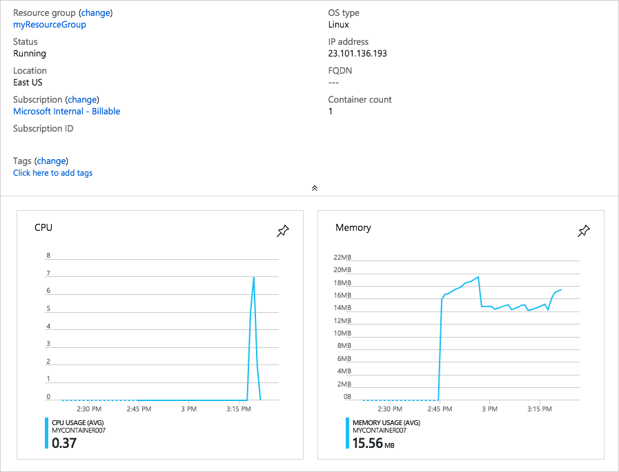

Here, you will perform some basic troubleshooting operations such as pulling container logs, container events, and attaching to a container instance. By the end of this module, you should understand basic capabilities for troubleshooting container instances.

## Create a container

Start by creating the following container: 

```azurecli
az container create \
    --resource-group <rgn>[sandbox resource group name]</rgn> \
    --name mycontainer \
    --image microsoft/sample-aks-helloworld \
    --ports 80 \
    --ip-address Public \
    --location eastus
```

## Get logs from a container instance

To view logs from your application code within a container, you can use the `az container logs` command:

```azurecli
az container logs \
    --resource-group <rgn>[sandbox resource group name]</rgn> \
    --name mycontainer
```

Example output:

```output
Checking for script in /app/prestart.sh
Running script /app/prestart.sh
Running inside /app/prestart.sh, you could add migrations to this file, e.g.:

#! /usr/bin/env bash

# Let the DB start
sleep 10;
# Run migrations
alembic upgrade head
```

## Get container events

The `az container attach` command provides diagnostic information during container startup. Once the container has started, it also streams STDOUT and STDERR to your local console:

```azurecli
az container attach \
    --resource-group <rgn>[sandbox resource group name]</rgn> \
    --name mycontainer
```

Example output:

```output
Container 'mycontainer' is in state 'Running'...
(count: 1) (last timestamp: 2018-09-21 23:48:14+00:00) pulling image "microsoft/sample-aks-helloworld"
(count: 1) (last timestamp: 2018-09-21 23:49:09+00:00) Successfully pulled image "microsoft/sample-aks-helloworld"
(count: 1) (last timestamp: 2018-09-21 23:49:12+00:00) Created container
(count: 1) (last timestamp: 2018-09-21 23:49:13+00:00) Started container

Start streaming logs:
Checking for script in /app/prestart.sh
Running script /app/prestart.sh
```

> [!TIP]
> To disconnect from an attached container, press <kbd>Ctrl+C</kbd>.

## Execute a command in a container

Azure Container Instances supports executing a command in a running container. Running a command in a container you've already started is especially helpful during application development and troubleshooting. The most common use of this feature is to launch an interactive shell so that you can debug issues in a running container.

This example starts an interactive terminal session with the running container:

```azurecli
az container exec \
    --resource-group <rgn>[sandbox resource group name]</rgn> \
    --name mycontainer \
    --exec-command /bin/sh
```

Once the command has completed, you are effectively working inside of the container. In this example, the `ls` command was run to display the contents of the working directory:

```output
# ls
__pycache__  main.py  prestart.sh  static  templates  uwsgi.ini
```

Run `exit` to stop the remote session.

## Monitor container CPU and memory

You may want to pull metrics on CPU and memory usage. To do so, first get the ID of the Azure container instance. In this example, the ID is placed in a variable named `CONTAINER_ID`:

```azurecli
CONTAINER_ID=$(az container show --resource-group <rgn>[sandbox resource group name]</rgn> --name mycontainer --query id --output tsv)
```

Now, use the `az monitor metrics list` command to pull back CPU usage information:

```azurecli
az monitor metrics list \
    --resource $CONTAINER_ID \
    --metric CPUUsage \
    --output table
```

Example output:

```output
Timestamp            Name              Average
-------------------  ------------  -----------
2018-08-20 21:39:00  CPU Usage
2018-08-20 21:40:00  CPU Usage
2018-08-20 21:41:00  CPU Usage
2018-08-20 21:42:00  CPU Usage
2018-08-20 21:43:00  CPU Usage      0.375
2018-08-20 21:44:00  CPU Usage      0.875
2018-08-20 21:45:00  CPU Usage      1
2018-08-20 21:46:00  CPU Usage      3.625
2018-08-20 21:47:00  CPU Usage      1.5
2018-08-20 21:48:00  CPU Usage      2.75
2018-08-20 21:49:00  CPU Usage      1.625
2018-08-20 21:50:00  CPU Usage      0.625
2018-08-20 21:51:00  CPU Usage      0.5
2018-08-20 21:52:00  CPU Usage      0.5
2018-08-20 21:53:00  CPU Usage      0.5
```

The following command can be used to get memory usage information:

```azurecli
az monitor metrics list \
    --resource $CONTAINER_ID \
    --metric MemoryUsage \
    --output table
```

Example output:

```output
Timestamp            Name              Average
-------------------  ------------  -----------
2018-08-20 21:43:00  Memory Usage
2018-08-20 21:44:00  Memory Usage  0.0
2018-08-20 21:45:00  Memory Usage  15917056.0
2018-08-20 21:46:00  Memory Usage  16744448.0
2018-08-20 21:47:00  Memory Usage  16842752.0
2018-08-20 21:48:00  Memory Usage  17190912.0
2018-08-20 21:49:00  Memory Usage  17506304.0
2018-08-20 21:50:00  Memory Usage  17702912.0
2018-08-20 21:51:00  Memory Usage  17965056.0
2018-08-20 21:52:00  Memory Usage  18509824.0
2018-08-20 21:53:00  Memory Usage  18649088.0
2018-08-20 21:54:00  Memory Usage  18845696.0
2018-08-20 21:55:00  Memory Usage  19181568.0
```

This information is also available in the Azure portal. To see a visual representation of CPU and memory usage information, visit the Azure portal overview page for a container instance.



[!include[](../../../includes/azure-sandbox-cleanup.md)]
