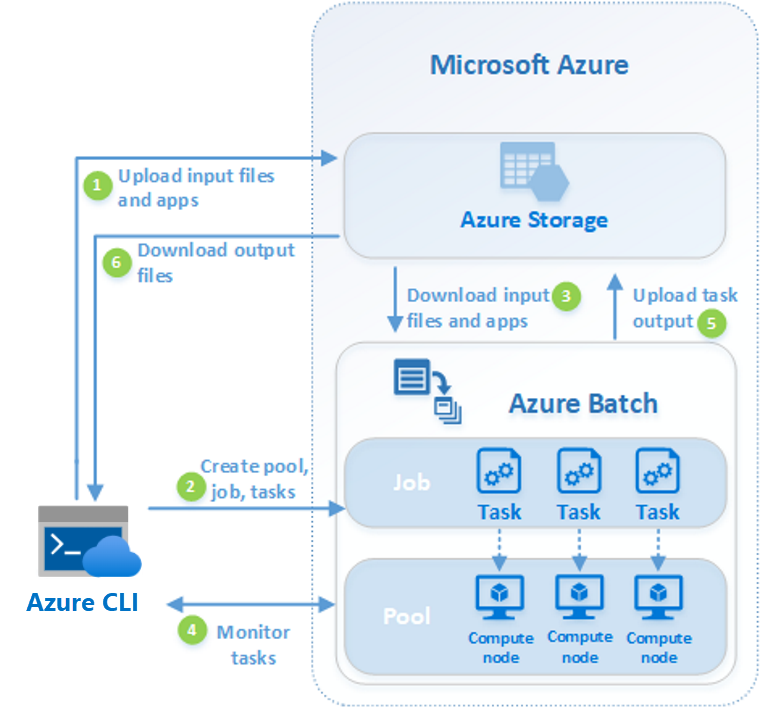

Few organizations have the resources to support permanent deployments of super-powerful compute platforms, which may only occasionally be used to capacity. More typically, you need a flexible and scalable compute solution, such as Azure Batch, to provide the computational power.

As part of the process of performing OCR on the uploaded pictures of water purification meters using Azure Batch, you need to have an understanding of the main components of an Azure Batch workflow.

Here, you'll look at what Azure Batch is designed to do, and how Batch components are used in a typical workflow.

## Compute-intensive tasks and parallel workloads 

Some workloads require massive computational power. Examples include financial risk modeling, 3D image rendering, media transcoding, and genetic sequence analysis. In some cases, these workloads can be broken down into separate subtasks and can be run in parallel, so that the tasks are performed in much less time. Three Virtual Machines (VMs) can do the work of one in a third of the time.

As part of the OCR project for the non-profit, you can use Azure Batch to partition up the work of performing the OCR so that the processing is done in parallel and takes much less time to complete.

## The components of Azure Batch

Azure Batch can be used for these large-scale parallel and computationally intensive tasks on Azure. At a high level, Azure Batch involves a number of components working together. Everything needs to take place within the context of an Azure Batch account, which acts as a container for all Batch resources. For some use cases, you may wish to associate this account with an Azure Storage account for the purposes of downloading input files and applications for use during execution and storing their results. Within your Azure Batch account, you can create pools of virtual compute nodes, running either Windows or Linux, of the number and CPU and memory size that you specify, which are managed and scheduled for you by the Azure Batch service. A Batch account can contain many Batch pools. Once you've created one or more pools, you create individual jobs, which act like logical containers for all the tasks you schedule and can share common properties. Again, it's perfectly possible to have many jobs. And finally, you create tasks, which describe how the work actually gets done. You can either use tasks to directly invoke the command line, or the tasks can run applications that you upload to Azure Storage. We'll see all the main components of Azure Batch working together in the next exercise.

## Typical Azure Batch workflow

So what does a typical Azure Batch workflow actually look like? As shown in the graphic below, a typical real-world Azure Batch scenario will require data and application files. The Batch workflow begins by uploading these data and application files to an Azure storage account. You then create a Batch pool with as many Windows or Linux virtual compute nodes as needed. They can also be autoscaled according in case the demands of your workloads vary over time.

The Batch service will then handle bringing the nodes online and scheduling tasks for execution onto the nodes. Before the tasks begin execution, they may download any data and application files from storage that they need for processing. While the tasks are executing, it's possible to query the status of the nodes and the progress of the tasks. Once the nodes complete their tasks, their task output can be examined or pushed to Azure storage.  

<!-- TODO: Graphic similar to the one here, but please replace 'Application or service' with 'Azure CLI' and an image of a terminal window https://learn.microsoft.com/azure/batch/batch-technical-overview> -->

