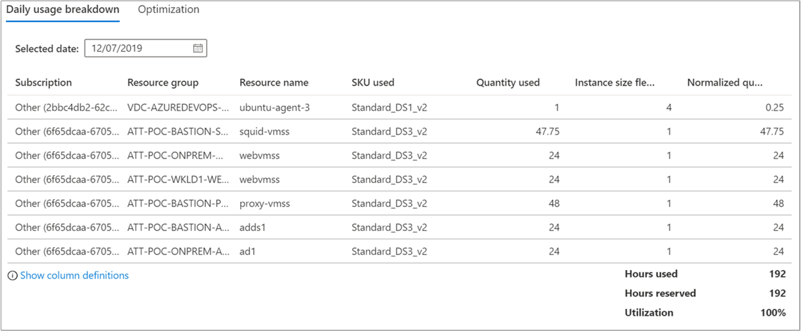

After you purchase a reservation, you should monitor its use to ensure you're fully using it. This unit explains how to find reservations with low utilization and how to optimize their use.

## View your reservation utilization

One way of viewing reservation usage is in the Azure portal. To maximize savings, try to get the reservation to 100% utilization wherever possible.

1. Sign in to the [Azure portal](https://portal.azure.com/).
1. Select **All services** &gt; **[Reservations](https://portal.azure.com/#blade/Microsoft_Azure_Reservations/ReservationsBrowseBlade)** and note the **Utilization (%)** for a reservation.  
  
1. Select the reservation utilization percentage to see utilization details.  
  
1. Select a point on the chart to see the usage breakdown by resource in the view.  
  

Billing admins can view all reservations from Cost Management + Billing > Reservation Transactions > and then select the blue banner.

You can get the same data that we covered in the preceding sections using APIs.

- Use the Reservation Summaries API to get reservation utilization percentage data at https://docs.microsoft.com/rest/api/consumption/reservationssummaries.
- Use Reservation Details API to determine which resources got a reservation discount and for what quantity at https://docs.microsoft.com/rest/api/consumption/reservationsdetails/list.

## Make optimizations with exchanges or scope changes

If you find that your organization's reservations are being underused, you have several ways to act.

**Exchange a reservation**

If your reservation is consistently underutilized, consider exchanging the unused quantity for another recommended size.

:::image type="content" source="../media/6-exchange-reservation.png" alt-text="Screenshot showing the Exchange option." lightbox="../media/6-exchange-reservation.png" :::

- VM reservations exchanges are interchangeable. So, you can exchange Azure virtual machines, Azure Dedicated Hosts, or Azure VMware Solution reservations interchangeably.
- You can also exchange other reservations within the same product type. For example, a SQL reservation can be exchanged for another SQL product.
- You can change the product, region, term, and payment option when you make an exchange. For example, you can return a quantity for 30 for a Ds1_v3 – West US with a 1-year term that was originally purchased for a quantity of 100. Then purchase a quantity of 20 Es4_v3 – East US with a 3 year term, as part of the exchange.
- When exchanging, the prorated reservation amount is refunded and you're charged fully for the new purchase. The prorated reservation amount is the daily prorated residual value of the reservation being returned.
- The new reservation's lifetime commitment should equal or be greater than the returned reservation's remaining commitment. For example, for a three-year reservation that's $100 per month that’s exchanged after the 18th payment, the new reservation's lifetime commitment should be $1,800 or more (paid monthly or upfront).
- There are no fees or penalty on exchange.

**Change your resources**

Where possible, you can resize existing resources that don’t get a reservation discount to sizes that match the under-utilized reservation. For example, you can change your VM from a D series to an E series if you have an unused reservation for the type E series in a matching region.

**Change the reservation scope**

If your reservation is scoped to a single subscription or resource group, then it’s possible that another subscription or resource group has matching resources that can benefit from the reservation. Consider one of the following two actions:

- Change the reservation scope to Shared scope
- Split the reservation into smaller chunks and assign them individually to scopes that have utilization for matching resources.

**Refund a reservation**

- You can refund reservations in the Azure portal. Select the reservation that you want to return and select **Refund**.
- Azure currently isn’t charging an early termination fee, but in the future there might be a 12% early termination fee for cancellations.
- The total canceled commitment can't exceed 50,000 USD in a 12-month rolling window for a billing profile or single enrollment. For example, for a three-year reservation that's 100 USD per month and it's refunded in the 18th month, the canceled commitment is 1,800 USD. After the refund, your new available limit for refund will be 48,200 USD. After 365 days of the refund, the 48,200 USD limit will be increased by 1,800 USD and your new pool will be 50,000 USD. Any other reservation cancellation for the billing profile or EA enrollment will deplete the same pool, and the same replenishment logic will apply.
- Azure won't process any refund that will exceed the 50,000 USD limit in a 12-month window for a billing profile or EA enrollment.
