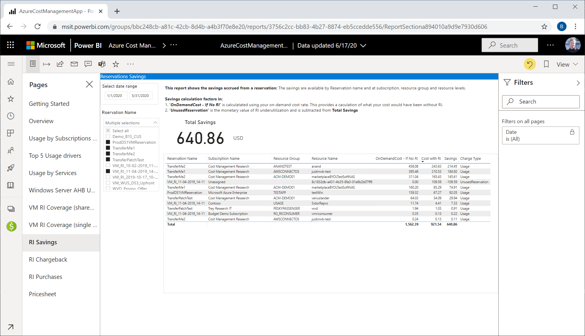
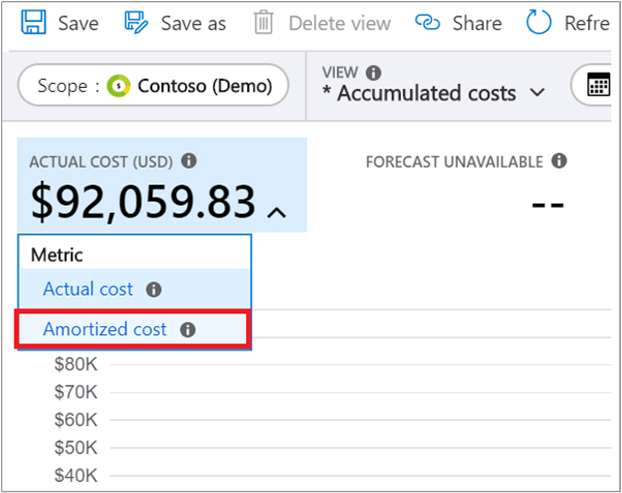
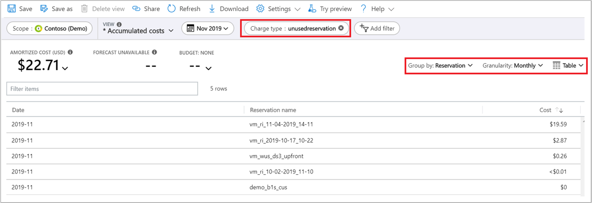

This unit covers some of the key reports that you might want to create or use after you buy a reservation to analyze and perform reporting. One of the first things you should do is analyze the Reservation savings report to look at unused reservation costs and savings. If you want to charge back, create a chargeback report to distribute costs to whoever uses the reservation. 

It's important to understand two concepts: actual cost data and amortized cost data.

- Actual cost data is used for purchases and to audit resources that don't show cost because of reservation application.
- Amortized data is used in charge back reports, savings reports, and unused reservation reports. Amortized cost is the consumption value based on the discounted price for any instances that are covered by reservations. Amortized costs are shown in reports evenly distributed over the duration of the reservation term.

## Review reservation savings in Power BI

Enterprise Agreement and Microsoft Customer Agreement customers can view the RI Savings report in the Power BI Cost Management App to view reservation transactions. The report takes the on-demand cost of resources and subtracts your purchased reservation costs to show savings. If you have unused reservations, they reduce your savings.

1. Get the [Cost Management App](https://appsource.microsoft.com/product/power-bi/costmanagement.azurecostmanagementapp).
2. Review the RI Savings report.

## Charge back reservation costs

The following sections describe different ways to prepare for reservation chargeback.

### Charge back with cost analysis

Cost analysis shows charges as they appear on your bill. The charges are shown as actual costs or amortized over the course of your reservation period.

1. In the Azure portal, navigate to cost analysis for your scope. For example,  **Cost Management + Billing** > **Cost Management** > **Cost analysis**.
1. Change the view from **Actual cost** to **Amortized cost**.  
    
1. Apply the following filters:
    - Select **Reservation** for **Pricing Model**.
    - Select **Reservation name** for **Reservation**.
1. Select filters and views as shown below. The view shows the monetary value of the reservation consumption by a subscription, resource group, or resource. You can use the view to charge back for reservation use.  
    

## Create a chargeback report from usage details data

You can create a charge back reservation report to charge internal cost centers at different grains: subscription, resource groups, or tags. The information needed to perform chargeback is contained in your usage data. Amortized cost data provides the monetary value of a reservation's utilization for the following data types:

- Resources, such as a VM
- Resource group
- Tags
- Subscription

Which data dimension should you use to calculate reservation costs for chargeback? It depends on how you've structured your costs in Azure. For example, if you have a different subscription for each team or resource-use scenario then using the Subscription dimension should meet your needs. If you have teams or workloads that share resources across multiple Cost Management scopes, consider tagging those resources and then using those tags in your chargeback analysis.

Download your reservation [usage details CSV file](https://docs.microsoft.com/azure/cost-management-billing/reservations/understand-reserved-instance-usage-ea#download-the-usage-csv-file-with-new-data) from the Azure portal or get it [using APIs](https://docs.microsoft.com/azure/cost-management-billing/reservations/understand-reserved-instance-usage-ea#get-azure-consumption-and-reservation-usage-data-using-api).

### Chargeback with Power BI

Enterprise Agreement and Microsoft Customer Agreement customers can view the RI Chargeback report in the Power BI Cost Management App. Review the reservation transactions, subscription names, and resource groups to help identify teams using resources.

1. Get the [Cost Management App](https://appsource.microsoft.com/product/power-bi/costmanagement.azurecostmanagementapp).
2. Review the RI Chargeback report.

## Review unused reservations

There are a few ways to review unused reservations: cost analysis, usage data, and Power BI.

The unused reservation view in cost analysis shows the monetary value of underutilized reservations. Use the report to view reservation waste so you can prioritize fixing it.

1. In cost analysis, change the view from actual cost to amortized cost.
1. Set up your cost analysis view with the following selections:
    - Set **Charge type** to **unusedreservation**.
    - Set **Group by** to **Reservation**.
    - Set **Granularity** to **Monthly**.
    - Set the chart type to **Table**.

The same unused reservation information is in usage details data. To view it, get amortized data and then apply a filter on ChargeType = **unusedreservation** to get the reservation waste.

The same data is available in [Cost Management App](https://appsource.microsoft.com/product/power-bi/costmanagement.azurecostmanagementapp).