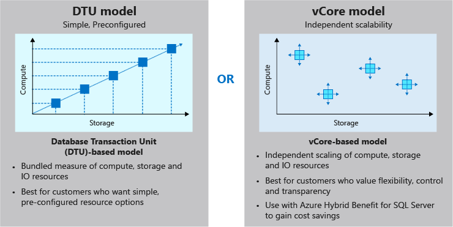
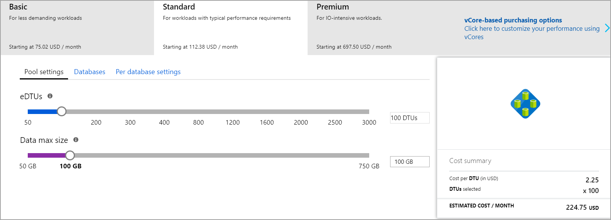
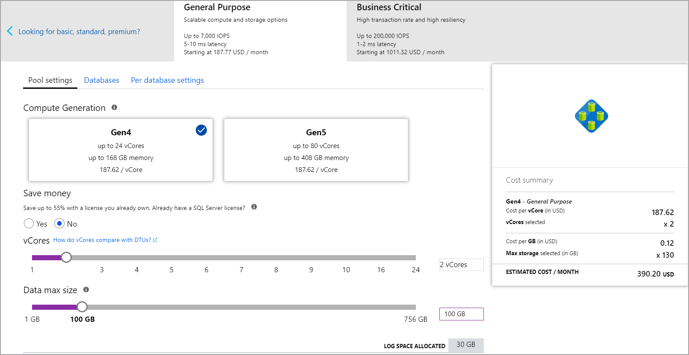

SQL elastic pools can help reduce server costs. To make effective use of elastic pools, their capacity must be configured correctly. To configure an elastic pool, we need to understand how SQL server performance is measured and priced, using either a *DTU-based* or *vCore-based* purchasing model.

## DTU-based pricing model

A database transaction unit (DTU) is a unit of measurement for the performance of a service tier in Azure and is based on a bundled measure of compute, storage, and IO resources.  Compute sizes are expressed in terms of Database Transaction Units (DTUs) for single databases or elastic Database Transaction Units (eDTUs) for elastic pools. 

If demand exceeds the available resources for your tier for any resource (CPU, storage or IO), the performance of your database is throttled. This model is best for customers who want simple, pre-configured resource options available in three tiers: **basic**, **standard**, and **premium**. 

## vCore-based pricing model

A virtual core (vCore) represents the logical CPU offered with an option to choose between generations of hardware and physical characteristics of hardware (for example, number of cores, memory, storage size). 

The vCore-based purchasing model gives you flexibility and control over individual resource consumption and a straightforward way to translate on-premises workload requirements to the cloud. This model allows you to choose compute, memory, and storage based upon their workload needs within the **general purpose** or **business critical** service tier. 

The chart below provides a comparison of the two pricing models:

## Review cost estimates

The Azure portal displays the results of your pool settings as an estimated monthly bill. The charts below display the DTU-based pricing and vCore-based pricing models.

**DTU-based Pricing Model**

**vCore-based Pricing Model**

