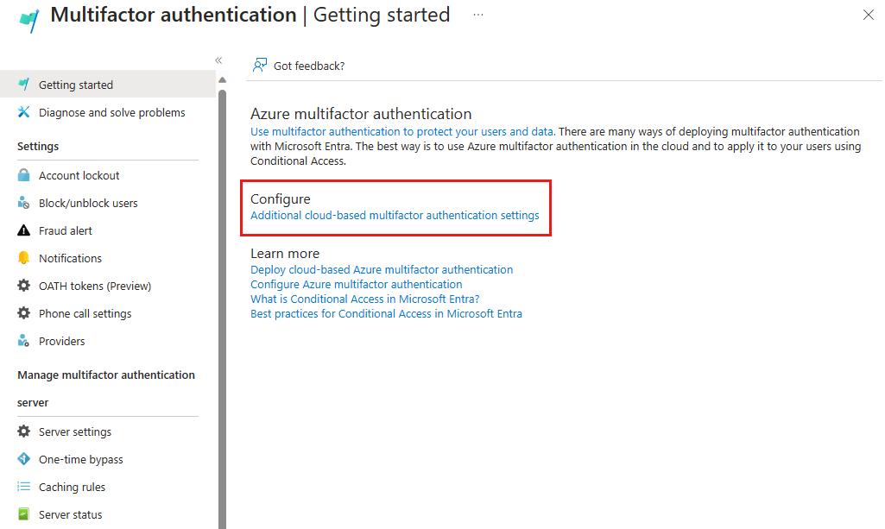
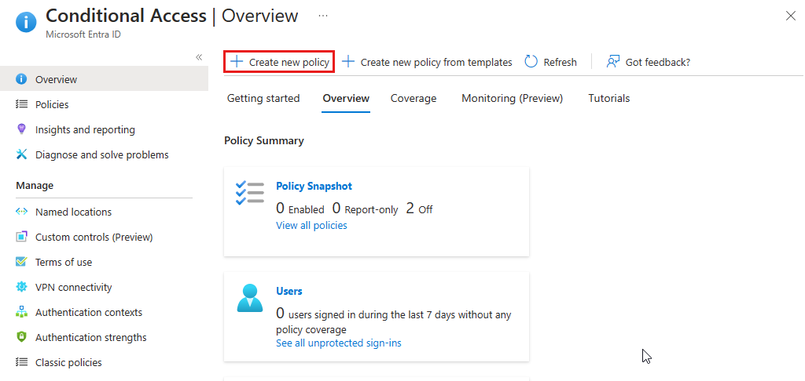

## Configure Azure AD MFA for applications

Let's walk through the basic steps necessary to configure and enable Azure AD Multifactor Authentication using Conditional policies. **Keep in mind that a real deployment requires significant thought and planning**. Make sure you review the documentation links at the end of this module before you enable MFA for your environments.

> [!IMPORTANT]
> You need Azure AD Premium for this exercise. You can use a [30-day free trial](https://azure.microsoft.com/trial/get-started-active-directory/) to try this feature out, or just read through the following instructions to understand the flow.

## Configure Multi-Factor Authentication options

1. Sign in to the [Azure portal](https://portal.azure.com/) using a Global administrator account.
1. Navigate to the Azure Active Directory dashboard using the **Azure Active Directory** option in the sidebar.
1. Select **Security** in the left-hand menu.
1. Select **Multifactor authentication** under the **Manage** heading in the left-hand menu. Here, you'll find options for Multi-Factor authentication.

    

1. Select the **Additional cloud-based multifactor authentication settings** link under **Configure**. A new browser page will open, where you can see all the MFA options for Azure.

    

    This is where you'd select the supported authentication methods. In the preceding example, all of them are selected.

    You can also enable or disable *app passwords* here, which allow users to create unique account passwords for apps that don't support multi-factor authentication. This feature lets the user authenticate with their Azure AD identity, using a different password specific to that app.

## Set up Conditional Access rules for MFA

Next let's examine how to set up Conditional Access policy rules that would enforce MFA for guest users accessing specific apps on your network.

1. Switch back to the Azure portal and select **Azure Active Directory > Security > Conditional Access**.

1. Select **New policy** from the top menu.

    

1. Name your policy; for example, *All users*.

1. Select the **0 users or workload identities selected** link to open the panel.
    - Select **Select users and groups** in the drop-down.
    - Check the **All users** radio button to apply this to all users and guests.

1. Select the **No cloud apps, actions, or authentication contexts selected** link under **Cloud apps or actions**.
    - Select the radio button for **Select apps**, then select the **None** link under the **Select** group.
    - Choose an app where you want to enable Azure AD MFA, such as **Visual Studio App Center**.
    - Select the **Select** button to close the panel.

1. Select the **0 conditions selected** link to review the **Conditions** section.
    - Select the **Not configured** link under **Locations**, select **Yes** under **Configure**, then select the radio button for **Any location**.

1. Select the **0 controls selected** link under Access Controls > Grant, make sure that **Grant access** is selected, select the **Require multi-factor authentication** checkbox; this is what enforces MFA.
1. Select the **Select** button to close the window.

1. Set **Enable policy** to **On**.

1. Select **Create** to create the policy.

    

MFA is now enabled for your selected application(s). The next time a user or guest tries to sign into that app, they'll be prompted to register for MFA.
