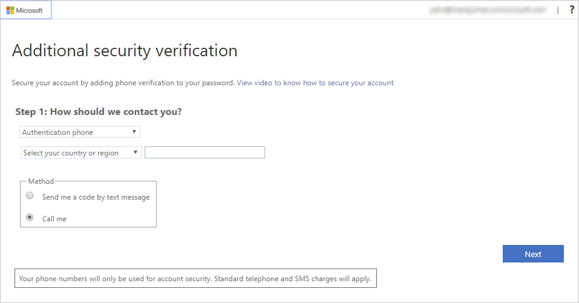
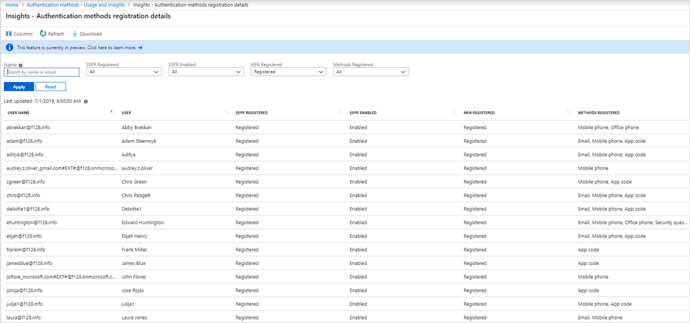

As mentioned earlier, it's recommended that administrators enable users to be able to select more than one authentication method in case their primary method is unavailable.

When a user signs into a service that requires MFA the first time, they will be asked to register their preferred multi-factor authentication method as shown in the following screenshot.

> [!TIP]
> If you followed the previous exercise and turned on MFA for an account and app, then you can try accessing that app with the given user account and you should see the above flow.

Once they've registered, each time they sign into a service or app that requires MFA the Azure login process will prompt for the additional authentication information as shown in the following image.

## Azure Authentication Methods

As we saw earlier, there are several possible authentication methods that an administrator can setup. Some of these also support Self-Service Password Reset (SSPR) which allows users to reset their password by supplying a secondary form of authentication. This is a service you can couple with Azure MFA to ease the burden on IT staff.

The following table lists the authentication methods and the services that can use them.

| Authentication method  | Services    |
|------------------------|-------------|
| **Password**           | Azure MFA and SSPR |
| **Security questions** | SSPR |
| **Email address**      | SSPR |
| **Microsoft Authenticator app** |Azure MFA and SSPR |
| **OATH hardware token** | Azure MFA and SSPR |
| **Text message** | Azure MFA and SSPR |
| **Voice call**   | Azure MFA and SSPR |
| **App passwords** | Azure MFA in certain cases |

Let's explore these in a bit more detail.

### Password

This is the only method that you can’t disable.

### Security questions

This method is available only for non-administrative accounts that use Self-Service Password Reset.

* Azure stores security questions privately and in a security-enhanced manner on a user object in the directory. Only users can answer the questions and only during registration. An administrator can’t read or change a user’s questions or answers.

* Azure provides 35 predefined questions, all translated and localized based on the browser locale.

* You can customize the questions by using the administrative interface; however, Azure displays them in the language entered. The maximum length is 200 characters.

### Email address

This method is available only in SSPR. It's recommended that you avoid the use of an email account that doesn’t require the user’s Azure AD password to access it.

### Microsoft Authenticator app

This method is available for Android and iOS. Users can register their mobile app at <https://aka.ms/mfasetup>

* The Microsoft Authenticator app helps prevent unauthorized access to accounts and helps stop fraudulent transactions by pushing  a notification to your smartphone or tablet. Users view the notification and, if it’s legitimate, select Verify. Otherwise, they select Deny.

* Users can use the Microsoft Authenticator app or a third-party app as a software token to generate an OATH verification code.  After entering the username and password, the users enter the code provided by the app on the sign-in screen. The verification code provides a second form of authentication.

### OATH hardware tokens

**OATH** is an open standard that specifies how to generate one-time password codes. Azure AD supports the use of OATH-TOTP `SHA-1` tokens of the 30-second or 60-second variety. Customers can get these tokens from the vendor of their choice. Note that secret keys are limited to 128 characters, which might not be compatible with all tokens.

### Text message

Azure sends a verification code to a mobile phone using SMS. The user must enter the code into the browser within a specific time period to continue.

### Voice call

Azure uses an automated voice system to call the number and the owner uses the keypad to confirm the authentication. Note that this option is not available to the free/trial Azure AD tier.

### App password

Certain non-browser apps don’t support Azure MFA. If users are enabled for Azure MFA and try to use non-browser apps, they’ll be unable to authenticate. The app password allows users to continue to authenticate.

## Monitoring adoption

Azure AD includes a **Usage & insights** view in the **Monitoring** section where you can monitor the authentication methods activity. From here you can view the adoption of MFA and SSPR:

In addition to the overall registration numbers, you can also see the success and failure of registrations per authentication method. This allows you to understand which authentication methods your users most commonly registered and which ones are easy for them to register. This data is calculated using the last 30 days of audit logs from the combined security info registration and SSPR registration experiences.

You can drill down and see the latest registration audit information for each user by clicking the chart.

You can also learn more about SSPR usage in your organization through the **Usage** tab on the main view as shown in the following image.

