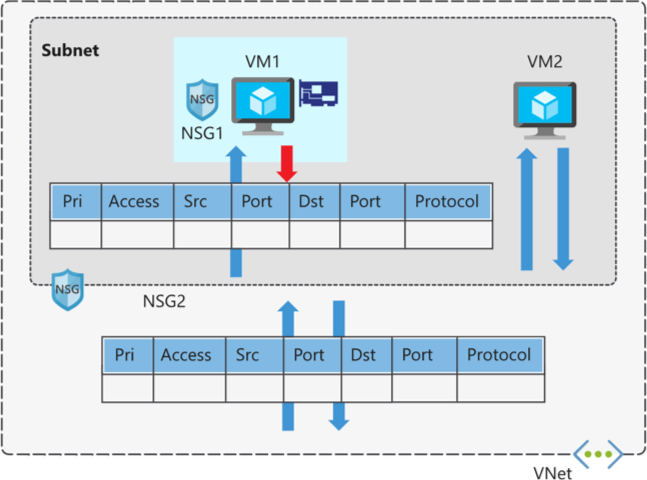
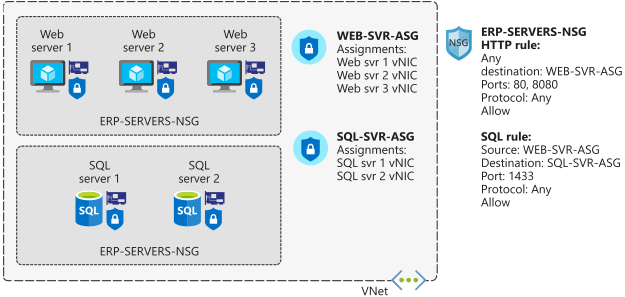

As part of the project to move your ERP system to Azure, you must ensure that servers have proper isolation so that only allowed systems can make network connections. For example, you have database servers that store data for your ERP app. You want to block prohibited systems from communicating with the servers over the network, while allowing app servers to communicate with the database servers.

## Network security groups

Network security groups filter network traffic to and from Azure resources. They also contain security rules that you configure to allow or deny inbound and outbound traffic. You can use network security groups to filter traffic between VMs or subnets, both within a virtual network and from the internet.

### Network security group assignment and evaluation

Network security groups are assigned to a network interface or a subnet. When you assign a network security group to a subnet, the rules apply to all network interfaces in that subnet. You can restrict traffic further by associating a network security group to a VM's network interface.

When you apply network security groups to both a subnet and a network interface, each network security group is evaluated independently. Inbound traffic is first evaluated by the network security group applied to the subnet, then by the network security group applied to the network interface. Conversely, outbound traffic from a VM is first evaluated by the network security group applied to the network interface, then by the network security group applied to the subnet.

Applying a network security group to a subnet instead of individual network interfaces can reduce administration and management efforts. This approach also ensures that all VMs within the specified subnet are secured with the same set of rules.

Each subnet and network interface can have one network security group applied to it. Network security groups support TCP, UDP, and ICMP, and operate at Layer 4 of the OSI model.

In this manufacturing company scenario, network security groups can help you secure the network. You can control which computers can connect to your app servers. You configure the network security group so that only a specific range of IP addresses can connect to the servers. You can lock this down even more by only allowing access to or from specific ports, or from individual IP addresses. These rules can be applied to devices that are connecting remotely from on-premises networks, or between resources within Azure.

## Security rules

A network security group contains one or more security rules. Configure security rules to either allow or deny traffic.

Rules have several properties:

|Property  |Explanation  |
|---------|---------|
|Name|A unique name within the network security group.|
|Priority | A number between 100 and 4096. |
|Source and destination| Any, or an individual IP address, classless inter-domain routing (CIDR) block (10.0.0.0/24, for example), service tag, or app security group. |
|Protocol     | TCP, UDP, or Any. |
|Direction| Whether the rule applies to inbound or outbound traffic.|
|Port range     | An individual port or range of ports.  |
|Action     | Allow or deny the traffic.      |

Network security group security rules are evaluated by priority, using the 5-tuple information (source, source port, destination, destination port, and protocol) to allow or deny the traffic. When the conditions for a rule match the device configuration, rule processing stops.

For example, suppose your company has created a security rule to allow inbound traffic on port 3389 (RDP) to your web servers, with a priority of 200. Next, suppose that another admin has created a rule to deny inbound traffic on port 3389, with a priority of 150. The deny rule takes precedence, because it's processed first. The rule with priority 150 is processed before the rule with priority 200.

With network security groups, the connections are stateful. Return traffic is automatically allowed for the same TCP/UDP session. For example, an inbound rule allowing traffic on port 80 also allows the VM to respond to the request (typically on an ephemeral port). You don't need a corresponding outbound rule.

With regard to the ERP system, the web servers for the ERP app connect to database servers that are in their own subnets. You can apply security rules to state that the only allowed communication from the web servers to the database servers is port 1433 for SQL Server database communications. All other traffic to the database servers will be denied.  

### Default security rules

When you create a network security group, Azure creates several default rules. These default rules can't be changed, but you can override them with your own rules. These default rules allow connectivity within a virtual network and from Azure load balancers. They also allow outbound communication to the internet, and deny inbound traffic from the internet.
 
The default rules for inbound traffic are:

| Priority | Rule name  | Description  |
|----------|------------|--------------|
| 65000 | AllowVnetInbound | Allow inbound coming from any VM to any VM within the subnet. |
| 65001 | AllowAzureLoadBalancerInbound | Allow traffic from the default load balancer to any VM within the subnet. |
| 65500 | DenyAllInBound | Deny traffic from any external source to any of the VMs. |

The default rules for outbound traffic are:

| Priority | Rule name  | Description  |
|----------|------------|--------------|
| 65000 | AllowVnetOutbound |  Allow outbound going from any VM to any VM within the subnet. |
| 65001 | AllowInternetOutbound | Allow outbound traffic going to the internet from any VM. |
| 65500 | DenyAllOutBound | Deny traffic from any internal VM to a system outside the virtual network. |

### Augmented security rules

You can use augmented security rules for network security groups to simplify the management of large numbers of rules. Augmented security rules also help when you need to implement more complex network sets of rules. Augmented rules let you add the following options into a single security rule:

- Multiple IP addresses
- Multiple ports
- Service tags
- App security groups

Suppose your company wants to restrict access to resources in your datacenter, spread across several network address ranges. With augmented rules, you can add all these ranges into a single rule, reducing the administrative overhead and complexity in your network security groups.

### Service tags

You can use service tags to simplify network security group security even further. You can allow or deny traffic to a specific Azure service, either globally or per region.

Service tags simplify security for VMs and Azure virtual networks by allowing you to restrict access by resources or services. Service tags represent a group of IP addresses, and help simplify the configuration of your security rules. For resources that you can specify by using a tag, you don't need to know the IP address or port details.

You can restrict access to many services. Microsoft manages the service tags, meaning you can't create your own. Some examples of the tags are:

- **VirtualNetwork** - Represents all virtual network addresses anywhere in Azure, and in your on-premises network if you're using hybrid connectivity.
- **AzureLoadBalancer** - Denotes Azure's infrastructure load balancer. The tag translates to the virtual IP address of the host (168.63.129.16) where Azure health probes originate.
- **Internet** - Represents anything outside the virtual network address that is publicly reachable, including resources that have public IP addresses. One such resource is the Web Apps feature of Azure App Service.
- **AzureTrafficManager** - Represents the IP address for Azure Traffic Manager.
- **Storage** - Represents the IP address space for Azure Storage. You can specify whether traffic is allowed or denied. You can also specify if access is allowed only to a specific region, but you can't select individual storage accounts.
- **SQL** - Represents the address for Azure SQL Database, Azure Database for MySQL, Azure Database for PostgreSQL, and Azure Synapse Analytics services. You can specify whether traffic is allowed or denied, and you can limit to a specific region.
- **AppService** - Represents address prefixes for Azure App Service.

## App security groups

App security groups let you configure network security for resources used by specific apps. You can group VMs logically, no matter what their IP address or subnet assignment.

Use app security groups within a network security group to apply a security rule to a group of resources. It's easier to deploy and scale up specific app workloads. You just add a new VM deployment to one or more app security groups, and that VM automatically picks up your security rules for that workload.

An app security group lets you group network interfaces together. You can then use that app security group as a source or destination rule within a network security group.

For example, your company has a number of front-end servers in a virtual network. The web servers must be accessible over ports 80 and 8080. Database servers must be accessible over port 1433. You assign the network interfaces for the web servers to one app security group, and the network interfaces for the database servers to another app security group. You then create two inbound rules in your network security group. One rule allows HTTP traffic to all servers in the web server app security group. The other rule allows SQL traffic to all servers in the database server app security group.

 Without app security groups, you'd need to create a separate rule for each VM or add a network security group to a subnet, then add all the VMs to that subnet.

The key benefit of app security groups is that it makes administration easier. You can easily add and remove network interfaces to an app security group as you deploy or redeploy app servers. You can also dynamically apply new rules to an app security group, which are then automatically applied to all the VMs in that app security group.

## When to use network security groups

As a best practice, you should always use network security groups to help protect your networked assets against unwanted traffic. Network security groups give you granular control access over the network layer, without the potential complexity of setting security rules for every VM or virtual network.
