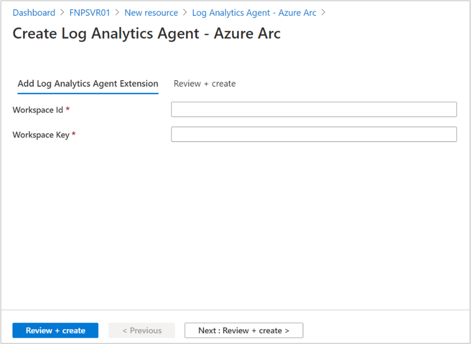

Tailwind Traders has onboarded its machines to Azure Arc-enabled servers and now wants to onboard those servers to Microsoft Defender for Cloud. In this Unit, you’ll learn how to onboard your Azure Arc-enabled servers to Microsoft Defender for Cloud by enabling Log Analytics.

## Add non-Azure machines with Azure Arc

Because your Azure VM is already registered and managed as an Azure resource, it's necessary to reconfigure the VM. Reconfiguring the VM involves removing extensions, disabling the Azure VM guest agent, and blocking Azure IMDS access. After you've made these three changes, your Azure VM behaves like any machine or server outside of Azure. This reconfigured Azure VM will offer a starting point to install and evaluate Azure Arc-enabled servers.

The preferred way of adding your non-Azure machines to Microsoft Defender for Cloud is with Azure Arc-enabled servers. Connecting a machine to Azure through Azure Arc-enabled servers creates an Azure resource for the hybrid machine. When you install the Log Analytics agent on the Arc-enabled server, the hybrid machine will also appear in Defender for Cloud. Just like your other Azure resources, the Arc-enabled server can also have security recommendations, surface alerts, and be captured in your secure score.

Defender for Cloud's Log Analytics auto-deploy tools don't support machines running Azure Arc. Log Analytics agent deployment options include:  

1. VM extensions for Azure Arc-enabled servers can be deployed from the Azure portal. They can also be deployed using PowerShell, the Azure CLI, or with an Azure Resource Manager (ARM) template.
1. Azure Policy through the Configure Log Analytics extension on Azure Arc enabled Linux servers / Configure Log Analytics extension on Azure Arc enabled Windows servers policy definitions
1. Azure Automation and its support for PowerShell and Python to automate the deployment of the Log Analytics agent VM extension.

## Enable the Log Analytics VM extension from Azure portal.

VM extensions can be applied to your Azure Arc-enabled server-managed machine via the Azure portal.:

1. From your browser, go to the [Azure portal](https://portal.azure.com/).
1. In the portal, browse **Servers - Azure Arc** and select your hybrid machine from the list.
1. Choose **Extensions**, then select **Add**. Choose the Log Analytics VM Extension from the list of available extensions and follow the instructions in the wizard.

   

4. To complete the installation, provide the workspace ID and primary key.

   

5. After confirming the required information provided, select **Review + Create**. A summary of the deployment is displayed, and you can review the status of the deployment.

## Verify your deployment.

Now you can see your Azure and non-Azure machines together in one place. Within Microsoft Defender for Cloud, open the asset inventory page and filter to the relevant resource types.

The asset inventory page of Microsoft Defender for Cloud provides a single page for viewing your connected resources and their security postures. Defender for Cloud periodically analyzes the security state of resources connected to your subscriptions to identify potential security vulnerabilities. It then provides you with recommendations on how to remediate those vulnerabilities.
