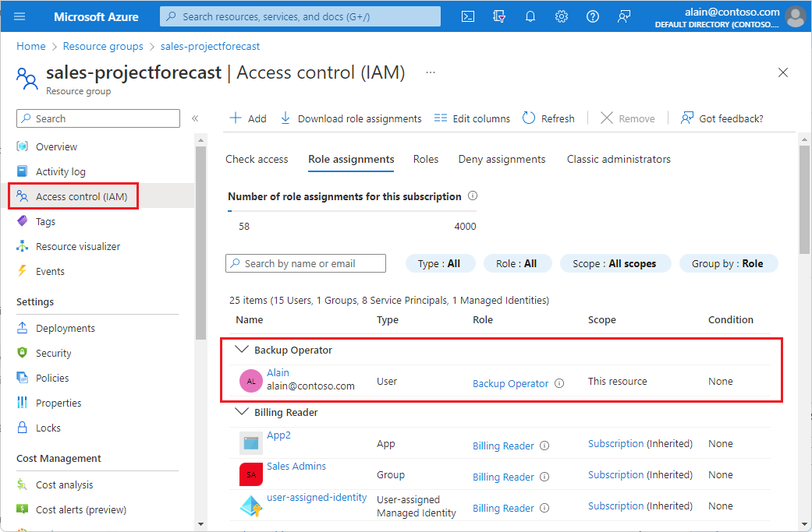
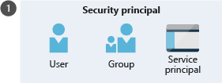
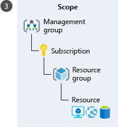

Suppose you need to manage access to resources in Azure for the development, engineering, and marketing teams. You’ve started to receive access requests, and you need to quickly learn how access management works for Azure resources.

## What is RBAC?

Role-based access control (RBAC) is an authorization system built on Azure Resource Manager that provides fine-grained access management of resources in Azure. Azure has lots of resources, but a few examples include virtual machines, websites, networks, and storage.

#### What is role-based access control?

> [!VIDEO https://www.microsoft.com/videoplayer/embed/RE2yEvk]

## What can I do with RBAC?

RBAC allows you to grant access to Azure resources that you control.

Here are some examples:

- Allow one user to manage virtual machines in a subscription and another user to manage virtual networks
- Allow a database administrator group to manage SQL databases in a subscription
- Allow a user to manage all resources in a resource group, such as virtual machines, websites, and subnets
- Allow an application to access all resources in a resource group

## RBAC in the Azure portal

In several areas in the Azure portal, you'll see a blade named **Access control (IAM)**, also known as identity and access management. On this blade, you can see who has access to that area and their role. Using this same blade, you can grant or remove access.

The following shows an example of the Access control (IAM) blade for a resource group. In this example, Alain Charon has been assigned the Backup Operator role for this resource group.

## How does RBAC work?

You control access to resources using RBAC by creating role assignments, which control how permissions are enforced. To create a role assignment, you need three elements: a security principal, a role definition, and a scope. You can think of these elements as "who", "what", and "where".

### 1. Security principal (who)

A *security principal* is just a fancy name for a user, group, or application that you want to grant access to.

### 2. Role definition (what you can do)

A *role definition* is a collection of permissions. It's sometimes just called a role. A role definition lists the permissions that can be performed, such as read, write, and delete. Roles can be high-level, like Owner, or specific, like Virtual Machine Contributor.

Azure includes several built-in roles that you can use. The following lists four fundamental built-in roles:

- Owner - Has full access to all resources, including the right to delegate access to others.
- Contributor - Can create and manage all types of Azure resources, but can’t grant access to others.
- Reader - Can view existing Azure resources.
- User Access Administrator - Lets you manage user access to Azure resources.

If the built-in roles don't meet the specific needs of your organization, you can create your own custom roles.

### 3. Scope (where)

*Scope* is where the access applies to. This is helpful if you want to make someone a Website Contributor, but only for one resource group.

In Azure, you can specify a scope at multiple levels: management group, subscription, resource group, or resource. Scopes are structured in a parent-child relationship. When you grant access at a parent scope, those permissions are inherited by the child scopes. For example, if you assign the Contributor role to a group at the subscription scope, that role is inherited by all resource groups and resources in the subscription.

### Role assignment

Once you have determined the who, what, and where, you can combine those elements to grant access. A *role assignment* is the process of binding a role to a security principal at a particular scope, for the purpose of granting access. To grant access, you create a role assignment. To revoke access, you remove a role assignment.

The following example shows how the Marketing group has been assigned the Contributor role at the sales resource group scope.

## RBAC is an allow model

RBAC is an allow model. What this means is that when you are assigned a role, RBAC allows you to perform certain actions, such as read, write, or delete. So, if one role assignment grants you read permissions to a resource group and a different role assignment grants you write permissions to the same resource group, you will have write permissions on that resource group.

RBAC has something called `NotActions` permissions. `NotActions` is not a deny rule – it is simply a convenient way to create a set of allowed permissions when specific permissions need to be excluded.

In this unit, you learned the basics of how RBAC works. Now that you have the RBAC fundamentals out of the way, you can get your hands dirty by starting to use RBAC. The easiest way to get started is to use the Azure portal. The rest of this module has you perform hands-on exercises related to RBAC.