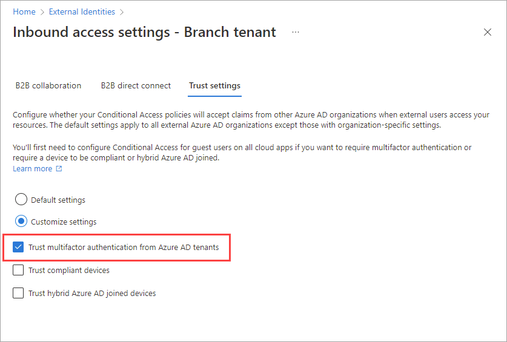

Sometimes organizations have different sets of B2B collaboration requirements for different partners. For example, an organization might want to block B2B collaboration with all Azure AD organizations by default, but allow collaboration with one organization. In the financial institution scenario, the IT admin needed to create organization-specific settings for the branch office and allow B2B collaboration so their users could access the main branch's applications.

Here, you'll learn the cross-tenant access settings you can use to create B2B collaboration settings that are specific to an organization. You'll also learn about trusting multi-factor authentication from another organization so that users don't have to complete the multi-factor authentication process multiple times when signing in.

## Creating organization-specific settings

We've seen how default cross-tenant access settings apply generally to all other Azure AD organizations. But you can also create organization-specific access settings. Through your cross-tenant access settings, you have the option of adding an organization and modifying the inbound and outbound B2B collaboration settings for that organization. These organizational settings then take precedence over the default settings.

The same B2B collaboration settings that are available at the default level are also available at the organizational level. Inbound settings control whether users from the other organization can be invited to your organization, and outbound settings either allow or block your users from being invited to the other organization. The settings can apply to all users and applications, or if you have an Azure AD premium license, they can apply to specific users, groups, or applications.

In our financial institution scenario, the main branch's internal applications contain highly sensitive data, so the IT admin blocked inbound B2B collaboration with other Azure AD organizations by default. However, the firm acquired a branch, which is managed in a separate Azure AD tenant. Because the branch employees needed access to the main applications, the IT admin wants to create an exception to allow inbound B2B collaboration for users in the branch.

## Trusting multi-factor authentication from another organization

One of the features of cross-tenant access settings is the ability to trust an external Azure AD organization's multi-factor authentication claims. When an external user has already completed multi-factor authentication in their home Azure AD tenant, not having to complete it again in your tenant makes for more a more streamlined sign-in experience.

This trust setting is available at both the default level and at the organizational level. This means you can choose to always trust multi-factor authentication claims from all external Azure AD organizations, and you can trust these claims for individual organizations.

This feature is especially useful in our example scenario. Users in the newly acquired branch are considered part of the larger organization. Ideally they wouldn't be asked to perform multi-factor authentication more than once while signing into their applications. To accomplish this, the IT admin can configure their branch-specific organizational settings to trust multi-factor authentication claims from the branch.

Along with multi-factor authentication trust settings, cross-tenant access settings also provide options for trusting device claims (compliant claims and hybrid Azure AD joined claims) from other Azure AD organizations.