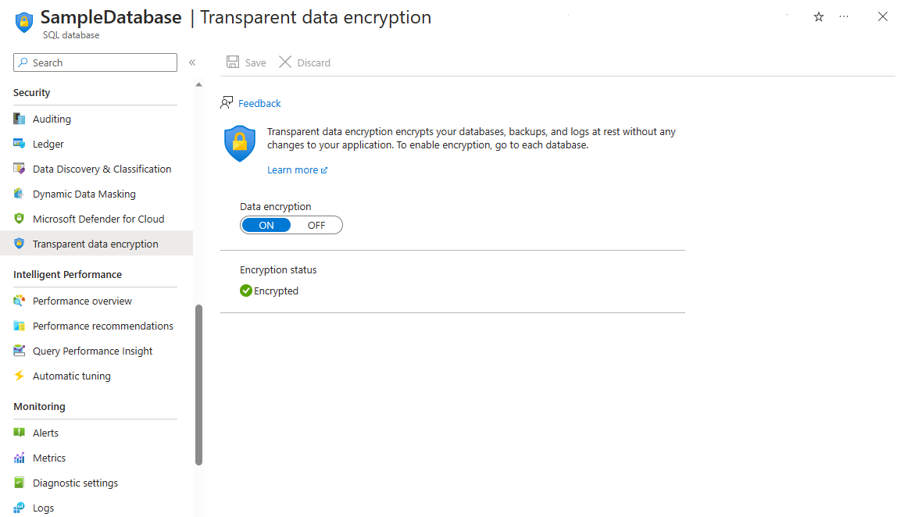
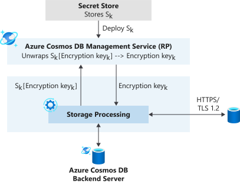

The data that your organization is moving to Azure includes customer details and financial information. This data must be kept as secure as possible, remain accessible for day-to-day use with systems and applications, and meet regulatory requirements. You need to understand how Azure SQL Database and Azure Cosmos DB can help you achieve these goals.

Here, you learn about the encryption features in Azure SQL Database and Azure Cosmos DB.

## Secure your Azure SQL database by using transparent data encryption

Azure SQL databases store your data in a structured format inside data files and transaction log files. You can encrypt these files so that the data remains secure. Even if the hard drives that store the data are compromised, or the data files are stolen.

For Azure SQL Database, you can achieve this encryption at rest through transparent data encryption. Transparent data encryption encrypts not only the data files, but also the transaction log files and any backups for your databases. This process of encryption is entirely transparent to the applications that use the databases. 

For older SQL databases, transparent data encryption might not be enabled by default. Newly provisioned SQL databases have transparent data encryption enabled by default.

Transparent data encryption ensures that an entire database is encrypted through a defined process. A database encryption key is used to encrypt the database. A transparent data encryption protector then secures this key. The protector can be a key you've stored in Azure Key Vault or a certificate that's managed for you. 

The database encryption key is decrypted at the moment the database is started. Afterward, this same database encryption key is used to decrypt the database, and encrypt it again when the time comes.

You can manually enable transparent data encryption for an SQL database on Azure, through Azure PowerShell, Transact-SQL, or the Azure portal. In the Azure portal, look for transparent data encryption under **Security** in your SQL database, and then select **ON**.

The following example shows how you can configure transparent data encryption in the portal:

## Secure your Azure Cosmos DB database by using automatic encryption at rest

Azure Cosmos DB databases allow your data to be stored in an unstructured format. Databases for Azure Cosmos DB are physically stored in solid-state hard drives. Azure Cosmos DB components, like backups, are stored in HDDs. 

Your media attachments, the actual databases, or backups can all be protected at rest. At the same time, none of this encryption affects the latency and throughput SLAs for Azure Cosmos DB. Your data is automatically encrypted at rest, but isn't automatically encrypted when it's generated and when it's in use.

Data in your Azure Cosmos DB database is protected through AES-256 encryption. In the background, the Azure Cosmos DB management service, with the help of a secret store, manages all of your encryption keys and unwraps them when necessary. These keys are used to encrypt and decrypt your data. Microsoft manages the keys for you, and the encryption keys are rotated to help keep your data secure.

Encryption at rest is enabled by default. You can use turnkey global distribution and replicate your data to any region, knowing that all of your data is automatically encrypted. In fact, you can't disable encryption even if you want to. Because encryption is enabled by default, there's nothing to do on your end to configure Azure Cosmos DB to encrypt your data.

Users establish secure connections with Azure Cosmos DB and send data. The data to be stored and persisted in Azure Cosmos DB is encrypted and written to secure storage, together with any relevant indexing data. A secured backup is then created routinely.
