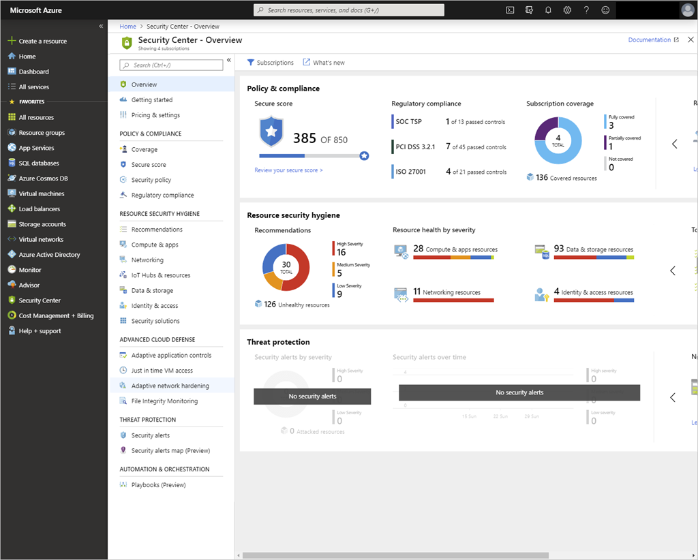

Keeping your cloud data and resources safe is a shared responsibility between you and Azure. Keeping track of created resources across the organization and ensuring they comply with your security policies is a full-time job for security operations (SecOps). A single mis-configured option can expose customer data or provide access to internal systems to attackers trying to penetrate your network. Luckily, Azure offers several tools to help identify security issues, secure your services, and harden your exposed network.

Azure Security Center is one of the primary tools in Azure used to detect threats. Security Center allows organizations to control and monitor the security of all of their running resources using intelligent threat detection to protect them from cyberattacks. As part of that threat detection, Security Center provides recommendations to close potential security holes and ensure compliance with your corporate policy and security guidelines.

Security Center provides an easy-to-read dashboard which shows compliance, security health, and security alerts. This is available right off the main Azure portal dashboard, or through the search window.

## Learning objectives

In this module, you will:

- Use the Azure Security Center dashboard to identify potential security issues.
- Learn how to protect VM-based resources and networks.
- Configure security policies to monitor created resources in Azure.
- Create and customize security alerts.

## Prerequisites

- Basic familiarity with Azure services.
- Familiarity with Azure virtual machines and virtual networking.
