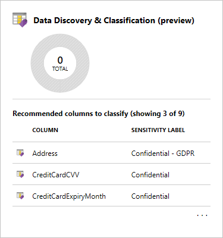
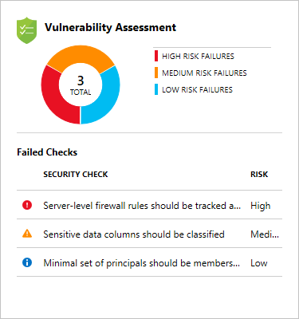

Imagine you receive an alert from your company's security administrator that a potential security breach has been detected on your network. In order to protect your database servers, you decide to add auditing and monitoring.

In this unit, we look at how auditing is configured against a database, and how to use the audits.

## Configure auditing

You'll enable auditing to store the operations that occur on the database for later inspection or to have automated tools analyze them. Auditing is also used for compliance management or understanding how your database is used. Auditing is also required if you wish to use Azure threat detection on your Azure SQL database.

An Azure storage account will be needed to store the audit history.

Let's look at the steps you take to set up auditing on your system.

1. Select the Azure SQL Server in the portal.

2. Navigate to the Auditing item in the left configuration options. You will find it in the Security category.

3. Auditing is turned off by default. To enable it on your database server, tap the ON button.

4. Once the ON button is selected, select the Configure button to define the storage account. You can select an existing storage account or create a new storage account to store your audits. The storage account must be configured to use the same region as your server.

5. Click the 'Save' button in the toolbar to save your changes.

These actions configure the audits at the database server level. You can also configure auditing at a database level.

You'll now configure Advanced Threat Protection.

## Configure Advanced Threat Protection

The Advanced Threat Protection system analyzes audit logs to look for potential problems and threats against your database.

Let's look at the steps you take to configure Advanced Threat Protection on your system.

1. Select the Azure SQL Server in the portal.

2. Navigate to the Advanced Threat Protection item in the left configuration options. You'll find it in the Security category.

3. Click the 'Enable Advanced Threat Protection on the server' button.

4. Change the Advanced Threat Protection switch to ON.

5. Select View Advanced Threat Protection server settings to see the options for the database system.

6. Next, define where notification emails will be delivered as a list of semicolon separated email addresses. Select Email service and co-administrators to send the threats to the service administrators.

7. You'll now specify the subscription and storage account that will be analyzed for any threats on the system. This should be the subscription and Azure storage account configured for auditing. You also need to set the number of days to retain the audit history. Setting the value to zero means that the audit will be stored forever.

Next, select the Storage access key to connect to the audits. Once you have configured the options, press OK.

Finally, set the Threat Detection types. The preferred option is All.

All represents the following values:

- SQL injection reports where SQL injections attacks have occurred;
- SQL injection vulnerability reports where the possibility of a SQL injection is likely; and
- Anomalous client login looks at logins that are irregular and could be cause for concern, such as a potential attacker gaining access.

Click the **Save** button to apply the changes.

You'll receive email notifications as vulnerabilities are detected. The email will outline what occurred and the actions to take.

## Enable Advanced Threat Protection

Once you've configured the server for Advanced Threat Protection, you must enable the option on each individual database. Navigate to the individual databases and enable Advanced Threat Protection by selecting 'Enable Advanced Threat Protection on the server'.

You can turn on periodic recurring scans that will scan the system every seven days to look for vulnerabilities.

When you select the Periodic recurring scan option, a scan will run immediately after saving the settings.

Click the **Save** button to save your changes.

You'll receive an email notification notifying you of any security issues. Make sure to address the threat immediately. You may get a notification for a number of reasons.

If you select the Advanced Threat Protection option when Advanced Threat Protection is running, you'll see a list of issues presented. This list may include Data Discovery & Classification problems such as sensitive data, a list of vulnerabilities on the system, and potential threats.

The Data Discovery & Classification panel shows columns within your tables that need to be protected. Some of the columns may have sensitive information or may be considered classified in different countries or regions.

Click on the Data Discovery & Classification panel.

A message will be displayed if any columns need protection configured. This message will be formatted like *"We have found 10 columns with classification recommendations"*. You can click on the text to view the recommendations.

Select the columns that you want to classify by clicking the checkmark next to the column, or select the checkbox to the left of the schema header. Select the Accept selected recommendations options to apply the classification recommendations.

Next, you'll edit the columns and then define the information type and the sensitivity label for the database. Click on the Save button to save the changes.

No active recommendations should be listed once you've managed the recommendations successfully.

The Vulnerability Assessment lists configuration issues on your database and the associated risk. For example, in the image above, you can see the server-level firewall needs to be set up.

Click on the Vulnerability Assessment panel to review a full list of vulnerabilities. From here, you can click on each individual vulnerability.

On the vulnerability page you will see the details such as the risk level, which database it applies to, a description of the vulnerability, and the recommended remediation to fix the issue. Apply the remediation to fix the issue or issues. Make sure to address all the vulnerabilities.

The last chart displays a list of threat detections. For example, in this list you one potential SQL injection attacks.

Click on the Threat Detection panel to navigate to the list of entries to see what the threat is. Address that issue by following the recommendations. For issues such as the SQL injection warnings, you'll be able to look at the query and work backward to where the query is being executed in code. Once found, you should rewrite the code so it will no longer have the issue.
