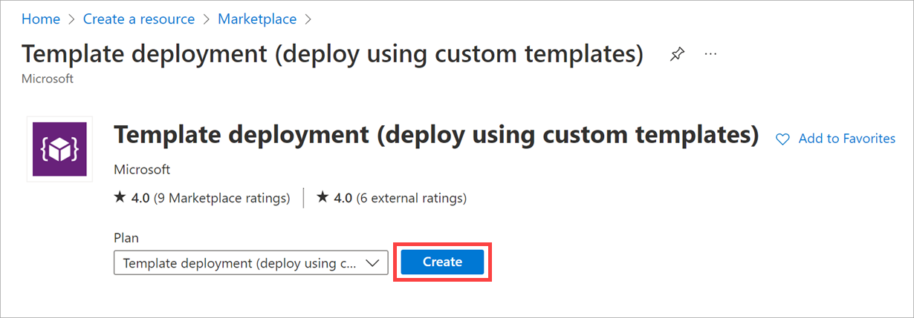
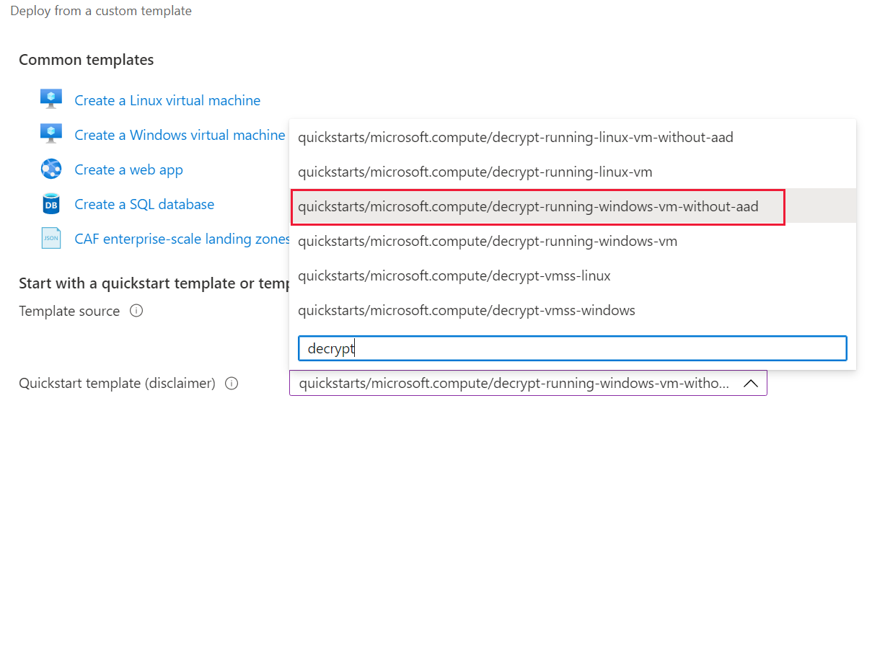

In this unit, you'll use an Azure Resource Manager template to decrypt your Windows VM you created earlier. We encrypted the OS drive on our Windows VM. However, the OS drive won't have any confidential information on it, so we could leave it unencrypted. Let's use a template to decrypt the OS drive.

## Decrypt a VM using an Azure Resource Manager template

You're going to use a template Microsoft has published on GitHub that is specifically designed to decrypt a running Windows VM.

1. Sign in to the [Azure portal](https://portal.azure.com/learn.docs.microsoft.com?azure-portal=true) with the same account you activated the sandbox with.

1. On the Azure portal menu or from the **Home** page, select **Create a resource**.

1. In the search box, enter **Template**.

1. From the resulting list, select **Template deployment (deploy using custom templates)**, and select **Create**.

    

1. In the **Select a template** search box, start entering "201-decrypt" and select the "201-decrypt-running-windows-vm-without-aad" template.

    

1. To launch the template runner, select **Select Template**.

1. In the settings view, enter the following information:
    - For the **Subscription**, select _Concierge Subscription_.
    - Select the sandbox resource group <rgn>Sandbox RG</rgn>. This will auto-select the region as well.
    - For the **VM Name**, enter "fmdata-vm01".
    - Leave the **Volume Type** as _All_.

1. Select the **I agree to the terms and conditions** check box.
1. To run the template, select **Purchase**. Note that there is no cost to this - it's a standard button.

The deployment may take a few minutes to complete.

## Verify the encryption status of the VM

1. On the Azure portal menu or from the **Home** page, select **Virtual machines**, and select your VM **fmdata-vm01**. Alternatively, you can search for your VM by name from **All Resources**.

1. On the **Virtual machine** pane, under **SETTINGS**, select **Disks**.

