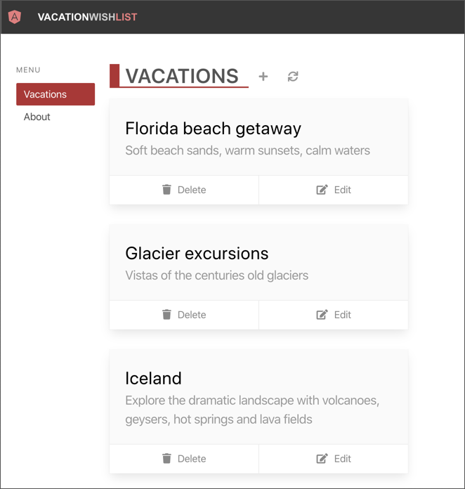

To use your current Express application and server, you must:

- Write code that includes the necessary middleware and logic to start and run the server.
- Configure and maintain the physical server hardware and software.
- Manage scaling your application up and down as demand fluctuates.
- Manage the costs of deploying and running the server.

Serverless architecture handles server maintenance, scaling, and cost management, and requires less middleware and other code. Overall, there's less to worry about when you build a serverless app. It's also easy to shift your  Express.js APIs to the serverless model without rewriting the code.

This learning module uses the [Refactor Node.js Express to Azure Functions](https://github.com/MicrosoftDocs/mslearn-module-shifting-nodejs-express-apis-to-serverless) sample project on GitHub. The client application is developed with Angular, but the same process works with Vue.js, React.js, or other frontend frameworks.

The sample project initially builds a Node.js Express application in TypeScript. The goal is to shift the project APIs to an Azure Functions app and migrate the Express server to a serverless model. The finished application and its API feature all the benefits of serverless technology.

