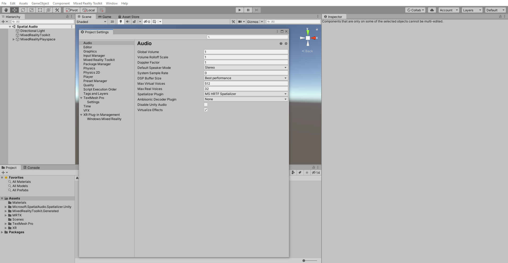
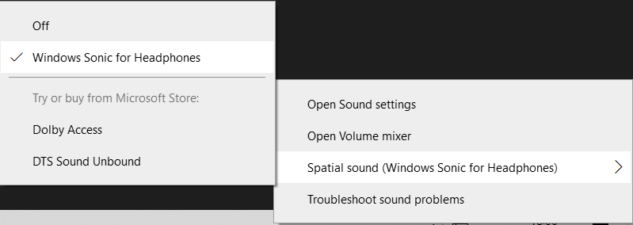

Through this module series, you'll learn how to use head-related transfer function (HRTF) offload on HoloLens 2 and How to enable reverb when using HRTF offload.

The [Microsoft Spatializer GitHub repository](https://github.com/microsoft/spatialaudio-unity) has a completed Unity project of this tutorial sequence.

For an understanding of what it means to spatialize sounds using HRTF-based spatialization technologies and recommendations for when it can be helpful, see [spatial sound design](/windows/mixed-reality/spatial-sound-design).

## Create and prepare the Unity project

In this section, you'll create a new Unity project and get it ready for MRTK development.

For this, first follow the Initializing your project and first application, excluding the Build your application to your device instructions, which includes the following steps:

1. Creating the Unity project and give it a suitable name, for example, *MRTK Tutorials*
2. Switching the build platform
3. Importing the TextMeshPro Essential Resources
4. Importing the Mixed Reality Toolkit
5. Configuring the Unity project
6. Creating and setting the scene and give the scene a suitable name, for example, *SpatialAudio*

Then follow the Changing the Spatial Awareness Display Option instructions to ensure the MRTK configuration profile for your scene is **DefaultHoloLens2ConfigurationProfile** and change the display options for the spatial awareness mesh to **Occlusion**.

## Add Microsoft Spatializer to the Project

* Download and import the Microsoft Spatializer [Microsoft.SpatialAudio.Spatializer.Unity.1.0.18.unitypackage](https://github.com/microsoft/spatialaudio-unity/releases/download/v1.0.18/Microsoft.SpatialAudio.Spatializer.Unity.1.0.18.unitypackage)

## Enable the Microsoft Spatializer plugin

* After importing the **Microsoft Spatializer** you need to enable it. Open **Edit -> Project Settings -> Audio**, and change **Spatializer Plugin** to "Microsoft Spatializer".

    

## Enable spatial audio on your workstation

* On desktop versions of Windows, spatial audio is disabled by default. Enable it by right-clicking on the volume icon in the task bar. To get the best representation of what you'll hear on HoloLens 2, choose **Spatial sound -> Windows Sonic for Headphones**.

    

    > [!NOTE]
    > This setting is only required if you plan to test your project in the Unity editor.
