In this module, you'll learn how to spatialize audio from an video source and test this in the unity editor and HoloLens 2.

## Import a video and add a Video Player to the Scene

For this module use You can use [this video](https://github.com/microsoft/spatialaudio-unity/blob/develop/Samples/MicrosoftSpatializerSample/Assets/Microsoft%20HoloLens%20-%20Spatial%20Sound-PTPvx7mDon4.mp4?raw=true) from the spatial audio sample project.

1. To import Video into the unity project. in the Unity menu select **Asset** > **Import New Asset**

    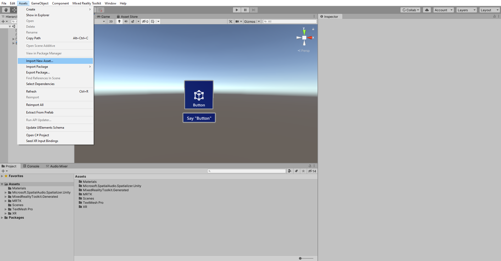
2. In the **Import New Asset...** window, select the **Microsoft HoloLens - Spatial Sound-PTPvx7mDon4** file you downloaded and click the **Open** button to import the asset into the project:

    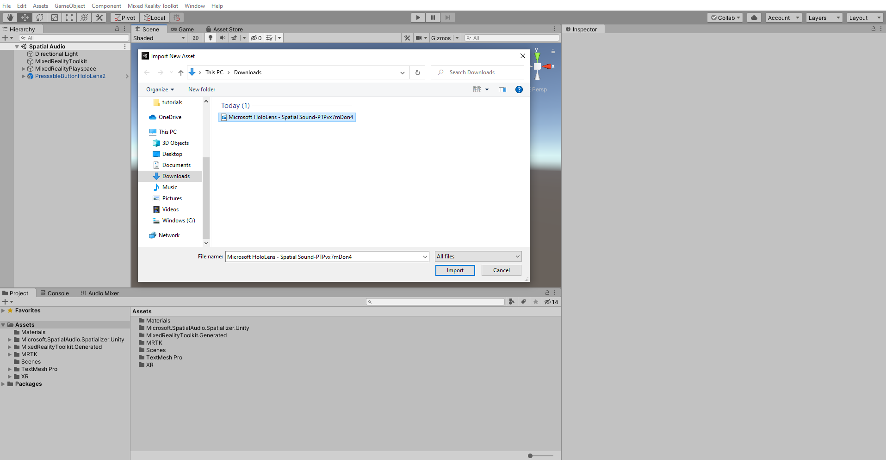
3. Adjusting the quality settings on the video clip can ensure smooth playback on HoloLens 2. Select the video file in the **Project** window and in the Inspector window of the video file, **override** the settings for **Windows Store Apps**, and:

    * Enable **Transcode**
    * Set **Codec** to H264
    * Set **Bitrate Mode** to Low
    * Set **Spatial Quality** to Medium Spatial Quality

4. After these adjustments, click on Apply to change the quality setting on the video clip.

    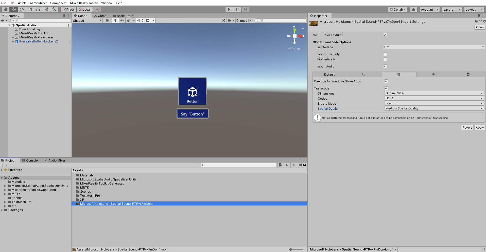
5. Right click on the Hierarchy, Select **Video** > **Video Player** to add Video player component.

    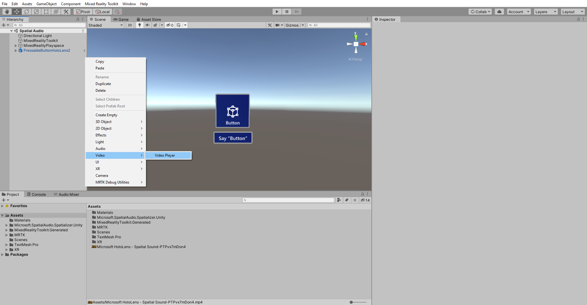

## Play video onto a quadrangle

The **Video Player** object needs a textured game object to render the video.

1. Right click the Hierarchy , Select **3D Object** > **Quad** to create a quad and configure its **Transform** component as follows:

    * **Position**: X = 0, Y = 0, Z = 2
    * **Rotation**: X = 0, Y = 0, Z = 0
    * **Scale**: X = 1.28, Y = 0.72, Z = 1

    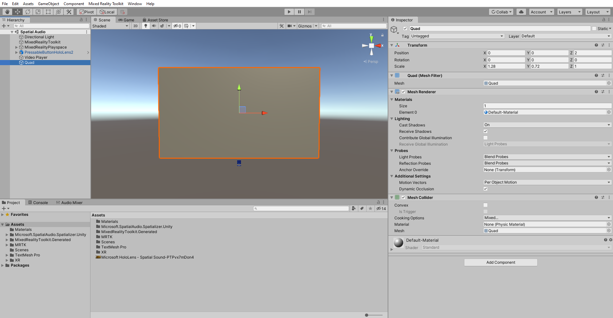
2. Now you need to texture the **Quad** with the video, In the **Project** window, right-click and choose **Create** > **Render Texture** to create a Render Texture component, enter a suitable name to the Render Texture for example, _Spatial Audio Texture_:

    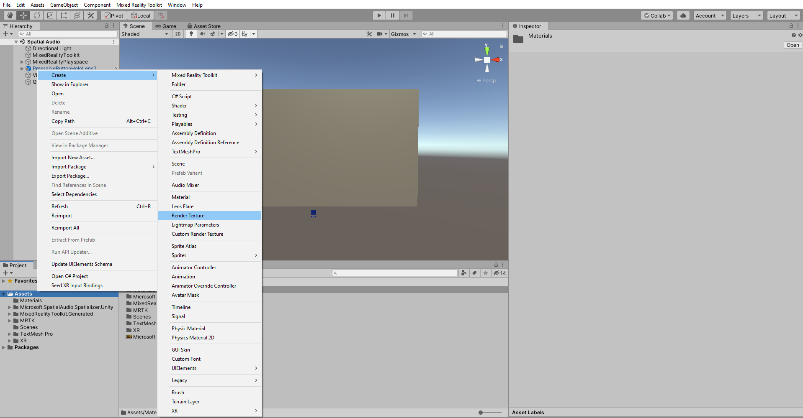

3. Select the **Render Texture** and in the Inspector window set the **Size** property to match the video's native resolution of 1280x720. Then, to ensure good rendering performance on HoloLens 2, set the **Depth Buffer** property to **At least 16 bits depth**.

    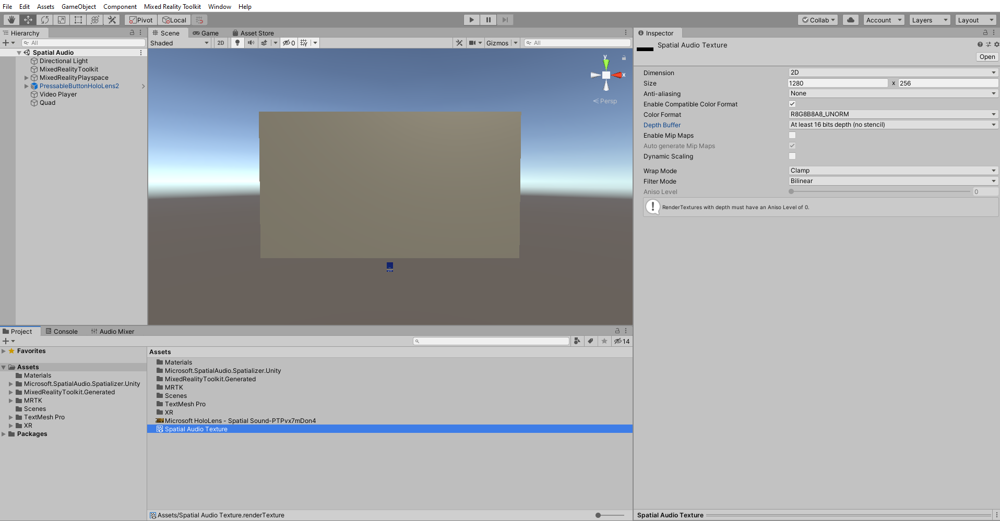

4. Next, use the created Render Texture **Spatial Audio Texture** as the texture for the **Quad**:

    * Drag the **Spatial Audio Texture** from the **Project** window onto the **Quad** in the Hierarchy to add the Render Texture to the Quad
    * To ensure good performance on HoloLens 2, select Quad in the Hierarchy and in the Inspector window for shader select the **Mixed Reality Toolkit** > **Standard** Shader.

    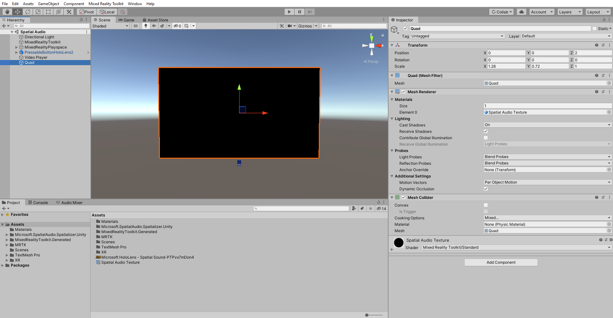

5. To set **Video Player** and **Render Texture** to play the video clip, select the **Video Player** in the **Hierarchy** and in the **Inspector** window,

    * Set the **Video Clip** property to the downloaded video file 'Microsoft HoloLens - Spatial Sound-PTPvx7mDon4'
    * Check the **Loop** checkbox
    * Set **Target Texture** to your new render texture **Spatial Audio Texture**

    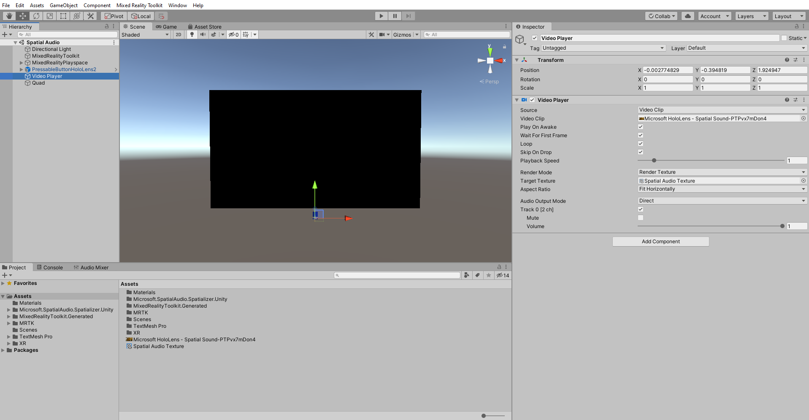

## Spatialize the audio from the video

1. In the Hierarchy window, select **Quad** object, then in the Inspector window, use the **Add Component** button to add **Audio Source** to which you'll route the audio from the video.

    In the **Audio Source**:

    * Set **Output** to the **Spatial Audio Mixer**
    * Check the **Spatialize** box
    * Move the **Spatial Blend** slider to 1 (3D)

    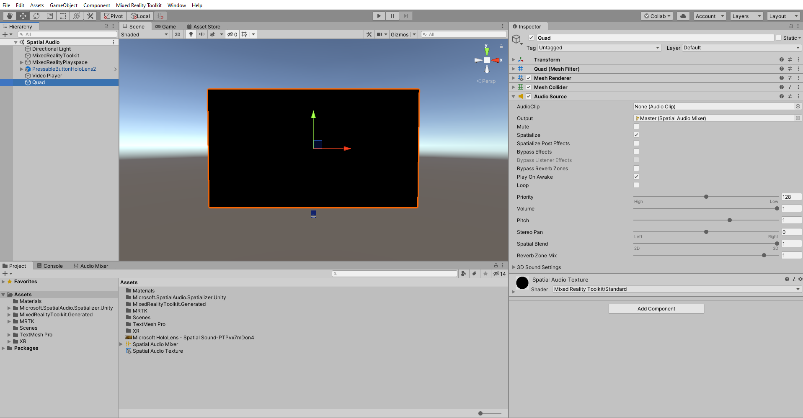

2. To set the Video Player to route its audio to the **Audio Source**, select the **Video Player** In the Hierarchy window, and in Video Player object in the Inspector do the following changes.

    * Set the **Audio Output Mode** to **Audio Source**
    * Set the **Audio Source** property to the **Quad**

    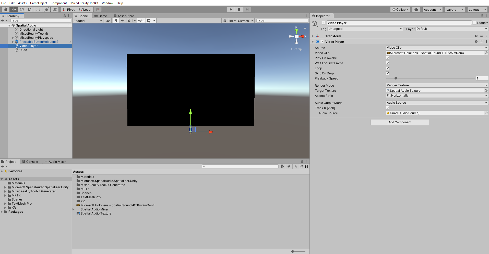
