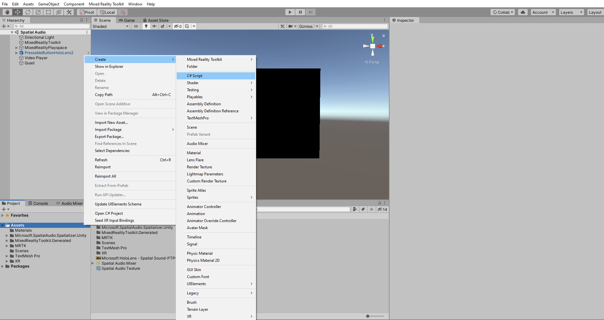
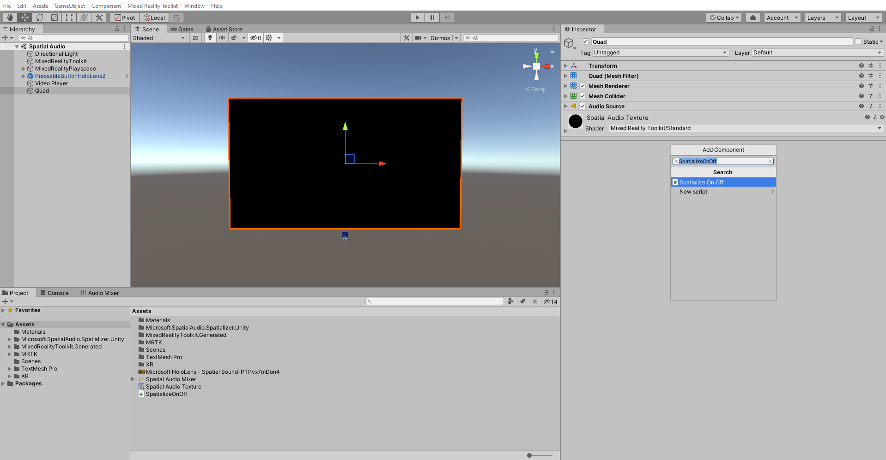
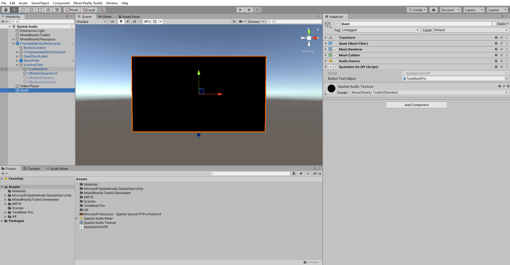
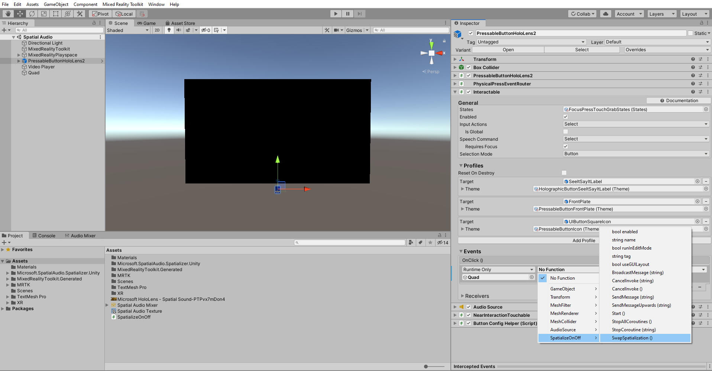

In this module, you'll learn how to Enable and disable spatialization at run time and test this in the unity editor and HoloLens 2.

## Add spatialization control script

1. Right-click in the Project window and choose **Create** > **C# Script** to create a new C# script, enter a suitable name for the script, for example, _SpatializeOnOff_:

    

2. Double-click the script in the Project window to open it in Visual Studio. Replace the default script contents with the following:

    ```c#
    using System.Collections;
    using System.Collections.Generic;
    using UnityEngine;
    using UnityEngine.Audio;

    [RequireComponent(typeof(AudioSource))]
    public class SpatializeOnOff : MonoBehaviour
    {
        public GameObject ButtonTextObject;
        //public AudioMixerGroup RoomEffectGroup;
        //public AudioMixerGroup MasterGroup;

        private AudioSource m_SourceObject;
        private bool m_IsSpatialized;
        private TMPro.TextMeshPro m_TextMeshPro;

        public void Start()
        {
            m_SourceObject = gameObject.GetComponent<AudioSource>();
            m_TextMeshPro = ButtonTextObject.GetComponent<TMPro.TextMeshPro>();
            SetSpatialized();
        }

        public void SwapSpatialization()
        {
            if (m_IsSpatialized)
            {
                SetStereo();
            }
            else
            {
                SetSpatialized();
            }
        }

        private void SetSpatialized()
        {
            m_IsSpatialized = true;
            m_SourceObject.spatialBlend = 1;
            m_TextMeshPro.SetText("Set Stereo");
            //m_SourceObject.outputAudioMixerGroup = RoomEffectGroup;
        }

        private void SetStereo()
        {
            m_IsSpatialized = false;
            m_SourceObject.spatialBlend = 0;
            m_TextMeshPro.SetText("Set Spatialized");
            //m_SourceObject.outputAudioMixerGroup = MasterGroup;
        }
    }
    ```

> [!NOTE]
> To enable or disable the spatialization, the script only adjusts the **spatialBlend** property, leaving the **spatialization** property enabled. In this mode, Unity still applies the **Volume** curve. Otherwise, if the user were to disable spatialization when far from the source, they would hear the volume increase abruptly.
> If you prefer to fully disable spatialization, modify the script to also adjust the **spatialization** boolean property of the **SourceObject** variable.

## Attach your script and drive it from the button

1. Select **Quad** in the Hierarchy and in the Inspector window, use the Add Component button to add **SpatializeOnOff(Script)**

    

2. In the Hierarchy locate **PressableButtonHoloLens2** > **IconAndText** > **TextMeshPro**.

3. With the **Quad** object still selected in the Hierarchy, in the Inspector window, locate the **Spatialize On Off (Script)** component and Drag and drop **TextMeshPro** Component of the PressableButtonHoloLens2.

    

4. To set the button to call the **SpatializeOnOff** script when the button is released You need to configure interactable script.

5. In the Hierarchy window, select the **PressableButtonHoloLens2**. In the Inspector window, locate the **Interactable (Script)** component and click on + icon under OnClick () event.

    * With the **PressableButtonHoloLens2** object still selected in the Hierarchy window, click-and-drag the **Quad** object from the Hierarchy window into the empty **None (Object)** field of the event you just added to make the ButtonParent object listen for button click event from this button:

    * Click the **No Function** dropdown of the same event. Then select **SpatializeOnOff** > **SwapSpatialization ()** to turn on and off the Spatial audio

    
