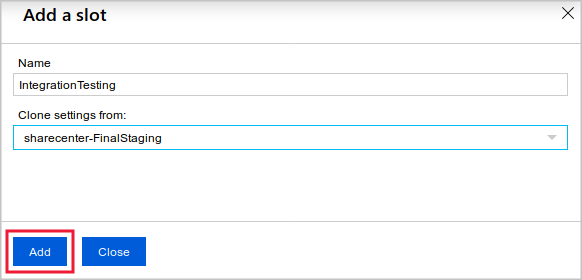
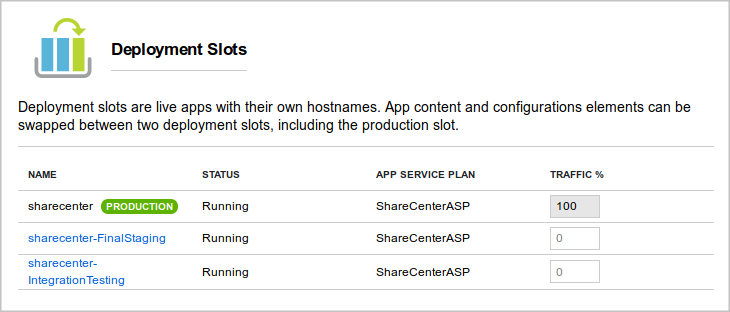

Organizations often need to run web apps in isolated environments to test them before deployment. They also need to deployment to occur quickly and with no impact on users. 

Suppose you are evaluating deployment slots as a streamlined mechanism for web app deployment in your social media system. You want to find out if deployment slots will reduce downtime during deployments, if they will ease rollbacks, and how to configure them in Azure.

Here, you will learn how deployment slots ease testing and roll-out of  new code.

## What is a deployment slot?

Within a single Azure App Service web app, you can create multiple deployment slots. Each slot is a separate instance of that web app with a separate hostname. You can deploy a different version of your web app into each slot.

One slot is the production slot; this is the web app that users see when they connect. You should be sure that the app deployed to this slot is stable and well-tested.

You can use additional slots to host new versions of your web app. You can run tests against these instances, including integration tests, acceptance tests, and capacity tests, and fix any problems you find before the code is moved to the production slot. Additional slots behave like their own App Service instances, giving you confidence that any tests you run will reflect the way that the app will run in production.

When you are satisfied with the results of testing a new version of your app, you can deploy it by swapping its slot with the production slot. Unlike the deployment of code, a slot swap is an instantaneous operation. When you swap slots, the slot hostnames are exchanged, immediately sending production traffic to the new version of the app. When you use slot swaps to deploy, your app will never be exposed to the public web in a partially deployed state.

If you find that, in spite of your careful testing, there is a problem with the new version, you can roll it back by quickly swapping the slots back.

## Slots as separate Azure resources

When you use more than one deployment slot for a web app, those slots are treated as separate instances of that web app. For example, they are listed separately in the **All resources** page in the Azure portal and they each have their own URL. However, each slot shares the resources of the App Service plan, including virtual machine memory and CPU as well as disk space.

## Deployment slots and tiers

Deployment slots are only available when you web app uses an App Service plan in the Standard, Premium, or Isolated tiers. The maximum numbers of slots you can create are shown in the following table:

|     Tier | Maximum Staging Slots |
|---------:|:---------------------:|
|     Free |           0           |
|   Shared |           0           |
|    Basic |           0           |
| Standard |           5           |
|  Premium |           20          |
| Isolated |           20          |

## Avoiding "cold start" during swaps

Many of the technologies that developers use to create web apps require final compilation and other actions on the server before a page can be delivered to a user. Many of these tasks are completed when the app first starts up and receives a request. For example, if you use ASP.NET to build your app, code is compiled and views completed when the first user requests a page. Subsequent requests for the same page will receive a faster response because the code has already been compiled.

This kind of delay is called a *cold start*, and can be avoided by using slot swaps to deploy to production. Swapping a slot into production "warms up" the app prior to the swap by sending a request to the root of the site. The warm-up request ensures that all compilation and caching tasks are complete. After the swap, the site responds as fast as if it had been deployed for days.

## How to create a deployment slot

Before you create a slot, ensure that your web app is running in the Standard, Premium, or Isolated tiers:

Open your web app in the Azure portal and select the **Deployment Slots** page, then click **Add Slot** and give the slot a name. Next, choose whether to clone settings from another slot. If you choose to clone, settings are copied to your new slot from the slot you specify.

> [!NOTE]
> Settings can be cloned to a new slot, but not content. New slots always begin with no content. You must deploy content by using git or another deployment strategy. The clone operation copies the configuration to the new slot. Afterwards, the configuration of the two slots can be changed independently.

Click **Add** to create the new slot. Once the new slot is created, you can see it in the list on the **Deployment Slots** page. You can click on it to view the slot's management page.

## How to access a slot

The new slot has its own hostname that is derived from the web app name and the name of the slot. You can see this hostname when you click on the slot in the **Deployment Slots** page:

You can deploy your code to the new slot in exactly the same way as you do for the production slot. Just substitute the new slot's name or URL in the configuration of the deployment tool you use. If you use FTP to deploy, you can see the FTP hostname and username to use just underneath the slot's URL.

The new slot is effectively a separate web app with a different hostname and as such is accessible to anyone from the internet if they know that hostname. Unless you register the slot with a search engine or link to it from a crawled page, the slot won't appear in search engine indexes so it will remain obscure to the general Internet user. However, you can choose to restrict access to a slot by using IP address restrictions. You can create a list of IP address ranges that are allowed to access the slot or a list of ranges that are denied access to the slot, just like the allow and deny ranges that you can configure on a firewall. Use this list to permit access only to computers that come from your company or development team.