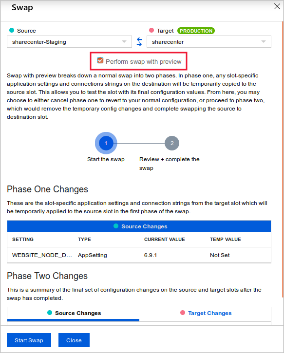

You can control the precise behavior of web apps and their configuration when you swap slots. 

Suppose you have set up deployment slots for production and staging and tested a new version of your social media web app in the staging slot. Now it's time to deploy that new version to production. You want to ensure that the app is deployed smoothly and in the correct configuration.

Here, you will learn how to perform a swap with the correct configuration for the deployed web app.

## Managing the configuration for a swap

When you swap two slots, an app's configuration travels to the new slot along with the app. However, this behavior can be overridden for individual application settings and configuration strings by configuring them as **slot settings**.

Suppose, for example, you have two databases &mdash; one is used for production and the other for acceptance testing. You always want the version of the app in the staging slot to use the testing database, and the version of the app in the production slot should always use the production database. To achieve this, you can configure the database connection string as a slot setting.

### How to configure slot settings

To configure the settings that will be swapped, navigate to the web app resource, and then, on the **Deployment Slots** page, click the deployment slot you want to configure. Next, click the **Application Settings** page for the deployment slot. Scroll down to the **Application settings** and **Connection strings**. To make one of these a slot setting, select the checkbox under **Slot**:

### How to swap slots in the Azure portal

To swap two slots using the Azure portal, open the resource page for the web app and click the **Deployment Slots** page, then click **Swap**. On the **Swap** dialog, you can select the source and target slots and see a summary of the settings that will be applied to the swapped slots:

## Swapping slots with preview

When you perform a slot swap, the slot settings in the target slot (typically Production) are applied to the version of the app in the source slot before the hostname swap occurs. In certain scenarios, problems could be discovered when this occurs. For example, if the database connection string is configured as a slot setting, the new version of the web app will use the existing production database. Suppose you have forgotten to upgrade the database schema in the production database prior to swapping - the new version of the app attempting to use the old schema could result in errors and exceptions.

To help avoid discover these kinds of problems prior to your app going live in production, Azure App Service supports **swap with preview**. When you choose this option, there are two phases to the swap:

- Phase 1: Slot settings from the target slot and applied to the web app in the source slot. Then Azure warms up the staging slot. At this point, the swap operation pauses so you can test the app in the source slot to make sure it works correctly with the target slot configuration. If no problems are found, you can begin phase 2.
- Phase 2: The hostnames for the two sites are swapped. The version of the app now in the source slot receives its slot settings.

> [!IMPORTANT]
> Remember that you must test your web app thoroughly while it is in the staging slot and eliminate bugs in code and problems with non-slot settings. Swap with preview can only help to spot and eliminate problems caused by the production slot settings. You should be confident that everything else is sound before you initiate any kind of swap into production.

### How to swap slots with preview

To use the swap-with-preview feature, select the **Perform swap with preview**, review the settings, and then click **Start Swap**.

Then follow the link provided to preview the new version of the site with slot settings from the destination slot applied. If you are happy to proceed, click **Complete Swap**.

## Auto swap

Auto swap brings the zero-downtime and easy rollback benefits of swap-based deployment to automated deployment pipelines. When you configure a slot for auto swap, Azure automatically swaps it whenever you push code or content into that slot.

When you use auto swap, the new version of the app can't be tested in the staging slot prior to the swap. Auto primarily benefits users who want to achieve zero-downtime deployments with very simple automated deployment pipelines. If you want to retain the ability to test prior to swapping, you can either implement a more complex deployment pipeline that requests the slot swap itself, or you can deploy to a separate slot dedicated for testing.

> [!NOTE]
> Auto-swap is not available on App Service on Linux.

### How to configure auto swap

You can configure auto swap on the **Application settings** page for the slot. Under **General settings** you can turn on auto swap and configure where to swap to when new code is pushed:

