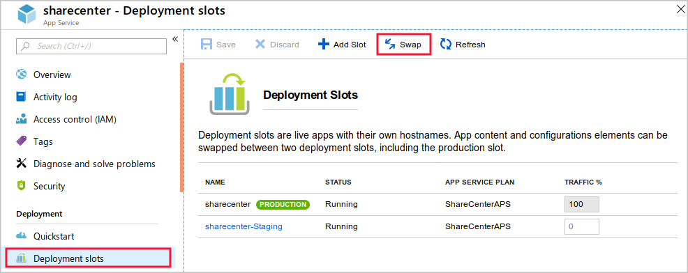
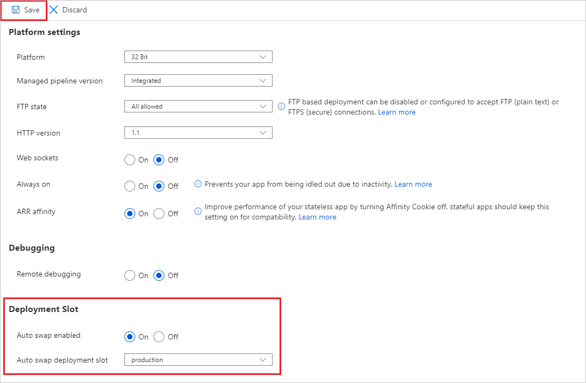

When you're ready to swap two slots, make sure you've applied the correct configuration to the swapped slots.

Suppose you've finished testing version 2 of your social media web app. Now, you want to deploy that version to production. You want to further streamline deployment by automatically swapping future versions of the app.

Here, you'll learn how to swap manually and automatically.

## Configure a slot setting

Before you deploy version 2 of the web app, configure a slot setting. The settings you'll configure here won't affect your demo app. The purpose of this exercise is just to see how the configurations work when you swap slots.

To configure slot settings:

1. From the **All resources** view in the Azure portal, navigate to the **Overview** page of the production slot of the web app.

1. Navigate to the **Configuration** page for the deployment slot.

1. Select **New application setting**. Add a new setting with the name **ENVIRONMENT_NAME** and a value of **production**. Check the **deployment slot setting** box to make this a slot setting.

1. Add another setting called **APP_VERSION**, and enter the value **1**. *Don't* make this a slot setting.

1. Near the top of the page, select **Save**.

1. Repeat the preceding steps on the **Staging** slot, but use the following values:

    | Name | Value | Deployment slot setting |
    |---|---|---|
    | ENVIRONMENT_NAME | staging | Yes |
    | APP_VERSION | 2 | No |

## Swap the slots

Now that you've tested version 2 of the web app in the staging slot, you can deploy it by swapping the slots. Follow these steps:

1. To make sure you're configuring the production slot, select **All resources**, and then select the production slot of the web app.

1. In the left menu pane, under **Deployment**, select **Deployment slots** > **Swap**.

    

1. Make sure you're about to swap the staging and production slots. Notice how the swap will affect settings. The value of the APP_VERSION setting will be exchanged between the slots, but the value of the ENVIRONMENT slot setting won't be swapped. Select **Swap**.

    

1. When the swap is complete, go to the **Overview** page of the production slot's web app, and select **Browse**. The web app appears on a new browser tab. Notice that version 2 of the web app is now in production.

1. Close the browser tab.

## Configure auto swap for the staging slot

Suppose that now that you're using deployment slots, you want to enable continuous deployment. You'll do this by using the auto swap feature for your web app. In a system that uses auto swap, when you deploy new code to the staging slot, Azure automatically warms it up and deploys it to production by swapping the staging and production slots. To configure auto swap, follow these steps:

1. Go to the **Configuration** page of the staging slot's web app, and navigate to the **General settings** tab.

1. Set **Auto swap enabled** to **On**.

1. In the **Auto swap deployment slot** list, select **production**, and then select **Save**.

    

## Deploy new code and auto swap it into production

Now, you'll modify the code to create version 3 of the web app. When you deploy it to the staging slot, you'll see an auto swap in action. Follow these steps:

1. On the right side of the Cloud Shell window, restart the editor if it's not already running.

    ```bash
    cd ~/demoapp/app-service-web-dotnet-get-started/
    code .
    ```

1. In the code editor, in the **File list** on the left, expand **aspnet-get-started** > **Views** > **Home**, and then select **Index.cshtml**.

1. Locate the following code.

    ```html
    <h1>Web App Version 2</h1>
    ```

1. Replace that code with this code.

    ```html
    <h1>Web App Version 3</h1>
    ```

1. To save your changes, press <kbd>Ctrl+S</kbd>.

1. In Cloud Shell, enter the following commands. Enter your deployment password when you're prompted.

    ```bash
    git add .
    git commit -m "Third version of web app."
    git push staging
    ```

    Wait for the deployment to finish. Near the end of the text output, you'll see a message that indicates that the deployment has requested an auto swap to the production slot.

1. In the Azure portal, navigate to the **Overview** page for the production slot's web app, and select **Browse**. The third version of the web app appears on a new browser tab. If the old version is shown, you may need to wait briefly and then refresh the page - the swap operation is atomic and occurs instantly, but it takes App Service a few moments to prepare the swap operation before it's executed.

## Roll back the new version

Suppose that deploying version 3 of your app to production revealed an unexpected problem. To quickly resolve it, you can roll back to the previous version of the site by swapping the slots again.

1. Go to the **Deployment slots** page of the production slot's web app.

1. Swap the staging and production slots.

1. When the swap finishes, on the **Overview** page, select **Browse** to view the app one last time. You'll see that version 2 has been redeployed to production.
