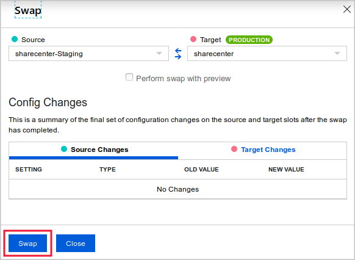

When you're ready to swap two slots, you need to make sure that the correct configuration is applied to the swapped slots.

Suppose you have completed testing on a new version of your social media web app. Now you want to deploy that version, to production. You also want to streamline deployment further by using auto swap for future versions of the app.

Here, you will learn how to perform a manual swap and how to use auto-swap.

## Configure a slot setting

Before you deploy version 2 of the web app, let's configure a slot setting. The setting we use here won't have any real effect on our demo app, we're just going to create them to see how they behave when we swap slots:

1. Navigate to the Overview page of the production-slot web app.
1. Click the **Application Settings** page for the deployment slot.
1. Scroll down to the **Application settings** and then click **+ Add new setting**.
1. Under **App setting name**, type **ENVIRONMENT_NAME** and under **Value** enter **production**. Select the checkbox under **Slot** to make it a slot setting.
1. Add another setting called **APP_VERSION** and enter the value **1**. Do not make this setting a slot setting.
1. Save the settings with the **Save** button near the top.
1. Repeat the above steps on the staging-slot web app, creating the following settings:

    | Name             | Value   | Slot |
    |------------------|---------|------|
    | ENVIRONMENT_NAME | staging | Yes  |
    | APP_VERSION      | 2       | $12  |

## Swap the slots

Now that you have completed your tests on version 2 of the web app, which is currently in the staging slot, you can deploy it by swapping the slots. Follow these steps:

1. To make sure you are configuring the production slot, click **All resources** and then select the production-slot web app.
1. Under **Deployment** click **Deployment slots** and then click **Swap**.

    

1. Check that you are about the swap the staging and production slots and notice how the swap will affect settings. Note that the value of the APP_VERSION setting will be exchanged between the slots, but the value of the slot setting ENVIRONMENT will not be swapped. Click **Swap**.

    

1. When the swap is complete, navigate to the Overview page of the production-slot web app and click **Browse**. The web app is displayed in a new browser tab. Notice that version 2 of the web app is now in production.
1. Close the browser tab.

## Configure auto swap for the staging slot

Now that you are using deployment slots, you'd like to go further and enable continuous deployment by using auto swap for your web app. Auto swap means that, when new code is deployed to the staging slot, Azure automatically warms it up and deploys it to production by swapping the staging and production slots. To configure auto swap, follow these steps:

1. Navigate to the **Application settings** page of the staging-slot web app.
1. In the **General settings**, next to **Auto Swap** click **On**.
1. In the **Auto Swap Slot** drop-down list, select **production**, and then click **Save**

    

## Deploy new code and auto swap it to production

Now, let's make a modification to the code to create a third version of the web app. When we deploy it to the staging slot, we'll see auto swap in action. Follow these steps:

1. In the Cloud Shell window on the right, restart the editor if it's not already running.

    ```bash
    code .
    ```

1. In the code editor, in the **File list** on the left, expand **aspnet-get-started**, expand **Views**, expand **Home**, and then click **Index.cshtml**.
1. Locate the following code:

    ```html
    <h1>Web App Version 2</h1>
    ```

1. Replace that code with:

    ```html
    <h1>Web App Version 3</h1>
    ```

1. To save your changes, type CTRL+S.
1. In the Cloud Shell, enter the following commands. Enter your password when prompted.

    ```bash
    git add .
    git commit -m "Third version of web app."
    git push staging
    ```

    Wait for the deployment to complete. Near the end of the text output, you'll see a message that indicates that the deployment has requested an auto swap to the production slot.

1. In the Azure portal, navigate to the Overview page for the production-slot web app and click **Browse**. Version 3 of the web app will be displayed in the new browser tab &mdash; the push to the staging slot triggered an auto-swap with the production slot.

## Roll back the new version

Suppose that deploying version 3 of our app to production has revealed an unexpected problem. To quickly resolve it, we can roll back to the previous version of the site by swapping the slots again.

Navigate to the **Deployment slots** page of the production-slot web app and swap the staging and production slots. When the swap completes, use the **Browse** button on the Overview page to view the app one last time. You'll see that version 2 has been redeployed to production.