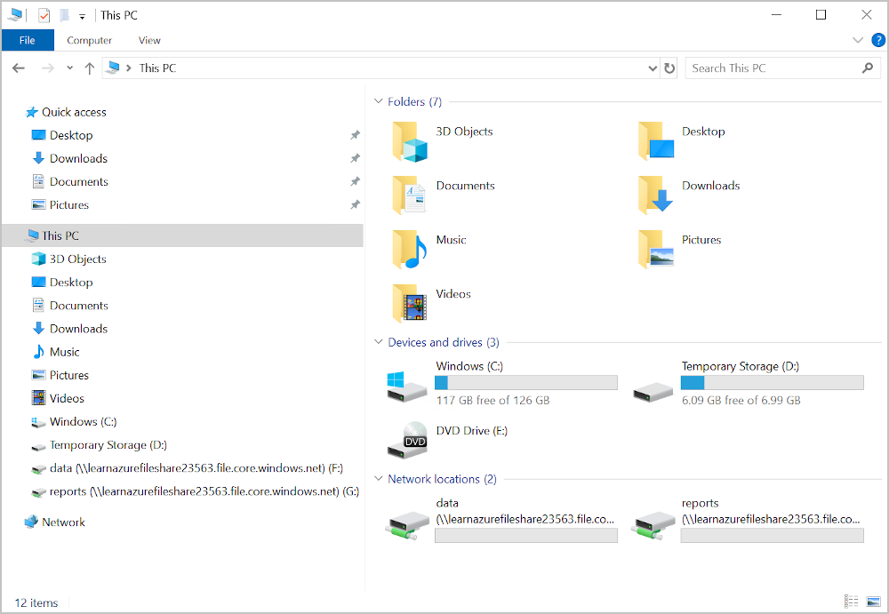

Azure storage accounts enable organizations to replicate their on-premises file shares in a secure, resilient, cloud service. Companies can then remove redundant hardware and infrastructure that's supporting the internal SANs and NAS. At the same time, a company can reduce the risk of files being unavailable because of a hardware failure.

The finance company has asked you to duplicate the two file shares that they currently have on-premises. It uses one file share for reports, and the other for application data. The storage account needs to be resilient to data center failures. That's why you'll create it to use GRS redundancy.

In this exercise, you'll first create a Windows VM to use as your example customer machine. You'll use the Windows VM to mount drives where you access the file shares. Next, in a new storage account, you'll create two file shares for reports and application data. Finally, you'll map two drives to the new Azure file shares and copy reports to them.

## Create a Windows Server

These steps create a Windows Server to use later in the exercise. Think of it as an on-premises machine running in the finance company's data center or branch office.

1. Using the Cloud Shell, create a Windows VM with the Azure CLI command.

    ```bash

    export PASSWORD=$(openssl rand -base64 32)

    az vm create \
    --no-wait \
    --resource-group <rgn>[sandbox Resource Group]</rgn> \
    --name 2019FileServer \
    --image Win2019Datacenter \
    --admin-username azureuser \
    --admin-password $PASSWORD
    ```

## Create a GRS storage account

1. Create a storage account using the Azure CLI command.

    ```bash
    export STORAGEACCT=learnazurefileshare$RANDOM
    
    az storage account create \
    --name $STORAGEACCT \
    --resource-group <rgn>[sandbox Resource Group]</rgn> \
    --sku Standard_GRS
    ```

1. Using Azure CLI commands, save the storage account key in a local variable.

    ```bash
    STORAGEKEY=$(az storage account keys list \
    --resource-group <rgn>[sandbox Resource Group]</rgn> \
    --account-name $STORAGEACCT \
    --query "[0].value" | tr -d '"')
    ```

## Create file shares


1. Create a file share to store the finance company's reports. 

    ```bash
    az storage share create \
    --account-name $STORAGEACCT \
    --account-key $STORAGEKEY \
    --name "reports"
    ```

1. Create a file share to store the finance company's application data.

    ```bash
    az storage share create \
    --account-name $STORAGEACCT \
    --account-key $STORAGEKEY \
    --name "data"
    ```

## Connect to your VM

1. Get the IP address of the Windows VM to use with Remote Desktop Connection.

    ```bash
    export RDPCONNECTION=$(az vm list-ip-addresses --name 2019FileServer --query "[].virtualMachine.network.publicIpAddresses[*].ipAddress" --output tsv):3389
    
    echo $RDPCONNECTION
    echo $PASSWORD
    ```

1. On your Windows machine, select **Start**, then type **Remote Desktop Connection**. Select the **Remote Desktop Connection** application in the search results.
1. In the **Remote Desktop Connection** window, in the **Computer** field, type the IP address from step 1 above.
1. Select the **Show Options** link at the bottom of the window. In the **Username** field, type **azureuser**.
1. Select **Connect**.
1. Paste the password returned in step 1 into the **Windows Security** window.

## Map drives to the Azure file shares

1. Sign in to the [Azure portal](https://portal.azure.com/?azure-portal=true), using the portal menu, then select **Storage Accounts**.
1. Select the created storage account that should be named learnazurefileshare, followed by random numbers.

    

1. Select **File shares**, then select **data**.

    

1. Select **Connect**, and on the popout on the right, select the **A** drive letter.

    

1. Copy the bottom PowerShell command.
1. Select **Start**, then type **PowerShell**, and select the **Windows PowerShell** application in the search results.
1. In the PowerShell window, paste the copied commands.
1. Return to the Azure portal, go back to the file shares, and select the **reports** file share.

    

1. Select **Connect**, and on the popout on the right, select the **R** drive letter.
1. Copy the bottom PowerShell command.
1. In the PowerShell window, paste the copied commands.

## Test the mounted drive

1. Open Explorer, and select **This PC**.

    

1. Select the data drive, named drive **A**. 
1. Right-click in the main window, and select **New > Text Document**. 
1. Name the file **test upload**.
1. Return to the Azure portal in your browser, and go to the **data** file share. You should see the file in the portal.
1. Keep this connection open for the next exercise.