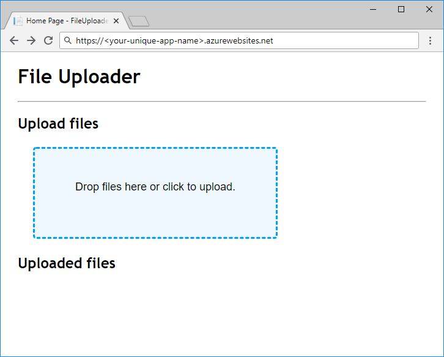

Once we have a reference to a blob, we can upload and download data. `ICloudBlob` objects have `Upload` and `Download` methods that support byte arrays, streams, and files as sources and targets. Specific types have additional methods for convenience &mdash; for example, `CloudBlockBlob` supports uploading and downloading strings with `UploadTextAsync` and `DownloadTextAsync`.

## Creating new blobs

To create a new blob, you call one of the `Upload` methods on a reference to a blob that doesn't exist in storage. This does two things: creates the blob in storage and uploads the data.

## Moving data to and from blobs

Moving data to and from a blob is a network operation that takes time. In the Azure Storage SDK for .NET Core, all methods that require network activity return `Task`s, so make sure you use `await` in your controller methods appropriately.

A common recommendation when working with large data objects is to use streams instead of in-memory structures like byte arrays or strings. This avoids buffering the full content in memory before sending it to the target. ASP.NET Core supports reading and writing streams from requests and responses.

## Concurrent access

Other processes may be adding, changing, or deleting blobs as your app is using them. Always code defensively and think about problems caused by concurrency, such as blobs that are deleted right as you try to download from them, or blobs whose contents change when you don't expect them to. See the Further Reading section at the end of this module for information about using AccessConditions and blob leases to manage concurrent blob access.

## Exercise

Let's finish our app by adding upload and download code, then deploy it to Azure App Service for testing.

### Upload

To upload a blob, we'll implement the `BlobStorage.Save` method using `GetBlockBlobReference` to get a `CloudBlockBlob` from the container. `FilesController.Upload` passes the file stream to `Save`, so we can use `UploadFromStreamAsync` to perform the upload for maximum efficiency.

In the editor, replace `Save` in `BlobStorage.cs` with the following code:

```csharp
public Task Save(Stream fileStream, string name)
{
    CloudStorageAccount storageAccount = CloudStorageAccount.Parse(storageConfig.ConnectionString);
    CloudBlobClient blobClient = storageAccount.CreateCloudBlobClient();
    CloudBlobContainer container = blobClient.GetContainerReference(storageConfig.FileContainerName);
    CloudBlockBlob blockBlob = container.GetBlockBlobReference(name);
    return blockBlob.UploadFromStreamAsync(fileStream);
}
```

> [!NOTE]
> The stream-based upload code shown here is more efficient than reading the file into a byte array before sending it to Azure Blob storage. However, the ASP.NET Core `IFormFile` technique we use to get the file from the client is not a true end-to-end streaming implementation and is only appropriate for handling uploads of small files. See the Further Reading section at the end of this module for information about fully streamed file uploads.

### Download

`BlobStorage.Load` returns a `Stream`, meaning that our code doesn't need to physically move the bytes from Blob storage at all &mdash; we just need to return a reference to the blob stream. We can do that with `OpenReadAsync`. ASP.NET Core will handle reading and closing the stream when it builds the client response.

Replace `Load` with this code and save your work:

```csharp
public Task<Stream> Load(string name)
{
    CloudStorageAccount storageAccount = CloudStorageAccount.Parse(storageConfig.ConnectionString);
    CloudBlobClient blobClient = storageAccount.CreateCloudBlobClient();
    CloudBlobContainer container = blobClient.GetContainerReference(storageConfig.FileContainerName);
    return container.GetBlobReference(name).OpenReadAsync();
}
```

### Deploy and run in Azure

Our app is finished &mdash; let's deploy it and see it work. Create an App Service app and configure it with application settings for our storage account connection string and container name. Get the storage account's connection string with `az storage account show-connection-string` and set the name of the container to be `files`.

The app name needs to be globally unique, so you'll need to choose your own name to fill in `<your-unique-app-name>`.

```azurecli
az appservice plan create --name blob-exercise-plan --resource-group <rgn>[Sandbox resource group name]</rgn>
az webapp create --name <your-unique-app-name> --plan blob-exercise-plan --resource-group <rgn>[Sandbox resource group name]</rgn>
CONNECTIONSTRING=$(az storage account show-connection-string --name <your-unique-storage-account-name> --output tsv)
az webapp config appsettings set --name <your-unique-app-name> --resource-group <rgn>[Sandbox resource group name]</rgn> --settings AzureStorageConfig:ConnectionString=$CONNECTIONSTRING AzureStorageConfig:FileContainerName=files
```

Now we'll deploy our app. The below commands will publish the site to the `pub` folder, zip it up into `site.zip`, and deploy the zip to App Service.

> [!NOTE]
> Make sure your shell is still in the `mslearn-store-data-in-azure/store-app-data-with-azure-blob-storage/src/start` directory before running the following commands.

```azurecli
dotnet publish -o pub
cd pub
zip -r ../site.zip *
az webapp deployment source config-zip --src ../site.zip --name <your-unique-app-name> --resource-group <rgn>[Sandbox resource group name]</rgn>
```

Open `https://<your-unique-app-name>.azurewebsites.net` in a browser to see the running app. It should look like the image below.



Try uploading and downloading some files to test the app. After you've uploaded a few files, run the following in the shell to see the blobs that have been uploaded to the container:

```console
az storage blob list --account-name <your-unique-storage-account-name> --container-name files --query [].{Name:name} --output table
```