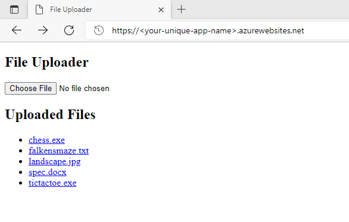

After you have an idea about how you're going to store data across storage accounts, containers, and blobs, you can think about the Azure resources you'll need to create to support the application.

### Storage accounts

Storage account creation is an administrative/management activity that takes place before deploying and running your application. Accounts are usually created by a deployment or environment setup script, an Azure Resource Manager template, or manually by an admin. Applications other than administrative tools generally should not have permissions to create storage accounts.

### Containers

Unlike storage account creation, container creation is a lightweight activity that makes sense to perform from within an application. It's not uncommon for applications to create and delete containers as part of their work.

For applications that rely on a known set of containers with hard-coded or preconfigured names, the typical practice is to let the application create the containers it needs on startup or first usage if they don't already exist. Letting your application create containers instead of doing it as part of your application's deployment eliminates the need for both your application and your deployment process to know the names of the containers the application uses.

## Exercise

You're going to complete an unfinished Java EE (Jakarta EE) application by adding code to use Azure Blob Storage. This exercise is more about exploring the Azure Storage SDK for Java and API than it is about designing an organization and naming scheme, but here's a quick overview of the application and how it stores data.



Your application works like a shared folder that accepts file uploads and makes them available for download. It doesn't use a database for organizing blobs &mdash; instead, it sanitizes the names of uploaded files and uses them as blob names directly. All uploaded files are stored in a single container.

The code you'll start with compiles and runs, but the parts responsible for storing and loading data are empty. After you complete the code, you'll deploy the application to Azure App Service and test it.

Let's set up the storage infrastructure for your application.

### Storage account

You'll use Azure Cloud Shell with the Azure CLI to create a storage account. You'll need to provide a unique name for the storage account &mdash; make a note of it for later.  Replace [your-unique-storage-account-name] with a name you choose.

To create the storage account, run this command. Remember to enter your unique storage account name in the code.

```azurecli
az storage account create \
  --kind StorageV2 \
  --resource-group [resource group name] \
  --location centralus \
  --name [your-unique-storage-account-name]
```

### Container

The application you'll be working within this module uses a single container. You're going to follow the best practice of letting the application create the container at startup. However, container creation can be done from the Azure CLI. If you'd like to see the documentation, in Cloud Shell, run the `az storage container create -h` command.
