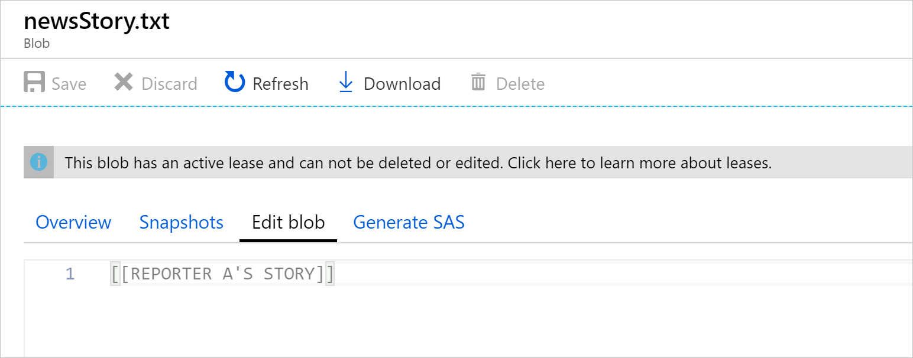

Pessimistic concurrency prevents other users from modifying data by locking it with a **lease**. A **lease** locks resticts access to a single client for a pre-determined amount of time. Once the lease has been acquired, other users are prevented from completing actions on that data. The lease defines how long you hold on to the content. Lease times are from between 15 to 60 seconds. A lease can be reacquired before it expires to extend it, and released earlier once you've finished using it. The blob service automatically releases finite leases when they expire.


<!-- TODO replace with studio graphics -->

Using our example app, the first reporter will lock the file. No one else will be granted a lock until the current one has been released, or has expired. The second reporter, being the quickest, has finished writing their story but will be unable to get a lock to save it until the first reporter lets them.

Locks on Azure blobs are called *leases*. An app must acquire a lease before it tries to update an object in blob storage. When requesting the least you specify an amount of time, or say that you want the lease indefinitely. The operations possible on a lease are:

- **Acquire**: requests a new lease.
- **Renew**: allows you to renew an existing lease.
- **Change**: is used to change the ID of an existing lease.
- **Release**: frees the lease early to allow another apps to acquire a lease.
- **Break**: ends the lease but prevents another client from acquiring a new lease until the current lease period has expired.

The first reporter will acquire a lease for the storage, and begin writing. The second reporter tries to acquire the lease before starting and receive an error, because there's already a lease in use. The reporter will have to wait until the lease is either released or expired.

### Azure Blob Storage

To acquire a lease in C#, use this code:

```csharp
string lease = file-to-change.AcquireLease(TimeSpan.FromSeconds(60), null);
```

The above code notifies Azure cloud storage that you'd like exclusive access to `file-to-change` for **60 seconds**. If a second app, or process, also tries to acquire a lease on the same object, Azure will return a **409** HTTP error code (conflict ocurred). If other processes, including the Azure portal, tries to change the file they won't be able to.



Now the lease has been created, you must use it with `UploadTextAsync` to prove you're allowed to complete the update. In code, you create an access condition generated from the acquired lease, and use that as the parameter:

    ```csharp
    var use-Lease = AccessCondition.GenerateLeaseCondition(new-Lease);
    await file-to-change.UploadTextAsync(story, null, accessCondition: AccessCondition.GenerateLeaseCondition(lease), null, null);
    ```
## Advantages and disadvantages

Pessimistic concurrency is primarily used in environments where there's heavy contention for data. The cost of protecting data with a lease is less than the cost of fixing the data if concurrency conflicts occur. Pessimistic concurrency is best implemented when lease times will be short, as in programmatic processing of records. Pessimistic concurrency isn't a scalable option if users are working with data and locking records for large periods of time. It's pessimistic, because you think that someone else is going to edit a file at the same time you're using it.

An app can request ownership of a blob and not allow anyone else to change it while it's being used. The obvious downside is that no one else can make changes to the storage. As you can see from the above Azure portal screenshot, it's still possible to open it for read access though.

Unlike optimistic concurrency, leases are enforced globally, regardless of application implementation. So if a single app acquires a lease, no other process can update the storage until the lease has expired or been released.
