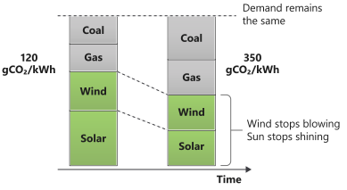
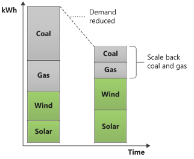
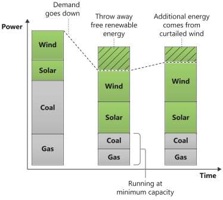
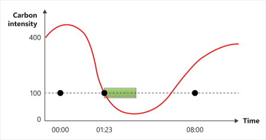

The carbon intensity of electricity is a measure of how much carbon (CO2eq) emissions produced per kilowatt-hour of electricity consumed.

The standard unit of carbon intensity is <nobr>**gCO2eq/kWh**</nobr> or grams of carbon per kilowatt-hour.

Not all electricity is produced in the same way. In different locations and at different times, electricity is made using various sources with varying emissions of carbon. Some sources, such as wind, solar, or hydroelectric, are clean, renewable sources that emit no carbon. Other fossil fuel sources emit varying amounts of carbon to produce electricity. For example, gas-burning power plants emit less carbon than coal-burning power plants.

If your computer was plugged directly into a hydroelectric plant, then the electricity it consumed would have a carbon intensity of <nobr>**zero gCO2eq/kWh**</nobr>. A hydroelectric plant emits no carbon to produce that electricity. Most people can't plug directly into hydroelectric plants. Instead, they plug into power grids supplied with electricity from a mix of sources that produce varying amounts of carbon. Therefore, when plugged into a grid, your carbon intensity is usually a number greater than zero.

## Variability of Carbon Intensity

Carbon intensity changes by location since some regions have an energy mix containing more clean energy sources than other regions.

Carbon intensity also changes over time due to the variable nature of renewable energy. For example, when it's cloudy or the wind isn't blowing, carbon intensity increases since more of the electricity in your mix comes from sources that emit carbon.

Electricity demand varies during the day, and that demand needs to be met by supply. Some of that supply can easily control the power it produces; for example, a coal power plant can burn less coal. Some of that supply can't easily control the power it produces; for example, a wind farm can't control how much the wind blows, it can only throw away (curtail) electricity that was made essentially for free.

As a by-product of the way energy markets work as demand for electricity goes down, ordinarily, the high emitting fossil fuel sources of power are scaled back first with renewables scaled back last.

Reducing the amount of electricity consumed in your applications can decrease the carbon intensity of the local grids' energy mix.

## Marginal Carbon Intensity

If you choose to consume more energy, that energy comes from the marginal power plant. That power plant is one that can control the energy it outputs, renewables cannot control the sun or the wind, so marginal power plants are often powered by fossil fuels.

The marginal plant emits carbon, at any moment we have the carbon intensity of the energy mix in the grid but also the carbon intensity of the energy that would have to be brought online to meet new demand, that's called the marginal carbon intensity.

Fossil fueled power plants rarely scale down to zero, they have a minimum functioning threshold. Some don't scale at all they are considered consistent always-on base load. Because of this, we can sometimes reach the perverse scenario where we throw away (curtail) renewable energy that was created for free to consume energy from fossil fuel power plants made with a fuel that costs money.

If a new load would be met with supply from a renewable source that would otherwise have been curtailed, then marginal carbon intensity will be <nobr>**zero gCO2eq/kWh**</nobr>.

There are moments when the marginal carbon intensity of electricity is <nobr>**zero gCO2eq/kWh**</nobr>, running compute during these times, results in **no carbon being emitted** from electricity consumption.

## Demand Shifting

There is currently little in the way of storage or buffering in electrical grid systems. Typically electricity is produced so supply always meets demand. If more energy is generated from renewables than is needed to support demand, and all our storage options are full, we curtail (throw away) that clean energy. One solution is to shift workloads to times and locations where there is more supply of renewable energy, this is called demand shifting.

If you can be flexible with when and where you run workloads, you can then choose to consume electricity when the carbon intensity is less and pause when carbon intensity is high. For example, training a machine learning model at a different time or region where the carbon intensity is much lower.

Studies such as _[Putting a CO2 figure on a piece of computation](https://ieeexplore.ieee.org/document/6128960)_ have shown that these actions can result in a carbon reduction of as much as 45% to 99% depending on the number of renewables powering the grid.

Look at your application end-to-end, identify opportunities for being flexible regarding workloads, and use the carbon intensity of electricity to signal when or if to run those workloads.

## Calculating Carbon Intensity

Several services allow you to obtain real-time data regarding the current carbon intensity of different electricity grids. Some provide estimates of future carbon intensity; some give the marginal carbon intensity.

- [Carbon Intensity API](https://carbonintensity.org.uk/): Free resource for carbon intensity data in the UK.

- [ElectricityMap](https://api.electricitymap.org/): Free for non-commercial single country use, premium solutions for commercial and multi-country access.

- [WattTime](https://www.watttime.org/): Free for a single grid region, premium solutions for multi-grid, and real-time marginal emissions.