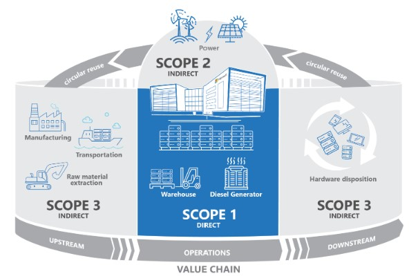
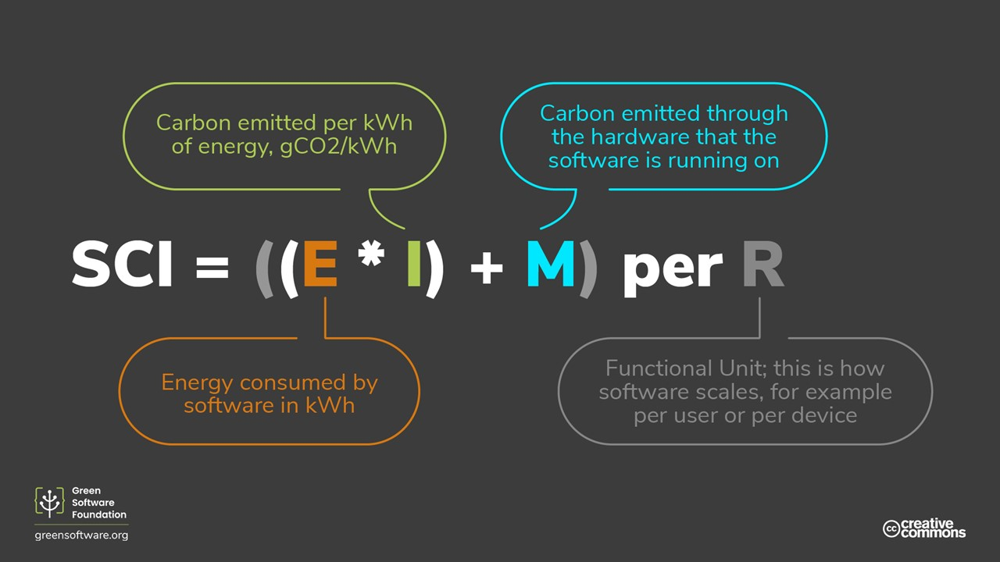

The [Greenhouse Gas (GHG) protocol](https://learn.greensoftware.foundation/measurement/#the-ghg-protocol) is the most commonly used method for organizations to measure their total carbon emissions. While software emissions can be calculated using this approach, it can be difficult. A better-suited calculation is the [Software Carbon Intensity (SCI)](https://learn.greensoftware.foundation/measurement/#software-carbon-intensity-specification) calculation.

## Greenhouse Gas Protocol

The GHG protocol enables organizations to calculate their total emissions. The emissions are attributed to a particular category corresponding to how they were produced. These categories are called scopes.

## Scope 1

These are direct emissions associated with your company-owned or controlled activities. For example, emissions from the combustion of fossil fuels in facilities and vehicles.

## Scope 2

Indirect emissions from the production of electricity or heat that you use. For example, from the energy sources that heat and light your home.

## Scope 3

Indirect emissions that come from other activities. A typical example for a business is emission from activities within the supply chain, production of purchased materials, transportation of goods and services, and use of sold products.

## Software Carbon Intensity Calculation

SCI is a method of measuring the carbon emissions associated with all types of software applications. It provides a consistent way to describe software emissions and how changes can make a difference.

It uses several components to calculate the emission score, all of which have already been previously introduced. The components are energy, location-based carbon intensity, and embodied carbon.  

Energy is the power consumed by the hardware and is measured in kilowatt-hours. More hardware suppliers are making this information available, and it can be consumed as datasets or via an API.

Carbon intensity is the amount of carbon equivalent for the particular time and location the software is running and is measured in grams of carbon equivalent per kilowatt-hour.

The calculation multiplies the energy consumed by the carbon intensity. The amount of carbon emitted through the hardware is then added to the sum. This gives a score that can be applied to each functional unit. For example, if the software is an API, the functional unit might be a single call to that API. This makes the score an intensity rather than a total.
