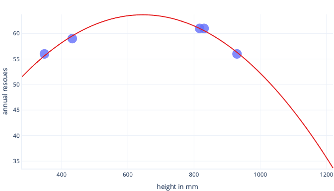
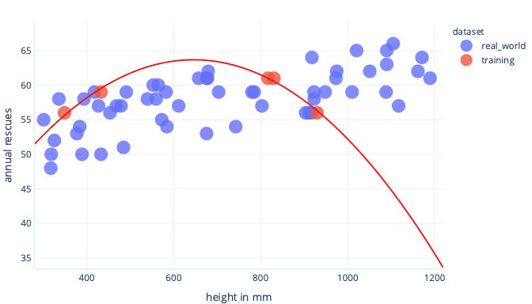

The data we use to train a model is often called a _training dataset_. We’ve already seen this in action. Frustratingly, when we use the model in the real world, after training we don’t know for certain how well our model will work. This uncertainty is because it’s possible that our training dataset is different to data in the real world.

## What is overfitting?

A model is _overfit_ if it works better on the training data than it does on other data. The name refers to the fact that the model has been fit so well that it's memorized details of the training set rather than finding broad rules that will apply to other data. Overfitting is common, but not desirable. At the end of the day, we only care how well our model works on real-world data.

## How can we avoid overfitting?

We can avoid overfitting several ways. The simplest way is to have a simpler model, or to use a dataset that's a better representation of what is seen in the real world. To understand these methods, consider a scenario where real-world data look like so:

Let’s say we collect information about only five dogs, though, and use that as our training dataset to fit a complex line. If we can do so, we can fit it very well:

When this is used in the real world, though, we'll find it makes predictions that turn out to be wrong:

If we have a more representative dataset and a simpler model, the line we fit turns out to make better (although not perfect) predictions:

A complimentary way we can avoid overfitting is to stop training after the model has learned general rules, but before the model is overfit. This requires detecting when we're beginning to overfit our model, though. We can do this using a _test dataset_.

## What is a test dataset?

A test dataset, also called a validation dataset, is a set of data similar to the training dataset. In fact, test datasets are usually created by taking a large dataset and splitting it. One portion is called the training dataset, and the other is called the test dataset.

The job of the training dataset is to train the model; we’ve seen training already. The job of the test dataset is to check how well the model works; it doesn't contribute to training directly.

### OK, but what’s the point?

The point of a test dataset is twofold.

First, if test performance stops improving during training, we can stop; there's no point in continuing. If we do continue, we can end up encouraging the model to learn details about the training dataset that aren't in the test dataset, which is overfitting.

Secondly, we can use a test dataset after training. This gives us an indication of how well the final model will work when it sees "real-world" data it hasn't seen before.

### What does that mean for cost functions?

When we use both training and test datasets, we end up calculating two cost functions.

The first cost function is using the training dataset, just like we've seen before. This cost function is fed to the optimizer and used to train the model.

The second cost function is calculated using the test dataset. We use this to check how well the model might work in the real world. The result of the cost function isn't used to train the model. To calculate this, we pause training, look at how well the model is performing on a test dataset, and then resume training.
