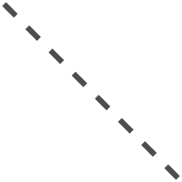

Represented by dotted lines or squares, trust boundaries are used to describe data-flow as it crosses different trust zone levels. Examples include:

- Firewalls
- Connections to third-party services
- Parts of your system only available to administrators

Areas with changing trust zones are the most targeted by attackers and should be carefully designed. Microsoft has predefined trust zone requirements for engineers to use internally, which takes the guesswork out of the design. If you work at Microsoft, contact your security team to learn more.

Important things to remember about trust boundaries:

- Include trust boundaries to handle data-flow as it crosses different trust zones
- Trust boundary lines are used to represent data flow as it crosses large environments, like the internet
- Trust boundary boxes represent smaller environments, like sandbox environments and corporate networks
