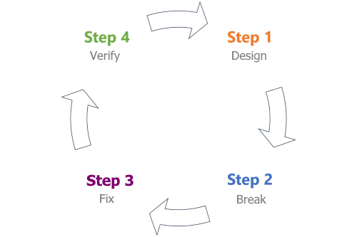

Threat modeling is an effective way to help secure your systems, applications, networks, and services. Microsoft defines it as an engineering technique that identifies potential threats and recommendations to help reduce risk and meet security objectives earlier in the development lifecycle.

You can use this technique to build graphical representations of systems, known as a data-flow diagrams. You can also rely on its framework to help fix security issues that could cost customer trust, data breaches, and resources.

Anyone with a working knowledge of the system and a basic understanding of security can work with threat modeling. This technique can be applied across any:

- Software delivery approaches, like Agile or Waterfall
- Deployment cadences, like hourly, monthly, or yearly

In this module, you'll explore the four high-level steps of threat modeling.

> [!NOTE]
> This training path will refer to systems, applications, and services as "systems."

## Learning objectives

In this module, you'll learn:

- The importance of capturing requirements and assumptions to help create a data-flow diagram
- The framework that helps you find security issues in a system
- The security control categories that help you reduce or eliminate potential threats
- The importance of verifying assumptions, requirements, and fixes before deployment

## Prerequisites

- None
