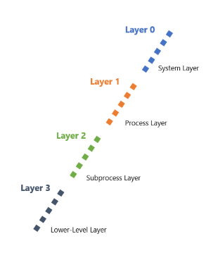

Data-flow diagram depth layers can help you decide how much context to include for a successful threat modeling exercise.

There are many factors that can help you decide how much depth to go in.

Every system should have a high-level overview of how they work, and most should have additional data-flow diagrams that focus on parts of the system that need a closer look. Examples include:

- A process parsing highly sensitive data
- Third-party authentication systems

At a high level, there are four depth layers used in threat modeling:

|Layer|Description|
|-----|-----------|
|0|Required for all systems, and contains major system parts|
|1|Required for most systems, and contains additional diagrams for each system part|
|2|Required for highly sensitive systems, and contains additional diagrams for system subparts|
|2|Required for critical or kernel level systems, and contains additional diagrams for every process]

Let's review each Depth Layer in the next few units.