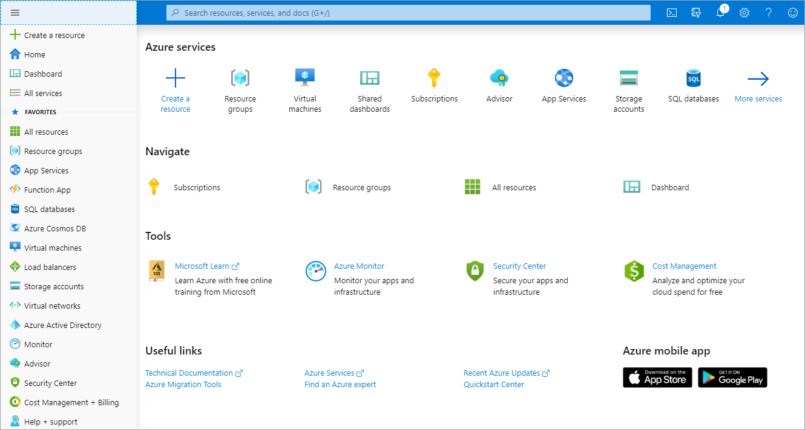
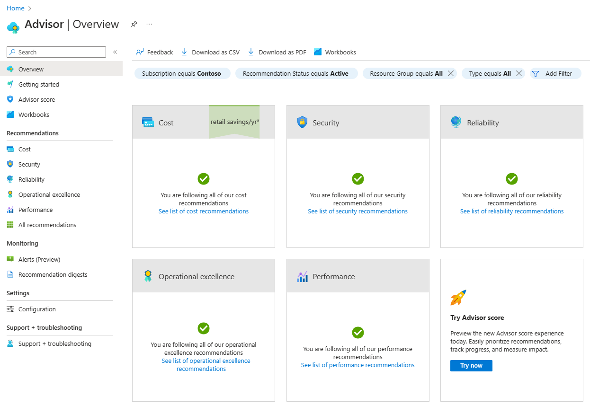

With an Azure account, you can sign into the **Azure portal**. The portal is a web-based administration site that lets you interact with all of your subscriptions and resources you have created. Almost everything you do with Azure can be done through this web interface.

## Azure portal layout

The Azure portal is the primary graphical user interface (GUI) for controlling Microsoft Azure. You can carry out the majority of management actions in the portal, and it is typically the best interface for carrying out single tasks, or when you want to look at the configuration options in detail.

:::row:::
    :::column:::
    
    :::column-end:::
    :::column span="3":::
    **Resource panel**

    In the left-hand sidebar of the portal is the resource panel, which lists the main resource types. Note that Azure has more resource types than just those shown. The resources listed are part of your *favorites*.

    You can customize this with the specific resource types you tend to create or administer most often.
    :::column-end:::
:::row-end:::

The remainder of the portal view is for the specific elements you are working with. The default (main) page is **Home**, but you can change your default view to the customizable **Dashboard** from **Settings**. We'll cover settings later in this unit.

## What is the Azure Marketplace?

The *Azure Marketplace* is often where you start when creating new resources in Azure. The Marketplace allows customers to find, try, purchase, and provision applications and services from hundreds of leading service providers, all certified to run on Azure.

The solution catalog spans several industry categories, including but not limited to open-source container platforms, virtual machine images, databases, application build and deployment software, developer tools, threat detection, and blockchain. Using Azure Marketplace, you can provision end-to-end solutions quickly and reliably, hosted in your own Azure environment. At the time of writing, this listing included over 8,000 listings.

While Azure Marketplace is designed for IT professionals and cloud developers interested in commercial and IT software, Microsoft Partners also use it as a launch point for all joint Go-To-Market activities.

## Configuring settings in the Azure portal

The Azure portal displays several configuration options, mostly in the status bar at the top-right of the screen.

If you are viewing the Azure portal on a screen with reduced horizontal space, the following icons may be made available through an ellipsis (**...**) menu.

### Cloud Shell

If you select the **Cloud Shell** icon (>_), you create a new Azure Cloud Shell session. Recall that Azure Cloud Shell is an interactive, browser-accessible shell for managing Azure resources. It provides the flexibility of choosing the shell experience that best suits the way you work. Linux users can opt for a Bash experience, while Windows users can opt for PowerShell. This browser-based terminal lets you control and administer all of your Azure resources in the current subscription through a command-line interface built right into the portal.

### Directories and subscriptions

Select the **Book and Filter** icon to show the **Directories + subscriptions** pane.

Azure allows you to have more than one subscription associated with one directory. On the **Directory + subscription** pane, you can change between subscriptions. Here, you can change your subscription or change to another directory.

### Notifications

Selecting the bell icon displays the **Notifications** pane. This pane lists the last actions that have been carried out, along with their status.

### Settings

Select the **Gear** icon to change the Azure portal settings. In the tabs at the left, you'll find:

- Inactivity sign out delay
- Default view when you first sign in
- Flyout or docked option for the portal menu
- Color and contrast themes
- Language and regional format

### Help pane

Select the **question mark** icon to show the **Help** pane. Here you choose from several options, including:

- Help + Support
- Service help
- Support resources

#### Help and support options

**Help + support** opens the main help and support area for the Azure portal and includes documentation options for a variety of common questions. One of the hidden areas here is the **Create support request** button, which is on this page. This is how you can open a support ticket with the Azure team.

All Azure customers can access billing, quota, and subscription-management support. *The availability of support for other issues depends on the support plan you have*.

When you open a support ticket, you'll complete the form by using provided dropdown lists and text-entry fields.

Once you've filled out the form, select **Create** to submit your support request. The Azure support team will contact you after you submit your request.

You can then check the status and details of your support request, by going to **Help** > **Help +support** > **All support requests**.

### Feedback pane

The **Feedback** icon on the top-right side of the screen opens the **Send us feedback** pane. Here, you can send feedback to Microsoft about Azure. You can decide as part of your feedback whether Microsoft can respond to your feedback by email.

### Profile settings

If you select on your name in the top right-hand corner, a menu opens with a few options:

- Sign in with another account, or sign out entirely
- View your account profile, where you can change your password

Select the "..." button on the right-hand side for options to:

- Check your permissions
- View your bill
- Submit an idea
- Update your contact information

If you select "..." and then **View my bill**, Azure takes you to the **Cost Management + Billing - Invoices** page, which helps you analyze where Azure is generating costs.

Azure is a large product, and the Azure portal user interface (UI) reflects this scope. The sliding pane approach allows you to navigate back and forth through the various administrative tasks with ease. Let's experiment a bit with this UI so you get some practice.

### Azure Advisor

Finally, the Azure Advisor is a free service built into Azure that provides recommendations on high availability, security, performance, operational excellence, and cost. Advisor analyzes your deployed services and looks for ways to improve your environment across those areas. You can view recommendations in the portal or download them in PDF or CSV format.

With Azure Advisor, you can:

- Get proactive, actionable, and personalized best practices recommendations.
- Improve the performance, security, and high availability of your resources as you identify opportunities to reduce your overall Azure costs.
- Get recommendations with proposed actions inline.

You can access Azure Advisor by selecting **Advisor** from the navigation menu, or search for it in the **All Services** menu.

Let's try some of these features out!
