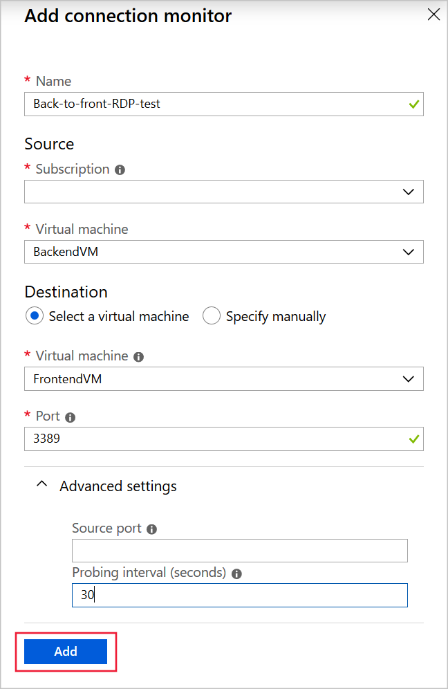
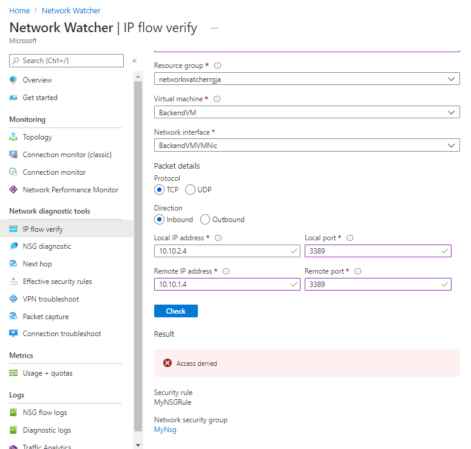

Azure Network Watcher helps you diagnose configuration errors that prevent virtual machines (VMs) from communicating.

Suppose you have two VMs that can't communicate. You want to diagnose the problem and resolve it as fast as possible. You want to use Network Watcher to do that.

Here, you'll troubleshoot connectivity between two VMs in different subnets.

[!include[](../../../includes/azure-exercise-subscription-prerequisite.md)]

## Configure a virtual network and VMs

Let's start by creating the problematic infrastructure, which includes a configuration error:

1. Open the [Azure Cloud Shell](https://shell.azure.com/?azure-portal=true) in your browser, and log in to the directory with access to the subscription you want to create resources in.

1. Run the following command in the Cloud Shell to create a variable to store your resource group name, and a resource group for your resources. Replace `<resource group name>` with a name for your resource group, and `<location>` with the Azure region you'd like to deploy your resources in.

    ```azurecli
    rg=<resource group name>

    az group create --name $rg --location <location>
    ```

1. In Azure Cloud Shell, run this command to create the virtual network **MyVNet1** and the subnet **FrontendSubnet**.

    ```azurecli
    az network vnet create \
        --resource-group $rg \
        --name MyVNet1 \
        --address-prefix 10.10.0.0/16 \
        --subnet-name FrontendSubnet \
        --subnet-prefix 10.10.1.0/24 \
        --location EastUS
    ```

1. Run this command to deploy a VM in **FrontendSubnet**. Replace `<password>` with a complex password of your choice.

    ```azurecli
    az vm create \
        --resource-group $rg \
        --no-wait \
        --name FrontendVM \
        --location EastUS \
        --vnet-name MyVNet1 \
        --subnet FrontendSubnet \
        --image Win2012R2Datacenter \
        --admin-username azureuser \
        --admin-password <password>
    ```

1. Run this command to create the subnet called **BackendSubnet**.

    ```azurecli
    az network vnet subnet create \
        --address-prefixes 10.10.2.0/24 \
        --name BackendSubnet \
        --resource-group $rg \
        --vnet-name MyVNet1
    ```

1. Run this command to deploy a virtual machine in **BackendSubnet**. Replace `<password>` with a complex password of your choice.

    ```azurecli
    az vm create \
        --resource-group $rg \
        --no-wait \
        --name BackendVM \
        --location EastUS \
        --vnet-name MyVNet1 \
        --subnet BackendSubnet \
        --image Win2012R2Datacenter \
        --admin-username azureuser \
        --admin-password <password>
    ```

1. Run this command to create a network security group (NSG).

    ```azurecli
    az network nsg create \
        --name MyNsg \
        --resource-group $rg \
        --location EastUS
    ```

1. Run this command to create an NSG configuration mistake that prevents communication between the VMs.

    ```azurecli
    az network nsg rule create \
        --resource-group $rg \
        --name MyNSGRule \
        --nsg-name MyNsg \
        --priority 4096 \
        --source-address-prefixes '*' \
        --source-port-ranges 80 443 3389 \
        --destination-address-prefixes '*' \
        --destination-port-ranges 80 443 3389 \
        --access Deny \
        --protocol TCP \
        --description "Deny from specific IP address ranges on 80, 443 and 3389."
    ```

1. Run this command to associate a network security group with a subnet.

    ```azurecli
    az network vnet subnet update \
        --resource-group $rg \
        --name BackendSubnet \
        --vnet-name MyVNet1 \
        --network-security-group MyNsg
    ```

## Enable Network Watcher for your region

Now let's use the Azure CLI to set up Network Watcher in the same region as the infrastructure.

To enable Network Watcher, run this command:

```azurecli
az network watcher configure \
    --resource-group $rg \
    --locations EastUS \
    --enabled
```

## Use Network Watcher to show the topology

Now you can use Network Watcher to troubleshoot connectivity between two VMs in different subnets. Your colleague has reported a connectivity issue over HTTP/HTTPS and the RDP protocol between the two VMs. First, investigate the network topology:

1. Sign in to the [Azure portal](https://portal.azure.com?azure-portal=true) by using the account that you used to activate the sandbox.

1. Go to **All Services** > **Networking** > **Network Watcher**, and then select **Topology**.

1. In the drop-down lists, select the subscription and resource group. Network Watcher displays your network topology:

    [](../media/3-network-topology-expanded-1.png#lightbox)

## Use Connection Monitor to run tests from the back end to the front end

The topology appears to be correct. Let's set up some tests in Connection Monitor to get more information. Start by creating two tests from the back-end VM to the front-end VM:

1. Under **Monitoring**, select **Connection Monitor**, and then select **+ Add**.

1. Configure Connection Monitor with these values, and then select **Add**.

    | Setting | Value |
    | --- | --- |
    | Name | Back-to-front-RDP-test |
    | Subscription | Select your subscription |
    | Virtual machine | BackendVM |
    | Destination virtual machine | FrontendVM |
    | Port | 3389 |
    | Probing interval (seconds) | 30 |
    | | |

    

1. Select **+ Add**. Configure a second test with these values, and then select **Add**.

    | Setting | Value |
    | --- | --- |
    | Name | Back-to-front-HTTP-test |
    | Subscription | Select your subscription |
    | Virtual machine | BackendVM |
    | Destination virtual machine | FrontendVM |
    | Port | 80 |
    | Probing interval (seconds) | 30 |
    | | |

1. In the list of tests, select **Back-to-front-RDP-test**, select the ellipsis (**...**), and then select **Start**.

1. Examine the results.

1. In the list of tests, select **Back-to-front-HTTP-test**, select **...**, and then select **Start**.

1. Examine the results.

The results should show that no traffic flows from the back-end VM to the front-end VM.

## Use Connection Monitor to run tests from the front end to the back end

Run the same tests in the opposite direction.

1. Under **Monitoring**, select **Connection monitor**, and then select **+ Add**.

1. Configure Connection Monitor with these values, and then select **Add**.

    | Setting | Value |
    | --- | --- |
    | Name | front-to-back-RDP-test |
    | Subscription | Select your subscription |
    | Virtual machine | FrontendVM |
    | Destination virtual machine | BackendVM |
    | Port | 3389 |
    | Probing interval (seconds) | 30 |
    | | |

1. Select **+ Add**. Configure a second test with these values, and then select **Add**.

    | Setting | Value |
    | --- | --- |
    | Name | Front-to-back-HTTP-test |
    | Subscription | Select your subscription |
    | Virtual machine | FrontendVM |
    | Destination virtual machine | BackendVM |
    | Port | 80 |
    | Probing interval (seconds) | 30 |
    | | |

1. In the list of tests, select **Front-to-back-RDP-test**, select **...**, and then select **Start**.

1. Examine the results.

1. In the list of tests, select **Front-to-back-HTTP-test**, select **...**, and then select **Start**.

1. Examine the results.

The results should show that traffic flows without problems from the front-end VM to the back-end VM.

## Use IP flow verify to test the connection

Let's use the IP flow verify tool to get more information.

1. Under **Network diagnostic tools**, select **IP flow verify**.

1. Configure the test with these values, and then select **Check**.

    | Setting | Value |
    | --- | --- |
    | Subscription | Select your subscription |
    | Resource group | Select your resource group |
    | Virtual machine | BackendVM |
    | Network interface | BackendVMVMNic |
    | Protocol | TCP |
    | Direction | Outbound |
    | Local IP address | 10.10.2.4 |
    | Local port | 3389 |
    | Remote port | 10.10.1.4 |
    | Remote port | 3389 |
    | | |

    

1. Examine the results. They show that access is denied because of NSG and security rules.

In this exercise, you have successfully used Network Watcher tools to discover the connectivity issue between the two subnets. Communication is allowed one way but blocked the other way because of NSG rules.
