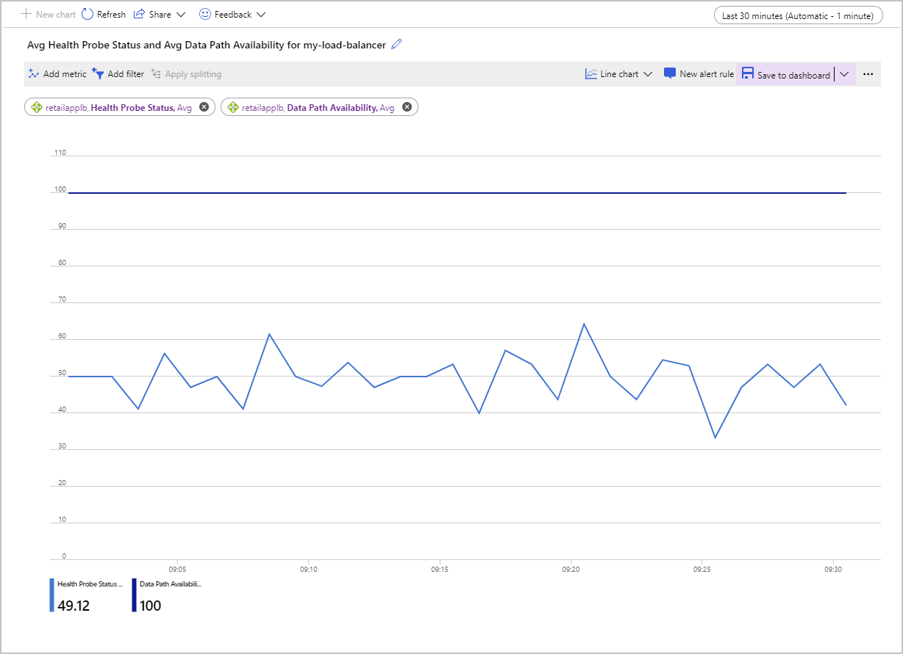
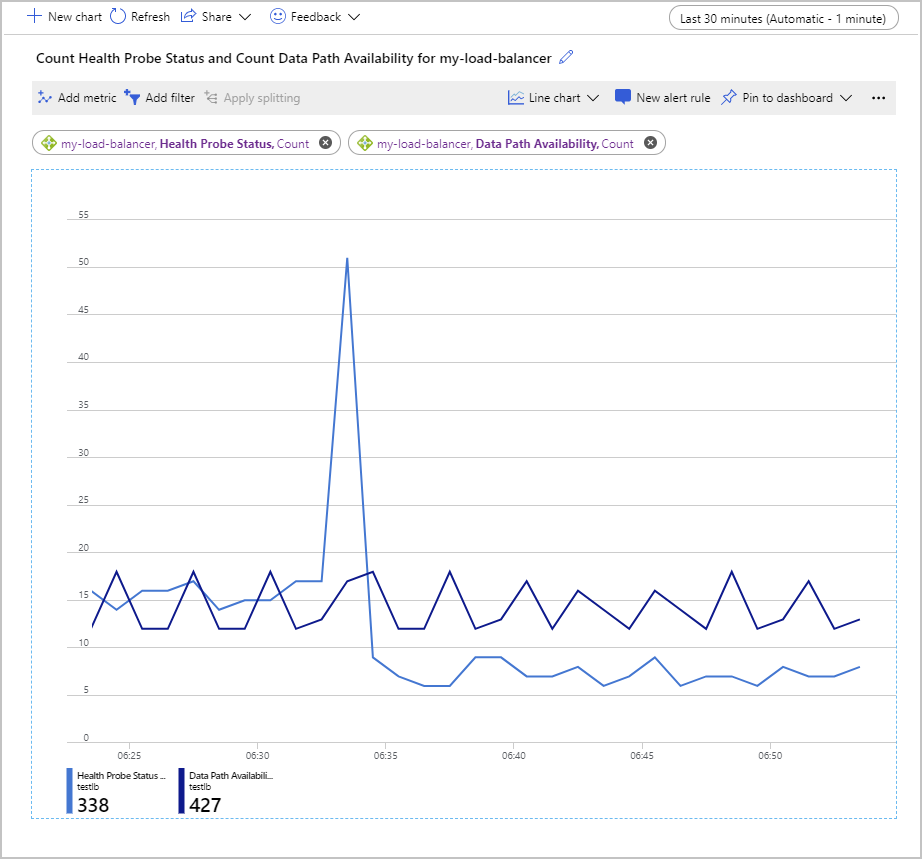
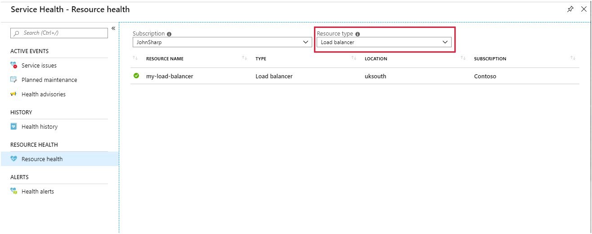
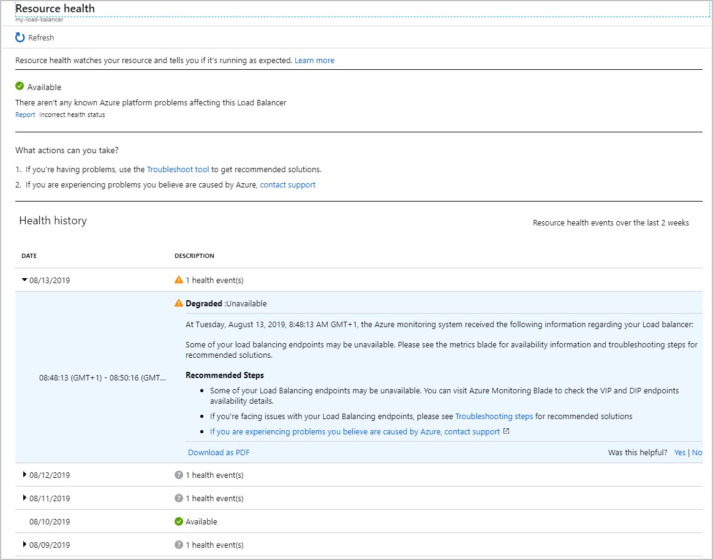
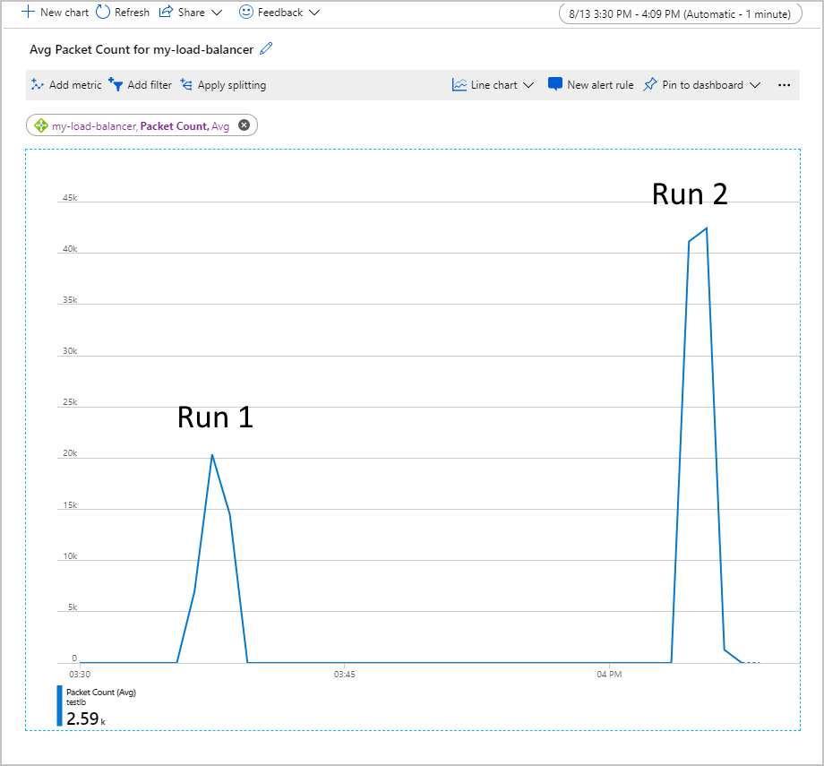

Monitoring the performance of Azure Load Balancer might give an early warning for any possible failures. Azure Monitor provides many important metrics you use to examine trends in the performance of Load Balancer. You can also trigger alerts if one or more virtual machines (VMs) fail health probe requests.

In the example scenario, you monitor the performance of the load-balanced system to ensure the performance meets requirements. If the performance trails off and connections to VMs start to fail, you'll troubleshoot the system to determine the cause and fix the problem. By the end of this unit, you'll be able to:

- Describe the metrics available for measuring the throughput and performance of a load-balanced system.
- Use the resource health page in the Azure portal to monitor the health of your system.
- Explain how to resolve common problems in a load-balanced system.

## Use Azure Monitor to troubleshoot Load Balancer

With Azure Monitor, you can capture and examine diagnostic logs and performance data for Load Balancer.

### Monitor connectivity

You can visualize metrics for Load Balancer by using the **Metrics** page in the Azure portal. From a connectivity troubleshooting perspective, the most important metrics are **Data Path Availability** and **Health Probe Status**.

> [!div class="mx-imgBorder"]
> 

Load Balancer continually tests the path's availability to the front-end IP address, through the load-balancing rules and the back-end pool, to the applications running on your VMs. This information is recorded as the **Data Path Availability** metric. Applying the **Avg** metric shows the average availability for a given time interval. This aggregation is a value between 0 (no availability) and 100, where there's at least one successful path available from the front-end IP address to a VM in the back-end pool.

The **Health Probe Status** metric is similar, but it only applies to the health probe for the VMs rather than the complete path through Load Balancer. Again, the **Avg** aggregation for this metric yields a value between 0 (all VMs are unhealthy and failing to respond) and 100, where all VMs are responding to the health probe.

The image shows the chart for average Data Path Availability and average Health Probe Status for a load balancer with two VMs in the back-end pool. One of the machines isn't responding to the health probe. The average Health Probe Status is hovering around the 50 percent mark:

> [!div class="mx-imgBorder"]
> 

Another way to examine these metrics is to use the **Count** aggregation. This approach can yield additional insights into potential problems with your configuration. The following example shows the graphs for the count of the Health Probe Status and Data Path Availability metrics. The graph shows how many successful probes were done over time.

> [!div class="mx-imgBorder"]
> 

An interesting point in this chart is that the number of successful Data Path Availability probes has remained within a consistent range. However, the number of successful Health Probe Status checks has spiked momentarily and then dropped to about half the value before the spike occurred.

In the setup used to generate this graph, the back-end pool contained just two VMs. One of these machines was stopped, to simulate a failure. The Data Path Availability metric shows that it's still possible for a client application to connect to the application running on the remaining working VM. But the Health Probe Status indicates that the overall *health* of the back-end pool is only half of what it was previously.

### View service health

The **Resource health** page for Load Balancer reports on the general state of your system. You access this page in the portal from Azure Monitor. Select **Service Health**, select **Resource Health**, and then select **Load Balancer** as the resource type.

> [!div class="mx-imgBorder"]
> 

Select your load balancer. You'll see a report that details the health history of your service. You can expand any item in the report to view the details. The following image shows the summary generated when one of the VMs in the back-end pool was taken offline.

> [!div class="mx-imgBorder"]
> 

### Monitor the workload per VM

The other metrics available for Load Balancer enable you to track the number of bytes and network packets that pass through Load Balancer per *front end*. A front end is defined as a combination of the IP address of Load Balancer, the protocol used to accept incoming requests, and the port number used by the load-balancing rule to connect to VMs. These metrics can give a measure of the throughput of your system per active VM.

The following graph shows the average packet count flowing through Load Balancer while running a test workload of 500 concurrent users for two minutes. The workload was run twice. The first time, the back-end pool contained two VM instances. For the second run, one of the VMs was shut down (simulating a failure).

> [!div class="mx-imgBorder"]
> 

In this chart, the average packet count per front end doubled when one VM was shut down. This volume of work could overload the remaining VM, which might lead to extended response times and possible timeouts.

## Investigate and remediate common problems with Load Balancer

This section covers some common failure scenarios you might come across with Load Balancer. Each scenario summarizes the symptoms of a failure and how you might resolve the problem.

### VMs behind Load Balancer not responding to traffic on the probe port

This problem could be the result of the following issues:

- The VMs in the back-end pool aren't listening on the correct probe port.
  
    Verify the health probe is set correctly in Load Balancer. Ensure the application code running on each VM is responding appropriately to probe requests. They should return an HTTP 200 (OK) response message.

- The NSG for the virtual network subnet that hosts the VMs is blocking the probe port.

    Check the NSG configuration for the virtual network subnet that contains the VMs. Ensure that the NSG allows traffic from Load Balancer to pass through the health probe port.

- You're attempting to access Load Balancer from the same VM and virtual network card. This problem isn't related to probing but is an unsupported data path scenario.
- You're attempting to access the Load Balancer front end from a VM in the back-end pool.

    Both of these items are application design issues. Avoid sending requests to the same instance of Load Balancer from a VM in the back-end pool.

### A VM in the back-end pool is unhealthy

In this case, most VMs are responding normally, but one or two others aren't. Because some VMs accept traffic, the health probe is likely configured correctly. The NSG for the subnet isn't blocking the port used by the health probe. The issue probably lies with the unhealthy VMs. This problem could be because the VMs are inaccessible or down, or there's an application issue on these machines.

Use the following steps to determine the cause of the problem with an unhealthy VM:

- Sign in to an unhealthy VM to verify that it's up. Check that the VM can respond to basic checks such as *ping*, *rdp*, or *ssh* requests from another VM in the back-end pool.
- If the VM is up and accessible, verify that the application is running.
- Run the `netstat -an` command and verify that the ports used by the health probe and application are listed as *LISTENING*.

### Misconfigurations in Load Balancer

Load Balancer requires you to correctly configure the routing rules that direct incoming traffic from the front end to the back-end pool. If a routing rule is missing or not configured correctly, traffic that arrives at the front end will be dropped, and the application is reported to clients as inaccessible.

Validate the route through Load Balancer from the front end to the back-end pool. You can use tools such as PsPing on Windows, and *TCPing* and *netsh*, which are available for Windows and Linux.

#### Use PsPing

The **PsPing** command tests *ping* connectivity through an endpoint. This command also measures the latency and bandwidth availability to a service. To verify that a route is available from your client to a VM through Load Balancer, use the following command. Replace \<*ip address*\> and \<*port*\> with the IP address and front-end port of the Load Balancer instance.

```CMD
psping -n 100 -i 0 -q -h <ip address>:<port>
```
|Flag| Description|
|-|-|
|*-n* |Specifies the number of pings to do.
|*-i* |Indicates the interval in seconds between iterations.|
|*-q* |Suppresses output during the pings. Only a summary is shown at the end.|
|*-h*| Prints a histogram that shows the latency of the requests.|

Typical output looks like this:

```Text
TCP connect to nn.nn.nn.nn:nn:
101 iterations (warmup 1) ping test: 100%

TCP connect statistics for nn.nn.nn.nn:nn:
  Sent = 100, Received = 100, Lost = 0 (0% loss),
  Minimum = 7.48ms, Maximum = 9.08ms, Average = 8.30ms

Latency Count
7.48    3
7.56    2
7.65    2
7.73    2
7.82    7
7.90    4
7.98    4
8.07    6
8.15    9
8.24    9
8.32    11
8.40    7
8.49    11
8.57    12
8.66    3
8.74    2
8.82    2
8.91    1
8.99    2
9.08    1
```

#### Use tcping

The *tcping* utility is similar to *ping* except that it operates over a TCP connection instead of ICMP, which Load Balancer doesn't route. Use *tcping* as follows:

```CMD
tcping <ip address> <port>
```

Typical output looks like this:

```Text
Probing nn.nn.nn.nn:nn/tcp - Port is open - time=9.042ms
Probing nn.nn.nn.nn:nn/tcp - Port is open - time=9.810ms
Probing nn.nn.nn.nn:nn/tcp - Port is open - time=9.266ms
Probing nn.nn.nn.nn:nn/tcp - Port is open - time=9.181ms

Ping statistics for nn.nn.nn.nn:nn
     4 probes sent.
     4 successful, 0 failed.  (0.00% fail)
Approximate trip times in milli-seconds:
     Minimum = 9.042ms, Maximum = 9.810ms, Average = 9.325ms
```

#### Use netsh

The *netsh* utility is a general-purpose network configuration tool. Use the *trace* command in *netsh* to capture network traffic. Then analyze it by using a tool such as Microsoft Message Analyzer or Wireshark. Use *netsh trace* to examine the network packets sent and received by *psping* when you test connectivity through Load Balancer as follows:

1. Start a network trace from a command prompt running as Administrator. The following example traces internet client traffic (HTTP requests) to and from the specified IP address. Replace \<*ip address*\> with the address of the Load Balancer instance. The trace data is written to a file named *trace.etl*:

    ```CMD
    netsh trace start ipv4.address=<ip address> capture=yes scenario=internetclient tracefile=trace.etl
    ```

1. Run *psping* to test connectivity through Load Balancer.

    ```CMD
    psping -n 100 -i 0 -q <ip address>:<port>
    ```

1. Stop tracing.

    ```CMD
    netsh trace stop
    ```

    This command takes a few minutes to complete, because it correlates and merges information while it creates the trace output file.

1. Start *Microsoft Message Analyzer*, and open the trace file.

1. Add the following filter to the trace. Replace \<*nn*\> with the Load Balancer front-end port number.

    ```Text
    TCP.Port==80 or TCP.Port==<nn>
    ```

1. Add the HTTP request source and destination as fields to the trace output. The result should look similar to the following image. In this example, 192.168.1.3 is the address of the PC running the *psping* command, and 51.105.19.142 is the front-end IP address of Load Balancer:

    > [!div class="mx-imgBorder"]
    > 

1. Examine the trace messages:

    - If there are no incoming packets to Load Balancer, it's likely there's a network security issue or a user-defined routing issue.
    - If no outgoing packets are returned to the client, there's probably an application configuration issue or a user-defined routing issue.

### VM firewall or NSG blocking the port

If the network and Load Balancer are configured correctly, the VM is up, and the application is running, connectivity problems could be caused by the firewall or NSG configuration for the VMs.

If there's a firewall on the VM, it could be blocking requests on the ports used by the health probe and application. Validate the firewall configuration on the host to ensure it allows traffic on the ports used by the health probe and the application.

Verify that any NSG for the VM's NIC allows for ingress and egress on the necessary ports. Check for a *Deny all* rule in the NSG on the VM's NIC that has higher priority than the default rule.

> [!IMPORTANT]
> You can associate an NSG with a subnet and the individual NICs of VMs in the subnet. You might have configured the NSG for a subnet to allow traffic to pass through a port. However, if the NSG for a VM closes that same port, requests won't get through to that VM.

## Limitations of Load Balancer

Azure Load Balancer is limited to only load balancing and handling port-forwarding for the TCP and UDP protocols. You can't use Load Balancer to manage requests submitted by using other network protocols such as ICMP.

Load Balancer operates at layer 4 in the ISO network stack and doesn't examine or otherwise manipulate the contents of network packets. You can't use it to implement content-based routing.

All client requests are terminated by a VM in the back-end pool. Load Balancer is invisible to clients. If no VMs are available, a client request will fail. Client applications can't communicate with, or otherwise interrogate the status of, Load Balancer or any of its components.

If you need to implement load balancing based on the contents of messages, consider using Azure Application Gateway. Or you could configure a proxy web server to handle incoming client requests and direct them toward specific VMs.
