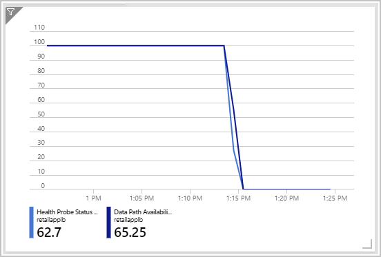
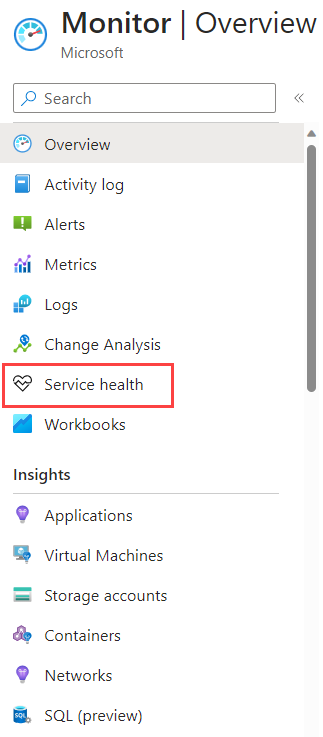
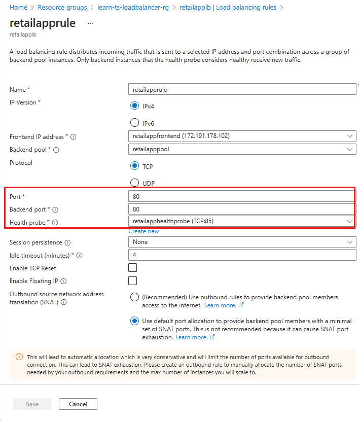
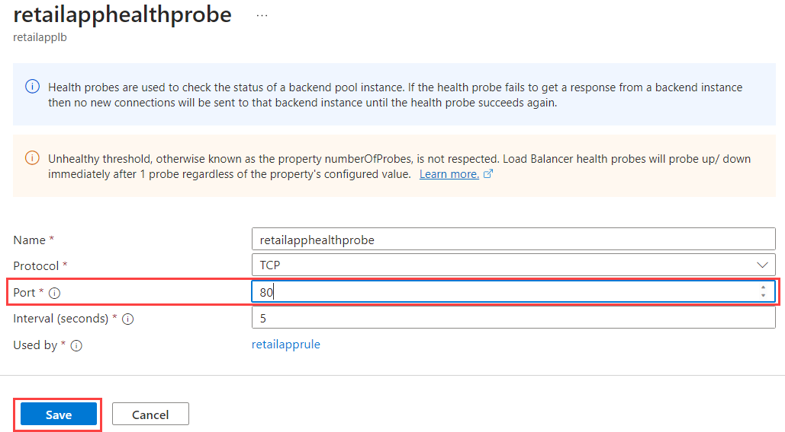
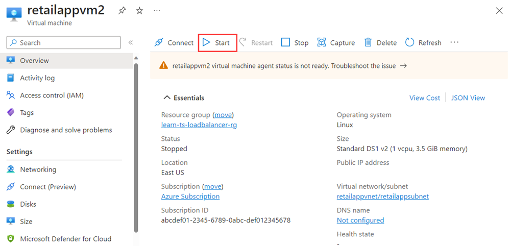
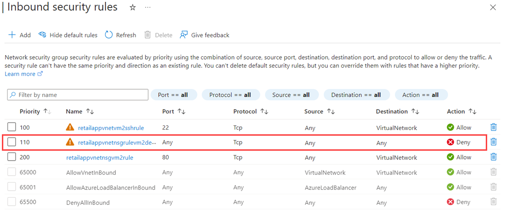
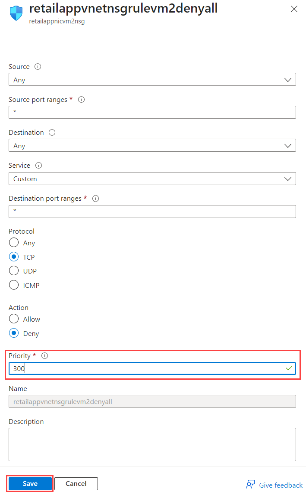

In our scenario, a change has been made to the network configuration. You've started to receive alerts informing you that virtual machines in the back-end pool aren't responding to health probes. Now you need to diagnose the cause of these failures and fix them.

In this exercise, you'll use a script to re-configure the environment and cause health probe failures. You'll use the skills learned in this module to return the load-balanced HTTP service back to full operation.

## Reconfigure load balancer and retest

1. In the Cloud Shell, go to the **src/scripts** folder.

    ```bash
    cd ~/load-balancer/src/scripts
    ```

1. Run the following command to reconfigure the load balancer, network, and virtual machines. This script introduces some problems that you'll later diagnose and correct.

    ```bash
    bash reconfigure.sh
    ```

1. Run the following commands to move to the **src/stresstest** folder:

    ```bash
    cd ~/load-balancer/src/stresstest
    ```
1. Run the stress test again where you replace <*ip address*> with the IP address of the load balancer. If you can't remember this address, run the **src/scripts/findip.sh** script again.

    ```bash
    dotnet run <ip address>
    ```

    This time, the app won't generate any output, and might eventually time out with the message *Error sending request to Load Balancer: The operation was canceled*. Press Enter to stop the application.

1. In the Azure portal, select **Dashboard**.
1. Review the dashboard that shows the health probe status and data path availability. You may need to change the time range to the past 30 minutes. It should look like the following chart, with both metrics dropped to zero:

    > [!div class="mx-imgBorder"]
    > 

    This chart shows that the virtual machines aren't responding to health probe requests from the load balancer. So they've been marked as unhealthy. There's no data path available between a client and the application running on these virtual machines.

## Diagnose and fix issues

The first step is to check that the virtual machines are running. Let's resolve issues one virtual machine at a time. So let's look at *appretailvm1* first. You'll examine *appretailvm2* later.

### Test the appretailvm1 virtual machine

You can't ping the *appretailvm1* or *appretailvm2* virtual machines directly because they have private addresses that are only available to other virtual machines on the same subnet. First you connect to the jump box, which has a public IP address and is in the same subnet. Then you can ping the virtual machines from there.

1. Return to the Cloud Shell.

1. Run the following commands to get the IP address of the jump box virtual machine:

    ```bash
    bash ~/load-balancer/src/scripts/jumpboxip.sh
    ```

1. Run the following command to get password that you created when you ran the initial setup script. Copy this password for the next step.

    ```bash
    echo $PASSWORD
    ```
 
1. Sign in to the jump box. Replace "azureuser" if you used a different user name. 

    ```bash
    ssh azureuser@<jumpbox ip address>
    ```

1. On the jump box, run the following command to test whether the **retailappvm1** virtual machine is running:

    ```bash
    ping retailappvm1 -c 10
    ```

    The retailappvm1 virtual machine should respond, indicating that it's running. The next step is to establish whether the web app is running on this virtual machine.

1. Run the following command to send an HTTP GET request to the retailappvm1 virtual machine:

    ```bash
    wget retailappvm1
    ```

    Again, this command should be successful. You can examine the page returned with the following command:

    ```bash
    cat index.html
    ```

    The file will contain the text **retailappvm1**; this is the response from the web app running on that virtual machine.

1. Delete the *index.html* file:

    ```bash
    rm index.html
    ```

### Check health probes and routing rules

The *retailappvm1* virtual machine is up, and the application is running on that virtual machine. There must be a problem between the load balancer and the virtual machines in the back-end pool.

1. In the Azure portal, search for **Monitor**.
1. On the **Monitor - Overview** page, select **Service Health**.

    > [!div class="mx-imgBorder"]
    > 

1. Select **Resource Health**. 
1. In the **Resource type** box, select **Load balancer**, and in the list of resources, select **retailapplb**.

    > [!div class="mx-imgBorder"]
    > 

1. Wait a few minutes for the load balancer health to be evaluated.
1. Under **Health history**, expand the topmost event, and review the recommended steps. These steps suggest checking the VIP (routing rule) and DIP (health probe) endpoints in the load balancer.

    > [!div class="mx-imgBorder"]
    > 

1. Go to the resource group **learn-ts-loadbalancer-rg**, and select **retailapplb**.

1. Select **Load balancing rules** > **retailapprule**. This rule receives Tcp traffic on port 80 of the front-end IP address, and sends it to port 80 on the selected virtual machine in the back-end pool. This configuration appears to be correct, although the port used by the health probe looks suspicious. It's currently set to port 85.

    > [!div class="mx-imgBorder"]
    > 

1. Close the **retailapprule** page.

1. Select **Health probes** > **retailapphealthprobe**. 
1. Change the **Port** from 85 back to 80, and then select **Save**.

    > [!div class="mx-imgBorder"]
    > 

1. Wait for a minute.
1. Select **Dashboard** in the menu on the left of the Azure portal. 

1. On the dashboard, select the chart showing the Health Probe Status and Data Path Availability metrics. The **Data Path Availability** metric should rise to 100, but the **Health Probe Status** metric will hover around 50. There's now a path available from the load balancer to at least one virtual machine, but only 50 percent of the virtual machines are showing as healthy.

    > [!div class="mx-imgBorder"]
    > 

    Select the chart to go to the metrics page for Load Balancer. This page enables you to refresh the chart, and zoom in on a specific time period.

1. In the Cloud Shell, run the following command to leave the jump box.

    ```bash
    exit
    ```

1. Run the stress test application again using the load balancer's IP address:

    ```bash
    cd ~/load-balancer/src/stresstest
    dotnet run <ip address>
    ```

    As before, the test still fails. There's now a path from the load balancer to at least one virtual machine, but this path doesn't work from a client running outside of the virtual network. Press Enter to stop the stress test app.

### Check NSG rules for the subnet

The problem might be caused by a network security rule blocking external traffic.

1. In the Azure portal, go to the resource group **learn-ts-loadbalancer-rg**.

1. Select the **retailappnsg** network security group. This security group determines which traffic is allowed through the virtual network.

1. Select **Inbound security rules**. Although there's a rule that allows incoming traffic from the load balancer running in the virtual network, there's no rule that permits traffic originating from outside the virtual network through port 80.

1. Select **+ Add**.
1. Enter the following settings, and then select **Add**:

    | Property  | Value  |
    |---|---|
    | Source | Any |
    | Source port ranges | \*  |
    | Destination | Any |
    | Destination port ranges | 80 |
    | Protocol | Tcp |
    | Action | Allow |
    | Priority | 100 |
    | Name | Port_80 |
    | Description | HTTP port |

1. In the Cloud Shell, run the stress test application again using the load balancer's IP address:

    ```bash
    cd ~/load-balancer/src/stresstest
    dotnet run <ip address>
    ```

    The application now runs, but you only get a response from the *retailappvm1* virtual machine. Allow the application to run for two or three minutes, and then press Enter to stop it.

1. In the Azure portal, go to the dashboard.
1. Select the chart for the average Packet Count metric. Note the peak value for the latest run of the stress test application. This value should be at least double that of the value recorded earlier when both virtual machines were available. Although you now have a functioning system, you're in danger of overloading the working virtual machine.

### Test the *appretailvm2** virtual machine

It seems that the *appretailvm2* virtual machine might not be handling requests properly. You need to check whether this virtual machine is up, and whether Load Balancer can connect to it.

1. In the Cloud Shell, sign in to the jump box again:

    ```bash
    ssh azureuser@<jump box ip address>
    ```

1. Try to ping the *appretailvm2* virtual machine:

    ```bash
    ping retailappvm2 -c 10
    ```

    The virtual machine fails to respond and the ping command reports 100 percent packet loss. Either the *retailappvm2* virtual machine isn't running, or there's a network problem.

1. In the Azure portal, go to the resource group **learn-ts-loadbalancer-rg**.

1. Select the **retailappvm2** virtual machine.
1. The **Overview** page shows that the virtual machine has stopped. Select **Start**, and wait for the machine to begin running.

    > [!div class="mx-imgBorder"]
    > 

1. Return to the Cloud Shell connected to the jump box, and repeat the ping command:

    ```bash
    ping retailappvm2 -c 10
    ```

    This time, the ping operations should succeed.

1. Test whether the application running on the *retailappvm2* virtual machine responds.

    ```bash
    wget retailappvm2
    ```

    This command times out. Either the application isn't running or there might be a network issue. Press Ctrl-C to stop the command.

1. On the jump box, sign in to the *retailappvm2* virtual machine. When prompted, enter the same password that you specified earlier.

    ```bash
    ssh azureuser@retailappvm2
    ```

1. Run the following command to test the application on this virtual machine:

    ```bash
    wget retailappvm2
    ```

    The command should be successful, and create the file *index.html* containing the response.

1. Examine this *index.html* file:

    ```bash
    cat index.html
    ```

    The file should contain the message *retailappvm2* showing that this virtual machine responded as expected.

1. Close the connection to the *retailappvm2* virtual machine:

    ```bash
    exit
    ```

1. Close the connection to the jump box:

    ```bash
    exit
    ```

    The *retailappvm2* virtual machine is up and the app is running, but you can't connect to the app from outside the virtual machine. This issue suggests a network problem.

1. In the Azure portal, go to the resource group **learn-ts-loadbalancer-rg**.

1. Select the **retailappnicvm2nsg** network security group.

1. Select **Inbound security rules**.

    The network security group has an inbound rule that blocks all outside traffic using the Tcp protocol. This rule has a priority number lower than the rule (which opens port 80) so it takes precedence.

    > [!div class="mx-imgBorder"]
    > 

1. Select the **retailappvnetnsgrulevm2denyall** rule, change the priority to 300, and then select **Save**.

    > [!div class="mx-imgBorder"]
    > 

1. Wait two minutes then go to the **Dashboard**.

1. Select the chart showing the **Health Probe Status** metric. The value of this metric should rise to 100. You might need to refresh the chart a few times.

    > [!div class="mx-imgBorder"]
    > 

1. Switch to the Cloud Shell, and run the *stresstest* application again using the load balancer's IP address:

    ```bash
    cd ~/load-balancer/src/stresstest
    dotnet run <ip address>
    ```

    You should now see messages from **retailappvm1** and **retailappvm2**. You have restored full connectivity to the system.

1. Press Enter to stop the application.


In this exercise, you resolved the following issues:

- On the load balancer rule *retailapprule*, the port used by the health probe was misconfigured to use 85 instead of 80. You updated the rule to use port 80.
- The network security group *retailappnsg* didn't have an inbound security rule that allowed traffic on port 80. So the network security group blocked the health probe. You added an inbound security rule to allow traffic on port 80.
- You checked the VM retailappvm2 and saw that it stopped. You restarted the VM.
- After you started the VM retailappvm2 and saw that the app was running, you couldn't connect to the app. The network security group had an inbound rule that blocked all outside traffic for TCP. This deny all rule took precedence over the inbound security rule that allowed traffic to port 80. You changed the priority of the deny all rule so it was higher than the port 80 rule.
