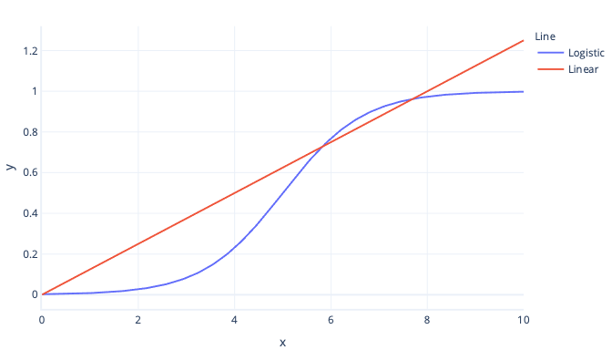
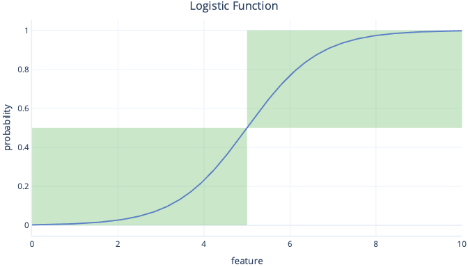

Classification models are used to make decisions or assign items into categories. Unlike regression modules, which output continuous numbers, such as heights or weights, classification models output Boolean--meaning either true or false--or categorical decisions, such as ‘apple’, ’banana’ or ‘cherry’.

There are many types of classification models. Some work similarly to classical regression models, while others are fundamentally different. One of the best models to learn initially is called logistic regression.

## What is logistic regression?

Logistic regression is a type of _classification_ model that works similarly to linear regression. The difference between this and linear regression is the shape of the curve. While simple linear regression fits a straight line to data, logistic regression models fit an s-shaped curve:

Logistic regression is better for estimating Boolean--true/false--outcomes than linear regression because the logistic curve always produces a value between 0 (false) and 1 (true). Anything between these two values can be thought of as a probability.

For example, let’s say we're trying to predict if an avalanche will occur today. If our logistic regression model gives us the value of 0.3, then it estimates there's a 30% probability of an avalanche.

### Converting outputs to categories

As logistic regression gives us these probabilities, rather than simple true/false values, we need to take extra steps to convert the result to a category. The simplest way to do this is to apply a threshold. For example, in the graph below, our threshold is set to 0.5. This means that any y-value below 0.5 is converted to false--left bottom box--and any value at above 0.5 is converted to true--right top box.

Looking at the graph, we can see that this means that when the feature is below 5, the probability will be less than 0.5, and so be converted into false. Feature values above 5 here give probabilities over 0.5, and so will be converted to true.

It’s notable that logistic regression doesn't have to be limited to a true/false outcome – it can also be used where there are three or more potential outcomes, such as ‘rain’, ‘snow’ or ‘sun’. This requires a slightly more complex setup, called **multinomial logistic regression.** While we won’t practice this during the next few exercises, this is worth considering in situations where you need to make predictions that aren't binary.

It’s also worth noting that logistic regression can use more than one input feature: more on this soon.